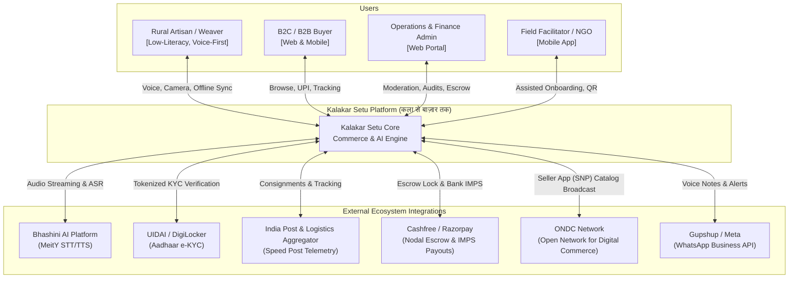
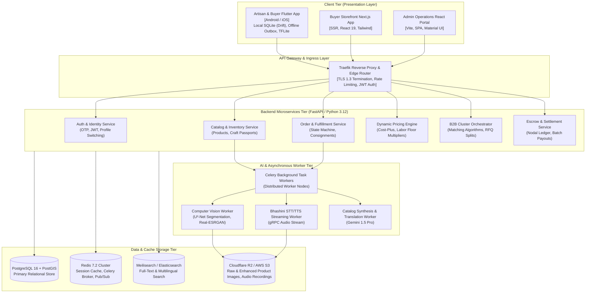
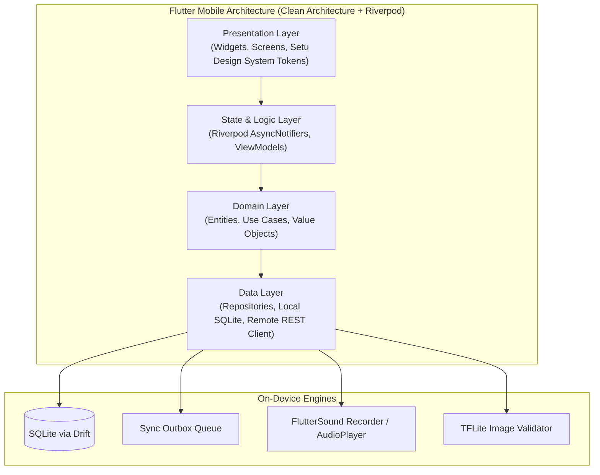
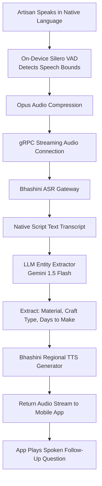
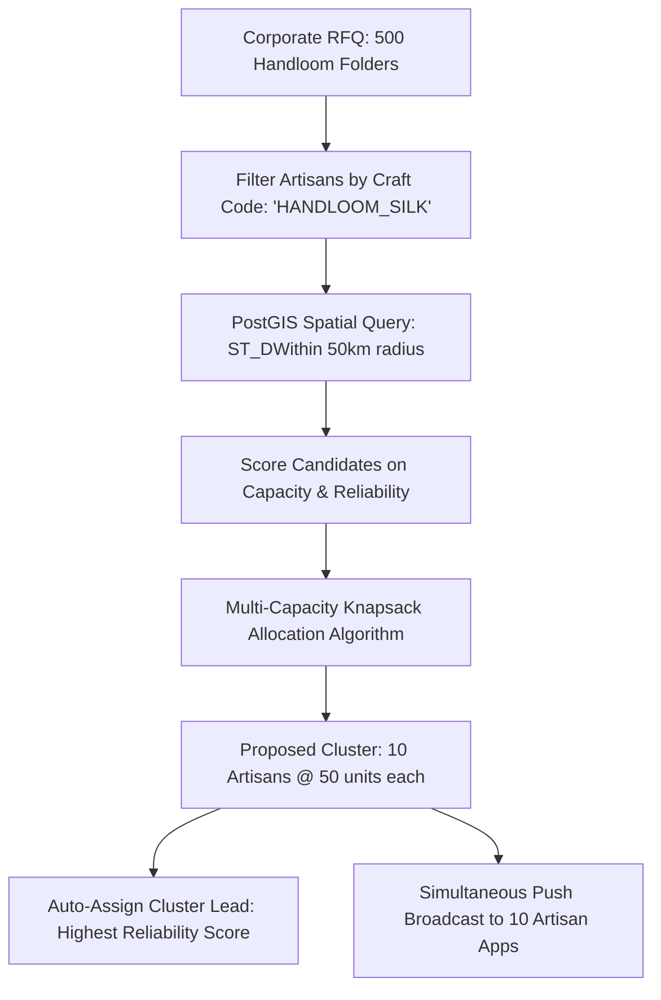
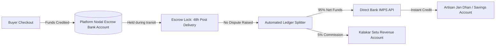

# Kalakar Setu — Production Architecture Specification
## कला से बाज़ार तक | System Architecture & Technology Blueprint

> **Document Type:** Production Architecture Specification  
> **Version:** 1.0  
> **Date:** 2026-09-03  
> **Status:** 🟡 Awaiting Product Owner Review  
> **Role:** Principal Software Architect  
> **Companion Documents:** [DATABASE.md](file:///C:/Users/rauts/OneDrive/Desktop/karagir%20se/DATABASE.md), [API.md](file:///C:/Users/rauts/OneDrive/Desktop/karagir%20se/API.md), [SECURITY.md](file:///C:/Users/rauts/OneDrive/Desktop/karagir%20se/SECURITY.md), [INFRASTRUCTURE.md](file:///C:/Users/rauts/OneDrive/Desktop/karagir%20se/INFRASTRUCTURE.md)

---

# Table of Contents

1. [Executive Summary & Architectural Drivers](#1-executive-summary--architectural-drivers)
2. [C4 System Architecture Models](#2-c4-system-architecture-models)
3. [Technology Stack Decision Matrix](#3-technology-stack-decision-matrix)
4. [Frontend Architecture (Cross-Platform Mobile & Web)](#4-frontend-architecture-cross-platform-mobile--web)
5. [Backend Micro-Services & API Gateway](#5-backend-micro-services--api-gateway)
6. [Offline-First Synchronization Engine](#6-offline-first-synchronization-engine)
7. [AI & Computer Vision Studio Pipeline](#7-ai--computer-vision-studio-pipeline)
8. [Voice-First Audio & Speech Processing Pipeline](#8-voice-first-audio--speech-processing-pipeline)
9. [Multilingual Translation & LLM Orchestration](#9-multilingual-translation--llm-orchestration)
10. [Dynamic Fair Pricing Calculation Engine](#10-dynamic-fair-pricing-calculation-engine)
11. [B2B Cluster Formation & RFQ Matching Engine](#11-b2b-cluster-formation--rfq-matching-engine)
12. [Payments, Escrow Vault & Automated Payouts](#12-payments-escrow-vault--automated-payouts)
13. [Logistics & National Postal Integration](#13-logistics--national-postal-integration)
14. [Search Engine & Recommendation Subsystem](#14-search-engine--recommendation-subsystem)
15. [Multi-Channel Notification Dispatcher](#15-multi-channel-notification-dispatcher)
16. [Caching, State & In-Memory Storage](#16-caching-state--in-memory-storage)
17. [Observability, Telemetry & Audit Logging](#17-observability-telemetry--audit-logging)

---

# 1. Executive Summary & Architectural Drivers

Kalakar Setu is designed as a **mission-critical, distributed mobile commerce and AI linkage platform**. Unlike conventional e-commerce systems optimized for high-end smartphones and high-speed broadband, Kalakar Setu must thrive under the extreme infrastructural constraints of rural India:

### Key Architectural Drivers (Quality Attributes)
1. **Zero-Network Resilience (Offline-First):** The artisan mobile application must function completely offline for core workflows (photo capture, voice dictation, order inspection, packaging). State mutations must queue locally and synchronize deterministically when connectivity returns.
2. **Extreme Compute Heterogeneity:** Artisans operate entry-level Android devices (2GB–3GB RAM, MediaTek/Unisoc processors, Android 9+). Compute-heavy AI (background segmentation, translation, neural pricing) must run in high-throughput cloud worker clusters, while maintaining an on-device lightweight fallback.
3. **Indic Multilingual Voice Latency:** Voice interactions must feel natural and conversational. Streaming Speech-to-Text (STT) and Text-to-Speech (TTS) must maintain a Round Trip Time (RTT) of $< 1.2\text{ seconds}$.
4. **Zero-Exploitation Escrow Security:** Payments must be held in an automated, regulatory-compliant nodal escrow structure (RBI Payment Aggregator Guidelines) that releases money to artisans within 48 hours of postal delivery confirmation.
5. **National Scale Logistics Integration:** Seamless inter-operation between modern private couriers and India Post's 1,55,000+ branch post offices via digital consignment manifests.

---

# 2. C4 System Architecture Models

### 2.1 C4 Level 1: System Context Diagram



---

### 2.2 C4 Level 2: Container Architecture Diagram



---

# 3. Technology Stack Decision Matrix

For every core technology choice, we provide: **Recommendation**, **Architecture Rationale**, and **Evaluated Alternatives**.

---

### 3.1 Mobile Client Framework

| Option | Decision |
|---|---|
| **Recommendation** | **Flutter (v3.24+ / Dart 3.5)** |
| **Why Recommended** | 1. **Pixel-Perfect Canvas Rendering:** Flutter compiles to native ARM binary using the Impeller rendering engine, ensuring high performance (60fps) on budget 2GB Android devices without JavaScript bridge overhead.<br/>2. **Complex Audio/Camera Controls:** Complete hardware-level control over `CameraX` (focus, exposure, stream analysis) and low-latency audio capture pipelines.<br/>3. **Offline Database Ecosystem:** Native SQLite bindings (`drift`) provide fast synchronous queries and reactive outbox streaming.<br/>4. **Unified Multi-Platform:** Single codebase compiles to Android APK (primary for artisans), iOS app, and PWA. |
| **Evaluated Alternatives** | - *React Native:* Higher bridge latency, occasional frame drops during real-time image processing, poor Indic font metric clipping support.<br/>- *Native Android (Kotlin/Jetpack Compose):* Excellent performance, but doubles maintenance and development costs across mobile platforms. |

---

### 3.2 Backend Service Framework

| Option | Decision |
|---|---|
| **Recommendation** | **Python 3.12 + FastAPI** |
| **Why Recommended** | 1. **Native AI/ML Ecosystem Integration:** OpenCV, PyTorch, NumPy, Pillow, and HuggingFace SDKs run natively in Python without fragile cross-language RPC bridges.<br/>2. **High-Throughput Asynchronous I/O:** Built on `Starlette` and `uvloop`, achieving performance on par with Go and Node.js for I/O-bound microservices.<br/>3. **Automated OpenAPI Contracts:** Auto-generates type-safe OpenAPI 3.0 schemas directly from Pydantic models, aligning backend contracts with frontend clients. |
| **Evaluated Alternatives** | - *Node.js / NestJS:* Excellent for standard CRUD, but requires IPC/HTTP bridges to Python for image segmentation and speech analysis, doubling network hops.<br/>- *Go (Golang):* Ultra-fast execution, but severely limited machine learning and vernacular NLP libraries. |

---

### 3.3 Primary Relational Database

| Option | Decision |
|---|---|
| **Recommendation** | **PostgreSQL 16 with PostGIS Extension** |
| **Why Recommended** | 1. **Geospatial Cluster Queries:** PostGIS provides native spatial indexing (`ST_DWithin`, `ST_Distance`) to identify artisan clusters within geographic radii (e.g., 50km of Madhubani).<br/>2. **ACID Transactional Integrity:** Escrow accounting, inventory reservation, and payout ledgers require strict serializable transaction isolation to prevent double-spending.<br/>3. **Native JSONB Operations:** Unstructured AI catalog attributes, craft passport schemas, and multilingual translation dictionaries can be queried directly via GIN indexes. |
| **Evaluated Alternatives** | - *MongoDB:* Lacks ACID transactions across multiple collections; poor spatial join performance for cluster logistics.<br/>- *MySQL:* Weaker spatial GIS ecosystem; less robust JSON querying compared to PostgreSQL's JSONB. |

---

### 3.4 Local Offline Client Database

| Option | Decision |
|---|---|
| **Recommendation** | **SQLite via Drift (Flutter)** |
| **Why Recommended** | 1. **Full Relational Integrity on Device:** Enables complex foreign-key constraints between offline drafts, local images, and queued outbox requests.<br/>2. **Type-Safe Dart DSL:** Drift compiles SQL queries at build time, preventing runtime schema mismatch crashes.<br/>3. **Zero RAM Footprint:** Embedded C-engine running locally within process memory without socket overhead. |
| **Evaluated Alternatives** | - *Hive:* Fast key-value store, but lacks relational integrity and complex query filtering needed for local inventory.<br/>- *WatermelonDB:* Primarily built for React Native; clumsy integration in Flutter. |

---

### 3.5 AI Foundation Model (Cataloging, Translation, Pricing)

| Option | Decision |
|---|---|
| **Recommendation** | **Google Gemini 1.5 Flash & Pro** |
| **Why Recommended** | 1. **Multimodal Native Understanding:** Accepts product photo and audio stream directly in a single context window, allowing simultaneous visual classification and vernacular transcription validation.<br/>2. **Indian Language Fluency:** Superior semantic comprehension across Hindi, Bengali, Tamil, Telugu, and regional dialects.<br/>3. **Cost & Latency Efficiency:** Gemini 1.5 Flash delivers sub-second inference at low cost for high-volume catalog generation. |
| **Evaluated Alternatives** | - *OpenAI GPT-4o:* Comparable multimodal capabilities, but higher API cost and higher latency from Indian regions.<br/>- *Self-Hosted Llama 3:* High GPU operational infrastructure costs for a startup phase. |

---

### 3.6 Speech-to-Text (STT) & Speech Synthesis (TTS)

| Option | Decision |
|---|---|
| **Recommendation** | **Bhashini AI Platform (Primary) + Google Cloud Speech-to-Text (Fallback)** |
| **Why Recommended** | 1. **Government Alignment & Dialect Coverage:** Bhashini is developed under the Ministry of Electronics and Information Technology (MeitY) specifically for Indian vernacular languages and regional acoustic profiles.<br/>2. **Zero Commercial API Toll:** Free access under National Language Translation Mission (NLTM).<br/>3. **Seamless Failover:** Hybrid gateway falls back to Google Cloud STT if Bhashini latency exceeds 1,200ms. |
| **Evaluated Alternatives** | - *Azure Cognitive Speech:* Good regional coverage, but recurring cost per audio minute.<br/>- *OpenAI Whisper:* Requires self-hosted GPU infrastructure and high compute resources for real-time audio streaming. |

---

### 3.7 Computer Vision & Studio Background Removal

| Option | Decision |
|---|---|
| **Recommendation** | **Self-Hosted U²-Net + FastSAM on GPU Workers** |
| **Why Recommended** | 1. **Handcraft-Specific Edge Preservation:** Open-source U²-Net fine-tuned on textile weave borders, cane fibers, and clay specular reflections prevents aggressive clipping.<br/>2. **Zero Third-Party Image API Costs:** Avoids SaaS tools (e.g., Remove.bg at ₹10–₹15/image), saving operational costs on millions of photos.<br/>3. **Data Privacy:** Raw artisan photos remain within platform sovereign cloud storage. |
| **Evaluated Alternatives** | - *Remove.bg / PhotoRoom API:* High cost per image ($0.20/call); economically unviable at rural scale.<br/>- *On-Device TFLite:* 2GB Android devices run out of memory (OOM) attempting high-res semantic segmentation. |

---

### 3.8 Payment Gateway & Escrow Settlement

| Option | Decision |
|---|---|
| **Recommendation** | **Cashfree Payments (Primary) + Razorpay Route (Secondary)** |
| **Why Recommended** | 1. **Automated Split & Escrow Nodal Accounts:** Native support for RBI-compliant marketplace nodal accounts that lock buyer payments and disburse automated payouts.<br/>2. **Rural Bank & Jan Dhan IMPS Success Rate:** Cashfree Payouts provides reliable API routing for cooperative rural banks and regional Gramin bank IFSC codes.<br/>3. **Penny-Drop Verification:** Built-in automated ₹1 bank account validation. |
| **Evaluated Alternatives** | - *PayU:* Strong gateway, but slower automated merchant payout API webhooks.<br/>- *Stripe India:* High international capability, but limited domestic rural bank integrations and strict onboarding requirements for unorganized micro-sellers. |

---

### 3.9 Logistics & Postal Aggregation

| Option | Decision |
|---|---|
| **Recommendation** | **Shiprocket Multi-Carrier Aggregator + Direct India Post Speed Post API** |
| **Why Recommended** | 1. **100% Pincode Reach:** India Post operates 1,55,000+ branch post offices (Dak Ghar), reaching remote tribal villages where private couriers do not deliver.<br/>2. **Automated Carrier Allocation:** Urban-to-urban deliveries use Blue Dart / Delhivery for speed (2–4 days); rural origin parcels route through India Post Speed Post.<br/>3. **Digital Consignment Generation:** Direct generation of barcode manifests on mobile screens. |
| **Evaluated Alternatives** | - *Delhivery Direct:* Excellent urban and semi-urban network, but cannot service deep interior rural hamlets without India Post. |

---

# 4. Frontend Architecture (Cross-Platform Mobile & Web)



### 4.1 State Management (Riverpod 2.5)
- **Declarative & Compile-Time Safe:** Riverpod ensures zero runtime `ProviderNotFoundException` errors.
- **AsyncValue Pattern:** Cleanly handles `AsyncLoading`, `AsyncData`, and `AsyncError` states across all 87 screens.
- **Offline Reactive Streams:** Drift database tables broadcast reactive Dart streams directly to UI widgets; when an outbox sync worker updates a row, the screen updates automatically.

### 4.2 On-Device Audio Subsystem
- **Recorder Configuration:** 16,000 Hz sample rate, 16-bit Linear PCM mono WAV encoding.
- **Voice Activity Detection (VAD):** Silero VAD runs on-device via ONNX Runtime Mobile, suppressing background noise and detecting when the artisan pauses speech for >1.5 seconds.

---

# 5. Backend Micro-Services & API Gateway

### 5.1 Microservices Boundary Definition

```
┌────────────────────────────────────────────────────────────────────────┐
│                        TRAEFIK REVERSE PROXY                          │
└───────────────────────────────────┬────────────────────────────────────┘
                                    │
       ┌────────────────────────────┼────────────────────────────┐
       ▼                            ▼                            ▼
┌───────────────┐            ┌───────────────┐            ┌───────────────┐
│  Auth Service │            │Catalog Service│            │ Order Service │
│  (Port 8001)  │            │  (Port 8002)  │            │  (Port 8003)  │
│- OTP Auth     │            │- Products     │            │- State Machine│
│- KYC Verify   │            │- Craft Passport│           │- Consignments │
│- Profile Sync │            │- Inventory    │            │- Splits       │
└───────┬───────┘            └───────┬───────┘            └───────┬───────┘
        │                            │                            │
        └────────────────────────────┼────────────────────────────┘
                                     ▼
                        ┌────────────────────────┐
                        │  PostgreSQL 16 Cluster │
                        └────────────────────────┘
```

1. **`auth-service` (Port 8001):** Phone number OTP delivery, JWT signing, multi-profile device authentication, Aadhaar tokenized verification.
2. **`catalog-service` (Port 8002):** Product CRUD, Digital Craft Passport generation, QR code minting, inventory tracking, image metadata.
3. **`order-service` (Port 8003):** Order state machine, acceptance timers, multi-artisan split package coordination, return dispute records.
4. **`pricing-service` (Port 8004):** Dynamic fair pricing calculation, regional labor indices, market demand estimation, fee breakdowns.
5. **`cluster-service` (Port 8005):** B2B RFQ parsing, spatial cluster matching, quota splitting, milestone verification.
6. **`payment-service` (Port 8006):** Escrow accounting, payment gateway webhooks, batch IMPS payout execution.

---

# 6. Offline-First Synchronization Engine

Artisans frequently create listings, accept orders, and update stock while completely disconnected. The platform implements an **Asymmetric Delta Sync Protocol with Outbox Pattern**:

```mermaid
sequenceDiagram
    autonumber
    actor Artisan
    participant LocalDB as Local SQLite (Drift)
    participant Outbox as Sync Outbox Queue
    participant SyncWorker as Background WorkManager
    participant Gateway as Traefik API Gateway
    participant Backend as Backend Sync Resolver

    Artisan->>LocalDB: Creates Product / Accepts Order
    LocalDB->>LocalDB: Commit state locally (is_synced = false)
    LocalDB->>Outbox: Push mutation event { mutation_id, action, payload, client_ts }
    Artisan->>Artisan: UI reflects change immediately (Instant Optimistic UI)

    Note over SyncWorker: Device reconnects to Cellular / Wi-Fi
    SyncWorker->>Outbox: Poll pending mutations (ordered by priority)
    SyncWorker->>Gateway: POST /api/v1/sync/batch-outbox
    Gateway->>Backend: Process mutation array with Idempotency Key
    Backend->>Backend: Resolve conflicts (Server-Canonical for Orders; Last-Write-Wins for Drafts)
    Backend-->>SyncWorker: Response { synced_ids: [1, 2], conflicts: [] }
    SyncWorker->>LocalDB: Mark is_synced = true; purge outbox items
    SyncWorker->>Artisan: Haptic pulse + Voice: "Sabhi updates sync ho gaye!"
```

### 6.1 Conflict Resolution Strategy
1. **Order Acceptance/Rejection:** **Server-Canonical Priority.** If an order was auto-cancelled on the server at $t=24\text{h}$, an offline artisan acceptance at $t=25\text{h}$ is safely rejected with a clear audio explanation: *"Yeh order samay seema samapt hone ke karan cancel ho gaya tha."*
2. **Catalog Edits (Title, Price, Description):** **Last-Write-Wins (LWW)** using deterministic client UTC timestamps.
3. **Stock Decrements:** **Optimistic Lock with Database Versioning.** Uses `WHERE version = current_version` to prevent overselling.

---

# 7. AI & Computer Vision Studio Pipeline

```mermaid
flowchart LR
    Raw[Raw Photo<br/>From Phone] --> LightCheck{Brightness & Blur Check}
    LightCheck -- Failed --> Alert[On-Device Voice Alert: Retake]
    LightCheck -- Passed --> Stage1[Stage 1: On-Device TFLite<br/>Auto-balance & Homography]
    Stage1 --> NetCheck{Connected?}
    NetCheck -- No --> Cache[Store in Local SQLite Outbox]
    NetCheck -- Yes --> CloudQueue[Redis Task Queue]
    CloudQueue --> Worker[Celery CV Worker (NVIDIA GPU)]
    Worker --> U2Net[U²-Net / FastSAM<br/>Background Segmentation]
    Worker --> ColorCal[Material Color Calibration]
    Worker --> DropShadow[Natural Directional Ground Shadow]
    Worker --> Upscale[Real-ESRGAN 2x Upscaling]
    Worker --> S3[Upload CDN WebP Asset]
    S3 --> Client[Display Side-by-Side Comparison on App]
```

### Processing Budget & Constraints
- On-device Stage 1 execution: $\le 800\text{ms}$.
- Cloud worker execution: $\le 4.5\text{ seconds}$ per image.
- Image output format: WebP (Lossy 85% quality, 1200×1200 px, target file size $\le 350\text{KB}$).

---

# 8. Voice-First Audio & Speech Processing Pipeline



### Fallback Circuit Breaker
If the Bhashini gRPC endpoint does not return initial ASR packets within $1,200\text{ms}$, the circuit breaker trips and seamlessly re-routes the audio buffer to **Google Cloud Speech-to-Text (v2 API)**, ensuring zero disruption to the conversation.

---

# 9. Multilingual Translation & LLM Orchestration

### Prompt Engineering & Taxonomy Mapping
The platform uses structured JSON-output prompting to prevent LLM hallucination:

```python
# System Prompt for Catalog Synthesis Engine
SYSTEM_PROMPT = """
You are an expert Indian Handicrafts and Handlooms Specialist.
Given raw entity data from a rural artisan, generate:
1. Title in English, Hindi, and regional script (SEO-optimized, max 80 chars).
2. Emotional storytelling description emphasizing traditional provenance, 
   botanical materials, and time invested.
3. Category mapping matching official Government DC Handicrafts taxonomy.
4. Searchable tags (technique, motif, occasion, region).

Strict Constraints:
- Never claim machine-made attributes.
- Highlight cultural authenticity respectfully.
- Return ONLY valid JSON adhering to the provided JSON Schema.
"""
```

### Translation Pipeline
All content is anchored around a **canonical English and Hindi pivot**. When an artisan speaks in Bengali, the audio transcribes to Bengali, extracts structured entities, and translates into English and Hindi simultaneously, allowing buyers across India and worldwide to search seamlessly.

---

# 10. Dynamic Fair Pricing Calculation Engine

The dynamic pricing engine is implemented as a **deterministic, transparent microservice** that combines hard labor minimums with market demand multipliers.

### Mathematical Formulation
$$\text{Base Cost} = C_{\text{material}} + (T_{\text{hours}} \times W_{\text{state}}) + C_{\text{packaging}}$$

$$\text{Fair Selling Price} = \text{Base Cost} \times M_{\text{complexity}} \times M_{\text{demand}}$$

$$\text{Artisan Net Take-Home} = \text{Fair Selling Price} \times (1 - R_{\text{commission}})$$

Where:
- $C_{\text{material}}$: Estimated material cost based on craft type and weight.
- $T_{\text{hours}}$: Production hours declared by artisan.
- $W_{\text{state}}$: State-specific artisan minimum hourly wage index (e.g., ₹50–₹120/hr).
- $M_{\text{complexity}}$: AI-assessed technique score based on image pattern density ($1.10$ to $1.60$).
- $M_{\text{demand}}$: Market sell-through velocity index ($0.95$ to $1.20$).
- $R_{\text{commission}}$: Flat platform fee ($0.05$ or $5\%$).

**Exploitation Floor Safeguard:** The platform strictly enforces:
$$\text{Selling Price} \ge (T_{\text{hours}} \times W_{\text{state}}) + C_{\text{material}}$$
If the artisan attempts to enter a price below this threshold, a voice warning triggers immediately.

---

# 11. B2B Cluster Formation & RFQ Matching Engine

When an institutional buyer requests 500 units of a craft, the single-artisan model fails. The **Cluster Orchestrator** forms an ad-hoc manufacturing cluster using spatial and capacity heuristics:



### Scoring Function
$$\text{Artisan Match Score} = (0.35 \times S_{\text{craft}}) + (0.25 \times R_{\text{reliability}}) + (0.25 \times C_{\text{available}}) + (0.15 \times P_{\text{proximity}})$$

---

# 12. Payments, Escrow Vault & Automated Payouts

The financial flow strictly adheres to the **Reserve Bank of India (RBI) Nodal Account / Escrow Guidelines**:



- **Escrow Freeze Trigger:** If the buyer files a dispute (`BUY-SCR-25`) within 48 hours of delivery, funds remain frozen in escrow until admin adjudication (`ADM-SCR-10`).
- **Transit Insurance Coverage:** If parcel damage is verified as courier mishandling, platform transit insurance settles the refund to the buyer while releasing the full payout to the artisan.

---

# 13. Logistics & National Postal Integration

### Routing Decision Engine
For every order, the logistics microservice calculates the optimal carrier route:

```
IF artisan_district IN Rural_Coverage_List OR courier_pickup_available == False:
    carrier = "INDIA_POST_SPEED_POST"
    fulfillment_mode = "POST_OFFICE_DROP"
ELSE IF package_weight > 10KG:
    carrier = "DELHIVERY_HEAVY_CARGO"
    fulfillment_mode = "DOORSTEP_PICKUP"
ELSE:
    carrier = "SHIPROCKET_BEST_SLA" (Blue Dart / Delhivery Air)
    fulfillment_mode = "DOORSTEP_PICKUP"
```

---

# 14. Search Engine & Recommendation Subsystem

- **Primary Search Cluster:** Meilisearch (v1.8+) with native support for multilingual typo tolerance, prefix search, and faceted filtering.
- **Search Scoring Signals:**
  - Semantic text match: $30\%$
  - Product quality & image score: $20\%$
  - Artisan verification & trust score: $15\%$
  - Listing recency: $10\%$
  - Fair price competitiveness: $10\%$
  - Conversion velocity: $10\%$
  - Geographic proximity: $5\%$
- **Discovery Quota Injection:** Search results automatically reserve **10% of slots on page 1** for newly registered rural artisans who have fewer than 5 lifetime sales, preventing algorithmic monopolies.

---

# 15. Multi-Channel Notification Dispatcher

The notification service implements an automated fallback cascade:

```
[ Push Notification (FCM) with TTS Auto-Play ]
                   │
         (Unread after 5 mins)
                   ▼
       [ WhatsApp Audio Note & Card ]
                   │
        (Undelivered after 10 mins)
                   ▼
         [ Urgent SMS Text Alert ]
                   │
  (Critical Order Unaccepted at 20h)
                   ▼
[ Outbound Telephony Call (IVR Regional Dialect) ]
```

---

# 16. Caching, State & In-Memory Storage

- **Redis 7.2 Cluster:**
  - User session tokens (TTL: 30 days).
  - Search auto-complete prefixes (TTL: 1 hour).
  - Celery distributed background job queue broker.
  - Rate limiting sliding-window counters (100 req/min per IP).
- **CDN Edge Cache (Cloudflare):**
  - All public product photos, WebP assets, and audio story clips cached at 200+ edge PoPs across India (TTL: 7 days, purged on product edit).

---

# 17. Observability, Telemetry & Audit Logging

- **Metrics Collection:** Prometheus scraping FastAPI `/metrics` endpoints every 15 seconds.
- **Log Aggregation:** Grafana Loki collecting structured JSON logs via Promtail.
- **Distributed Tracing:** OpenTelemetry instrumentation across API gateway, microservices, and Celery workers, visualized in Grafana Tempo.
- **Error Crash Reporting:** Sentry integrated into Flutter mobile clients and FastAPI backends, capturing breadcrumbs, device battery level, network type (2G/3G/4G), and exception stack traces.

---

# 18. Supabase Production Backend Foundation & Mobile Data Access Layer

### 18.1 Clean Architecture Data Flow
The React Native mobile client adheres to a strict unidirectional data access architecture, preventing ad-hoc API queries from presentation layers:

```
┌────────────────────────────────────────────────────────┐
│               PRESENTATION LAYER (UI)                  │
│   (Screens, Modern Tactile Components, Modals)         │
└───────────────────────────┬────────────────────────────┘
                            │ Dispatches User Actions
                            ▼
┌────────────────────────────────────────────────────────┐
│             STATE MANAGEMENT LAYER (Zustand)           │
│   (useAuthStore, useCartStore, useOrderStore, etc.)    │
└───────────────────────────┬────────────────────────────┘
                            │ Calls Data Services
                            ▼
┌────────────────────────────────────────────────────────┐
│             SERVICE / DATA ACCESS LAYER                │
│   (authService, productService, marketplaceService)   │
└───────────────────────────┬────────────────────────────┘
                            │ Validates & Prepares Payloads
                            ▼
┌────────────────────────────────────────────────────────┐
│             SUPABASE SDK LAYER (@supabase/js)          │
│   (Session Persistence, PostgREST Client, Storage)     │
└───────────────────────────┬────────────────────────────┘
                            │ HTTPS / TLS 1.3
                            ▼
┌────────────────────────────────────────────────────────┐
│             SUPABASE CLUSTER (Cloud ap-southeast-2)    │
│   - PostgreSQL 15+ with pg_trgm & pgcrypto             │
│   - Row Level Security (RLS) on all 19 Tables          │
│   - Database Triggers (Automatic Profile Creation)     │
│   - Encrypted Object Storage (4 S3-compatible buckets) │
└────────────────────────────────────────────────────────┘
```

### 18.2 Core Architectural Invariants
1. **Zero Client Secret Exposure:** The mobile application bundles strictly the public anonymous key (`EXPO_PUBLIC_SUPABASE_ANON_KEY`). Service-role keys are prohibited.
2. **Database-Enforced Authorization:** Mobile UI conditional rendering is never considered security. RLS policies independently evaluate every transaction against `(select auth.uid())`.
3. **Automated User Lifecycle:** When an artisan or buyer signs up through Supabase Auth, PostgreSQL trigger `on_auth_user_created` atomically seeds `public.profiles`.
4. **Resilient Local Persistence:** Auth tokens and offline sync queues are persisted locally via AsyncStorage, enabling instant app restarts without visual authentication flicker.

---

*End of Production Architecture Specification — Kalakar Setu Platform*
