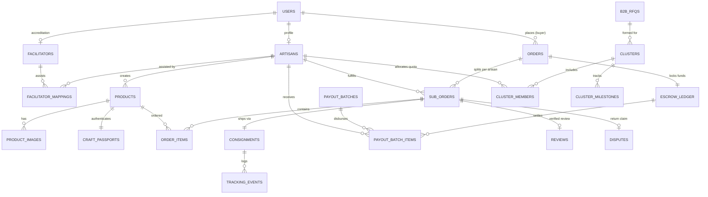

# Kalakar Setu — Production Database Architecture & Schema Specification
## कला से बाज़ार तक | Relational Schemas, PostGIS Spatial Indexing & Offline SQLite Storage

> **Document Type:** Production Database Specification  
> **Version:** 1.0  
> **Date:** 2026-09-03  
> **Target Engines:** PostgreSQL 16 with PostGIS Extension (Cloud Primary), SQLite 3 via Drift (Mobile Offline Local)  
> **Status:** 🟡 Production-Ready DDL Specification

---

# Table of Contents

1. [Database Architecture & Design Principles](#1-database-architecture--design-principles)
2. [Entity-Relationship Diagram (ERD)](#2-entity-relationship-diagram-erd)
3. [PostgreSQL Production DDL (Core Relational Schema)](#3-postgresql-production-ddl-core-relational-schema)
   - [3.1 Enums & Extensions](#31-enums--extensions)
   - [3.2 Users, Authentication & Roles](#32-users-authentication--roles)
   - [3.3 Artisans, Profiles & Facilitator Mappings](#33-artisans-profiles--facilitator-mappings)
   - [3.4 Product Catalog, Media & Craft Passports](#34-product-catalog-media--craft-passports)
   - [3.5 Orders, Multi-Artisan Splits & Escrow State Machine](#35-orders-multi-artisan-splits--escrow-state-machine)
   - [3.6 Logistics, Consignments & Tracking Events](#36-logistics-consignments--tracking-events)
   - [3.7 Escrow Ledger, Settlements & Bank Payouts](#37-escrow-ledger-settlements--bank-payouts)
   - [3.8 B2B RFQs & AI Artisan Clusters](#38-b2b-rfqs--ai-artisan-clusters)
   - [3.9 Verified Reviews, Photos & Moderation Audits](#39-verified-reviews-photos--moderation-audits)
   - [3.10 Disputes, Return Claims & Insurance](#310-disputes-return-claims--insurance)
   - [3.11 Immutable Security Audit Trail](#311-immutable-security-audit-trail)
4. [Client-Side SQLite (Drift) Offline DDL](#4-client-side-sqlite-drift-offline-ddl)
5. [Indexing & Query Optimization Strategy](#5-indexing--query-optimization-strategy)
6. [Data Migration & Versioning Plan (Alembic)](#6-data-migration--versioning-plan-alembic)

---

# 1. Database Architecture & Design Principles

### Principle 1: Strict Financial & Inventory Isolation
Escrow accounting and stock availability enforce double-entry book balancing. No balance or inventory is updated without an atomic database transaction using row-level locking (`SELECT ... FOR UPDATE`).

### Principle 2: Native Multilingual Storage via JSONB
Product titles, descriptions, and care guidelines are stored in structured JSONB columns indexed by Generalized Inverted Indexes (GIN). This allows dynamic addition of new regional Indian languages without destructive schema migrations.

### Principle 3: Spatial Indexing for Artisan Cluster Discovery
Artisan workshop coordinates and village boundaries use PostGIS `GEOGRAPHY(Point, 4326)`. Spatial queries use GiST indexing to calculate cluster proximity in sub-milliseconds.

### Principle 4: Deterministic Auditability
Financial and security actions are append-only. Hard deletions are forbidden on orders, products, reviews, and payouts; soft deletions use `deleted_at` timestamps with partial unique constraints.

---

# 2. Entity-Relationship Diagram (ERD)



---

# 3. PostgreSQL Production DDL (Core Relational Schema)

### 3.1 Enums & Extensions

```sql
-- Enable necessary PostgreSQL extensions
CREATE EXTENSION IF NOT EXISTS "uuid-ossp";
CREATE EXTENSION IF NOT EXISTS "postgis";
CREATE EXTENSION IF NOT EXISTS "pg_trgm";
CREATE EXTENSION IF NOT EXISTS "btree_gin";

-- Domain Enums
CREATE TYPE user_role_enum AS ENUM ('ARTISAN', 'BUYER', 'FACILITATOR', 'ADMIN_STAFF', 'SUPER_ADMIN');
CREATE TYPE verification_tier_enum AS ENUM ('UNVERIFIED', 'AADHAAR_VERIFIED', 'MASTER_CRAFTSPERSON');
CREATE TYPE product_status_enum AS ENUM ('DRAFT', 'PENDING_MODERATION', 'ACTIVE', 'PAUSED', 'SOLD_OUT', 'ARCHIVED');
CREATE TYPE stock_type_enum AS ENUM ('READY_STOCK', 'MADE_TO_ORDER');
CREATE TYPE order_status_enum AS ENUM ('INITIATED', 'PLACED', 'CONFIRMED', 'IN_PRODUCTION', 'READY_TO_SHIP', 'IN_TRANSIT', 'DELIVERED', 'RETURN_REQUESTED', 'RETURNED', 'CANCELLED', 'REFUNDED');
CREATE TYPE escrow_status_enum AS ENUM ('HELD_IN_ESCROW', 'DISPUTED_LOCKED', 'RELEASED_TO_PAYOUT', 'REFUNDED_TO_BUYER');
CREATE TYPE fulfillment_mode_enum AS ENUM ('POST_OFFICE_DROP', 'DOORSTEP_PICKUP');
CREATE TYPE cluster_status_enum AS ENUM ('PROPOSED', 'CONFIRMED', 'IN_PRODUCTION', 'QC_INSPECTION', 'COMPLETED', 'CANCELLED');
```

---

### 3.2 Users, Authentication & Roles

```sql
CREATE TABLE users (
    id UUID PRIMARY KEY DEFAULT uuid_generate_v4(),
    phone_number VARCHAR(15) UNIQUE NOT NULL,
    email VARCHAR(255) UNIQUE,
    full_name VARCHAR(150),
    preferred_language VARCHAR(10) DEFAULT 'hi_IN' NOT NULL,
    role user_role_enum NOT NULL DEFAULT 'BUYER',
    is_active BOOLEAN DEFAULT TRUE NOT NULL,
    is_phone_verified BOOLEAN DEFAULT FALSE NOT NULL,
    device_pin_hash VARCHAR(255),
    created_at TIMESTAMPTZ DEFAULT CURRENT_TIMESTAMP NOT NULL,
    updated_at TIMESTAMPTZ DEFAULT CURRENT_TIMESTAMP NOT NULL,
    deleted_at TIMESTAMPTZ
);

CREATE INDEX idx_users_phone ON users(phone_number);
CREATE INDEX idx_users_role ON users(role);
```

---

### 3.3 Artisans, Profiles & Facilitator Mappings

```sql
CREATE TABLE artisans (
    id UUID PRIMARY KEY REFERENCES users(id) ON DELETE CASCADE,
    workshop_name VARCHAR(200),
    profile_photo_url TEXT,
    story_voice_url TEXT,
    craft_category_code VARCHAR(50) NOT NULL,
    years_of_experience INT DEFAULT 1,
    verification_tier verification_tier_enum DEFAULT 'UNVERIFIED' NOT NULL,
    aadhaar_token VARCHAR(255),
    bank_account_number_enc TEXT,
    bank_ifsc_code VARCHAR(11),
    bank_beneficiary_name VARCHAR(150),
    bank_verified BOOLEAN DEFAULT FALSE NOT NULL,
    health_score INT DEFAULT 100 NOT NULL CHECK (health_score BETWEEN 0 AND 100),
    village_name VARCHAR(150),
    district VARCHAR(100) NOT NULL,
    state VARCHAR(100) NOT NULL,
    pincode VARCHAR(6) NOT NULL,
    location_coordinates GEOGRAPHY(Point, 4326) NOT NULL,
    shg_cooperative_name VARCHAR(200),
    created_at TIMESTAMPTZ DEFAULT CURRENT_TIMESTAMP NOT NULL,
    updated_at TIMESTAMPTZ DEFAULT CURRENT_TIMESTAMP NOT NULL
);

CREATE INDEX idx_artisans_craft ON artisans(craft_category_code);
CREATE INDEX idx_artisans_district_state ON artisans(district, state);
CREATE INDEX idx_artisans_location ON artisans USING GIST(location_coordinates);
CREATE INDEX idx_artisans_health ON artisans(health_score);

CREATE TABLE facilitators (
    id UUID PRIMARY KEY REFERENCES users(id) ON DELETE CASCADE,
    organization_name VARCHAR(200) NOT NULL,
    designation VARCHAR(100),
    accreditation_code VARCHAR(50) UNIQUE NOT NULL,
    operating_district VARCHAR(100) NOT NULL,
    operating_state VARCHAR(100) NOT NULL,
    id_proof_url TEXT NOT NULL,
    is_accredited BOOLEAN DEFAULT FALSE NOT NULL,
    created_at TIMESTAMPTZ DEFAULT CURRENT_TIMESTAMP NOT NULL,
    updated_at TIMESTAMPTZ DEFAULT CURRENT_TIMESTAMP NOT NULL
);

CREATE TABLE artisan_facilitator_mappings (
    id UUID PRIMARY KEY DEFAULT uuid_generate_v4(),
    artisan_id UUID NOT NULL REFERENCES artisans(id) ON DELETE CASCADE,
    facilitator_id UUID NOT NULL REFERENCES facilitators(id) ON DELETE CASCADE,
    linked_at TIMESTAMPTZ DEFAULT CURRENT_TIMESTAMP NOT NULL,
    is_active BOOLEAN DEFAULT TRUE NOT NULL,
    UNIQUE(artisan_id, facilitator_id)
);
```

---

### 3.4 Product Catalog, Media & Craft Passports

```sql
CREATE TABLE products (
    id UUID PRIMARY KEY DEFAULT uuid_generate_v4(),
    artisan_id UUID NOT NULL REFERENCES artisans(id) ON DELETE RESTRICT,
    title JSONB NOT NULL, -- {"en": "...", "hi": "...", "bn": "..."}
    description JSONB NOT NULL,
    craft_category_code VARCHAR(50) NOT NULL,
    materials JSONB NOT NULL, -- ["Natural Cotton", "Botanical Inks"]
    technique VARCHAR(100),
    dimensions JSONB, -- {"length_cm": 30, "width_cm": 20, "weight_grams": 450}
    selling_price NUMERIC(10, 2) NOT NULL CHECK (selling_price >= 50.00),
    ai_suggested_price NUMERIC(10, 2) NOT NULL,
    labor_hours INT NOT NULL CHECK (labor_hours >= 1),
    stock_quantity INT DEFAULT 1 NOT NULL CHECK (stock_quantity >= 0),
    stock_type stock_type_enum DEFAULT 'READY_STOCK' NOT NULL,
    lead_time_days INT DEFAULT 0 NOT NULL,
    status product_status_enum DEFAULT 'DRAFT' NOT NULL,
    is_gi_certified BOOLEAN DEFAULT FALSE NOT NULL,
    gi_tag_number VARCHAR(100),
    search_vector TSVECTOR,
    version INT DEFAULT 1 NOT NULL, -- Optimistic lock
    created_at TIMESTAMPTZ DEFAULT CURRENT_TIMESTAMP NOT NULL,
    updated_at TIMESTAMPTZ DEFAULT CURRENT_TIMESTAMP NOT NULL,
    deleted_at TIMESTAMPTZ
);

CREATE INDEX idx_products_artisan ON products(artisan_id);
CREATE INDEX idx_products_status ON products(status) WHERE deleted_at IS NULL;
CREATE INDEX idx_products_price ON products(selling_price);
CREATE INDEX idx_products_title_jsonb ON products USING GIN(title);
CREATE INDEX idx_products_search ON products USING GIN(search_vector);

CREATE TABLE product_images (
    id UUID PRIMARY KEY DEFAULT uuid_generate_v4(),
    product_id UUID NOT NULL REFERENCES products(id) ON DELETE CASCADE,
    raw_image_url TEXT NOT NULL,
    enhanced_image_url TEXT,
    thumbnail_url TEXT,
    is_primary BOOLEAN DEFAULT FALSE NOT NULL,
    ai_enhancement_applied BOOLEAN DEFAULT FALSE NOT NULL,
    sort_order INT DEFAULT 0 NOT NULL,
    created_at TIMESTAMPTZ DEFAULT CURRENT_TIMESTAMP NOT NULL
);

CREATE INDEX idx_product_images_product ON product_images(product_id);

CREATE TABLE craft_passports (
    id UUID PRIMARY KEY DEFAULT uuid_generate_v4(),
    product_id UUID UNIQUE NOT NULL REFERENCES products(id) ON DELETE CASCADE,
    passport_code VARCHAR(50) UNIQUE NOT NULL, -- e.g., "IN-BR-MDB-2026-89421"
    qr_code_svg_url TEXT NOT NULL,
    public_verification_url TEXT NOT NULL,
    artisan_voice_snippet_url TEXT,
    carbon_score_grams INT,
    first_scanned_at TIMESTAMPTZ,
    scan_count INT DEFAULT 0 NOT NULL,
    created_at TIMESTAMPTZ DEFAULT CURRENT_TIMESTAMP NOT NULL
);

CREATE INDEX idx_craft_passports_code ON craft_passports(passport_code);
```

---

### 3.5 Orders, Multi-Artisan Splits & Escrow State Machine

```sql
CREATE TABLE orders (
    id UUID PRIMARY KEY DEFAULT uuid_generate_v4(),
    buyer_id UUID NOT NULL REFERENCES users(id) ON DELETE RESTRICT,
    order_number VARCHAR(30) UNIQUE NOT NULL, -- e.g., "KS-2026-98124"
    total_amount NUMERIC(10, 2) NOT NULL,
    shipping_total NUMERIC(10, 2) NOT NULL,
    tax_total NUMERIC(10, 2) DEFAULT 0.00 NOT NULL,
    payment_method VARCHAR(30) NOT NULL, -- "UPI", "CARD", "COD"
    gateway_txn_id VARCHAR(100),
    shipping_address JSONB NOT NULL,
    billing_gstin VARCHAR(15),
    created_at TIMESTAMPTZ DEFAULT CURRENT_TIMESTAMP NOT NULL,
    updated_at TIMESTAMPTZ DEFAULT CURRENT_TIMESTAMP NOT NULL
);

CREATE INDEX idx_orders_buyer ON orders(buyer_id);
CREATE INDEX idx_orders_number ON orders(order_number);

-- Multi-Artisan Split Packages
CREATE TABLE sub_orders (
    id UUID PRIMARY KEY DEFAULT uuid_generate_v4(),
    order_id UUID NOT NULL REFERENCES orders(id) ON DELETE CASCADE,
    artisan_id UUID NOT NULL REFERENCES artisans(id) ON DELETE RESTRICT,
    sub_order_number VARCHAR(35) UNIQUE NOT NULL, -- e.g., "KS-2026-98124-A1"
    subtotal NUMERIC(10, 2) NOT NULL,
    shipping_fee NUMERIC(10, 2) NOT NULL,
    platform_commission NUMERIC(10, 2) NOT NULL, -- 5%
    artisan_net_payout NUMERIC(10, 2) NOT NULL,
    status order_status_enum DEFAULT 'PLACED' NOT NULL,
    acceptance_deadline_at TIMESTAMPTZ NOT NULL, -- t+24h
    accepted_at TIMESTAMPTZ,
    ready_to_ship_at TIMESTAMPTZ,
    delivered_at TIMESTAMPTZ,
    return_window_closes_at TIMESTAMPTZ,
    version INT DEFAULT 1 NOT NULL,
    created_at TIMESTAMPTZ DEFAULT CURRENT_TIMESTAMP NOT NULL,
    updated_at TIMESTAMPTZ DEFAULT CURRENT_TIMESTAMP NOT NULL
);

CREATE INDEX idx_sub_orders_order ON sub_orders(order_id);
CREATE INDEX idx_sub_orders_artisan ON sub_orders(artisan_id);
CREATE INDEX idx_sub_orders_status ON sub_orders(status);

CREATE TABLE order_items (
    id UUID PRIMARY KEY DEFAULT uuid_generate_v4(),
    sub_order_id UUID NOT NULL REFERENCES sub_orders(id) ON DELETE CASCADE,
    product_id UUID NOT NULL REFERENCES products(id) ON DELETE RESTRICT,
    unit_price NUMERIC(10, 2) NOT NULL,
    quantity INT NOT NULL CHECK (quantity >= 1),
    product_snapshot JSONB NOT NULL -- Preserves historical title & attributes
);
```

---

### 3.6 Logistics, Consignments & Tracking Events

```sql
CREATE TABLE consignments (
    id UUID PRIMARY KEY DEFAULT uuid_generate_v4(),
    sub_order_id UUID UNIQUE NOT NULL REFERENCES sub_orders(id) ON DELETE RESTRICT,
    carrier_name VARCHAR(100) NOT NULL, -- "INDIA_POST_SPEED_POST", "BLUEDART"
    tracking_number VARCHAR(50) UNIQUE NOT NULL,
    barcode_image_url TEXT NOT NULL,
    shipping_label_pdf_url TEXT,
    fulfillment_mode fulfillment_mode_enum NOT NULL,
    pickup_scheduled_date DATE,
    origin_pincode VARCHAR(6) NOT NULL,
    destination_pincode VARCHAR(6) NOT NULL,
    dispatched_at TIMESTAMPTZ,
    created_at TIMESTAMPTZ DEFAULT CURRENT_TIMESTAMP NOT NULL
);

CREATE TABLE tracking_events (
    id UUID PRIMARY KEY DEFAULT uuid_generate_v4(),
    consignment_id UUID NOT NULL REFERENCES consignments(id) ON DELETE CASCADE,
    checkpoint_location VARCHAR(150) NOT NULL,
    status_summary VARCHAR(255) NOT NULL,
    telemetry_raw JSONB,
    event_timestamp TIMESTAMPTZ NOT NULL,
    created_at TIMESTAMPTZ DEFAULT CURRENT_TIMESTAMP NOT NULL
);

CREATE INDEX idx_tracking_events_consignment ON tracking_events(consignment_id);
```

---

### 3.7 Escrow Ledger, Settlements & Bank Payouts

```sql
CREATE TABLE escrow_ledger (
    id UUID PRIMARY KEY DEFAULT uuid_generate_v4(),
    sub_order_id UUID UNIQUE NOT NULL REFERENCES sub_orders(id) ON DELETE RESTRICT,
    nodal_account_ref VARCHAR(100) NOT NULL,
    held_amount NUMERIC(10, 2) NOT NULL,
    commission_amount NUMERIC(10, 2) NOT NULL,
    net_payout_amount NUMERIC(10, 2) NOT NULL,
    status escrow_status_enum DEFAULT 'HELD_IN_ESCROW' NOT NULL,
    lock_expires_at TIMESTAMPTZ NOT NULL,
    released_at TIMESTAMPTZ,
    created_at TIMESTAMPTZ DEFAULT CURRENT_TIMESTAMP NOT NULL,
    updated_at TIMESTAMPTZ DEFAULT CURRENT_TIMESTAMP NOT NULL
);

CREATE INDEX idx_escrow_status_release ON escrow_ledger(status, lock_expires_at);

CREATE TABLE payout_batches (
    id UUID PRIMARY KEY DEFAULT uuid_generate_v4(),
    batch_reference VARCHAR(50) UNIQUE NOT NULL,
    total_disbursed NUMERIC(12, 2) NOT NULL,
    total_artisans_count INT NOT NULL,
    authorized_by_staff_id UUID NOT NULL REFERENCES users(id),
    signed_at TIMESTAMPTZ DEFAULT CURRENT_TIMESTAMP NOT NULL,
    status VARCHAR(30) DEFAULT 'COMPLETED' NOT NULL
);

CREATE TABLE payout_batch_items (
    id UUID PRIMARY KEY DEFAULT uuid_generate_v4(),
    batch_id UUID NOT NULL REFERENCES payout_batches(id) ON DELETE RESTRICT,
    artisan_id UUID NOT NULL REFERENCES artisans(id) ON DELETE RESTRICT,
    sub_order_id UUID NOT NULL REFERENCES sub_orders(id) ON DELETE RESTRICT,
    payout_amount NUMERIC(10, 2) NOT NULL,
    bank_utr_number VARCHAR(50) UNIQUE NOT NULL,
    transfer_status VARCHAR(30) DEFAULT 'SUCCESS' NOT NULL,
    disbursed_at TIMESTAMPTZ DEFAULT CURRENT_TIMESTAMP NOT NULL
);
```

---

### 3.8 B2B RFQs & AI Artisan Clusters

```sql
CREATE TABLE b2b_rfqs (
    id UUID PRIMARY KEY DEFAULT uuid_generate_v4(),
    buyer_id UUID NOT NULL REFERENCES users(id) ON DELETE RESTRICT,
    company_name VARCHAR(200) NOT NULL,
    company_gstin VARCHAR(15) NOT NULL,
    craft_category_code VARCHAR(50) NOT NULL,
    quantity_required INT NOT NULL CHECK (quantity_required >= 50),
    target_delivery_date DATE NOT NULL,
    budget_per_unit NUMERIC(10, 2) NOT NULL,
    customization_notes TEXT,
    reference_sample_url TEXT,
    created_at TIMESTAMPTZ DEFAULT CURRENT_TIMESTAMP NOT NULL
);

CREATE TABLE clusters (
    id UUID PRIMARY KEY DEFAULT uuid_generate_v4(),
    rfq_id UUID NOT NULL REFERENCES b2b_rfqs(id) ON DELETE RESTRICT,
    cluster_code VARCHAR(50) UNIQUE NOT NULL, -- e.g., "CLUST-2026-DIWALI-04"
    cluster_lead_artisan_id UUID NOT NULL REFERENCES artisans(id),
    total_units_allocated INT NOT NULL,
    unit_payout_rate NUMERIC(10, 2) NOT NULL,
    status cluster_status_enum DEFAULT 'PROPOSED' NOT NULL,
    created_at TIMESTAMPTZ DEFAULT CURRENT_TIMESTAMP NOT NULL,
    updated_at TIMESTAMPTZ DEFAULT CURRENT_TIMESTAMP NOT NULL
);

CREATE TABLE cluster_members (
    id UUID PRIMARY KEY DEFAULT uuid_generate_v4(),
    cluster_id UUID NOT NULL REFERENCES clusters(id) ON DELETE CASCADE,
    artisan_id UUID NOT NULL REFERENCES artisans(id) ON DELETE RESTRICT,
    allocated_units INT NOT NULL CHECK (allocated_units >= 1),
    completed_units INT DEFAULT 0 NOT NULL,
    advance_deposit_amount NUMERIC(10, 2) NOT NULL,
    is_accepted BOOLEAN DEFAULT FALSE NOT NULL,
    accepted_at TIMESTAMPTZ,
    UNIQUE(cluster_id, artisan_id)
);

CREATE TABLE cluster_milestones (
    id UUID PRIMARY KEY DEFAULT uuid_generate_v4(),
    cluster_id UUID NOT NULL REFERENCES clusters(id) ON DELETE CASCADE,
    milestone_name VARCHAR(100) NOT NULL, -- "RAW_MATERIALS", "50_PERCENT", "FINAL_QC"
    completion_percentage INT NOT NULL,
    proof_photo_urls JSONB,
    is_approved BOOLEAN DEFAULT FALSE NOT NULL,
    approved_by_staff_id UUID REFERENCES users(id),
    approved_at TIMESTAMPTZ
);
```

---

### 3.9 Verified Reviews, Photos & Moderation Audits

```sql
CREATE TABLE reviews (
    id UUID PRIMARY KEY DEFAULT uuid_generate_v4(),
    sub_order_id UUID UNIQUE NOT NULL REFERENCES sub_orders(id) ON DELETE RESTRICT,
    product_id UUID NOT NULL REFERENCES products(id) ON DELETE CASCADE,
    buyer_id UUID NOT NULL REFERENCES users(id) ON DELETE RESTRICT,
    star_rating INT NOT NULL CHECK (star_rating BETWEEN 1 AND 5),
    review_comment TEXT,
    review_comment_translated JSONB,
    photo_urls JSONB,
    is_verified_purchase BOOLEAN DEFAULT TRUE NOT NULL,
    is_public BOOLEAN DEFAULT TRUE NOT NULL,
    created_at TIMESTAMPTZ DEFAULT CURRENT_TIMESTAMP NOT NULL
);

CREATE INDEX idx_reviews_product ON reviews(product_id);
```

---

### 3.10 Disputes, Return Claims & Insurance

```sql
CREATE TABLE disputes (
    id UUID PRIMARY KEY DEFAULT uuid_generate_v4(),
    sub_order_id UUID UNIQUE NOT NULL REFERENCES sub_orders(id) ON DELETE RESTRICT,
    buyer_id UUID NOT NULL REFERENCES users(id) ON DELETE RESTRICT,
    reason VARCHAR(50) NOT NULL, -- "TRANSIT_DAMAGE", "DEFECT", "WRONG_ITEM"
    evidence_photo_urls JSONB NOT NULL,
    description TEXT,
    adjudicated_verdict VARCHAR(50), -- "INSURANCE_SETTLED", "REFUND_ARTISAN_FAULT", "DENIED"
    adjudicated_by_staff_id UUID REFERENCES users(id),
    adjudicated_at TIMESTAMPTZ,
    insurance_claim_ref VARCHAR(100),
    created_at TIMESTAMPTZ DEFAULT CURRENT_TIMESTAMP NOT NULL
);
```

---

### 3.11 Immutable Security Audit Trail

```sql
CREATE TABLE admin_audit_logs (
    id UUID PRIMARY KEY DEFAULT uuid_generate_v4(),
    staff_id UUID NOT NULL REFERENCES users(id),
    action_type VARCHAR(50) NOT NULL, -- "KYC_APPROVE", "PAYOUT_SIGN", "LISTING_DELETE"
    target_entity VARCHAR(50) NOT NULL,
    target_id UUID NOT NULL,
    changes JSONB,
    ip_address INET NOT NULL,
    user_agent TEXT,
    created_at TIMESTAMPTZ DEFAULT CURRENT_TIMESTAMP NOT NULL
);

CREATE INDEX idx_audit_logs_staff ON admin_audit_logs(staff_id);
CREATE INDEX idx_audit_logs_created ON admin_audit_logs(created_at);
```

---

# 4. Client-Side SQLite (Drift) Offline DDL

The artisan's mobile device maintains an embedded SQLite database using Dart Drift:

```sql
-- Mobile Local SQLite DDL
CREATE TABLE local_draft_products (
    id TEXT PRIMARY KEY,
    title_raw TEXT NOT NULL,
    craft_category_code TEXT NOT NULL,
    materials_json TEXT NOT NULL,
    labor_hours INTEGER NOT NULL,
    selling_price REAL NOT NULL,
    primary_image_path TEXT NOT NULL,
    voice_description_path TEXT,
    is_synced INTEGER DEFAULT 0 NOT NULL,
    created_at INTEGER NOT NULL
);

CREATE TABLE sync_outbox_queue (
    mutation_id TEXT PRIMARY KEY,
    entity_type TEXT NOT NULL, -- "PRODUCT_CREATE", "ORDER_ACCEPT", "STOCK_UPDATE"
    entity_id TEXT NOT NULL,
    action TEXT NOT NULL,
    payload_json TEXT NOT NULL,
    retry_count INTEGER DEFAULT 0 NOT NULL,
    status TEXT DEFAULT 'PENDING' NOT NULL, -- 'PENDING', 'PROCESSING', 'FAILED'
    created_at INTEGER NOT NULL
);

CREATE TABLE cached_orders (
    sub_order_id TEXT PRIMARY KEY,
    order_number TEXT NOT NULL,
    buyer_city TEXT NOT NULL,
    payout_amount REAL NOT NULL,
    status TEXT NOT NULL,
    acceptance_deadline INTEGER NOT NULL,
    product_title TEXT NOT NULL,
    product_thumb_path TEXT,
    last_synced_at INTEGER NOT NULL
);
```

---

# 5. Indexing & Query Optimization Strategy

1. **Automated Search Vector Maintenance:**
   A trigger keeps PostgreSQL `search_vector` synchronized on product inserts and updates:
   ```sql
   CREATE OR REPLACE FUNCTION products_search_vector_update() RETURNS trigger AS $$
   BEGIN
       NEW.search_vector :=
           setweight(to_tsvector('english', coalesce(NEW.title->>'en', '')), 'A') ||
           setweight(to_tsvector('simple', coalesce(NEW.title->>'hi', '')), 'A') ||
           setweight(to_tsvector('english', coalesce(NEW.description->>'en', '')), 'B') ||
           setweight(to_tsvector('english', coalesce(NEW.materials::text, '')), 'C');
       RETURN NEW;
   END;
   $$ LANGUAGE plpgsql;

   CREATE TRIGGER trg_products_search_vector
   BEFORE INSERT OR UPDATE ON products
   FOR EACH ROW EXECUTE FUNCTION products_search_vector_update();
   ```

2. **Partial Indexing on Active Records:**
   ```sql
   CREATE INDEX idx_active_products ON products (craft_category_code, selling_price)
   WHERE status = 'ACTIVE' AND deleted_at IS NULL;
   ```

---

# 6. Data Migration & Versioning Plan (Alembic)

- **Alembic in Python Backend:** All relational DDL is tracked via Python migration scripts under `/backend/migrations`.
- **Zero-Downtime Deployment Rule:** Schema additions must be backward-compatible (all new columns nullable or have defaults). Column drops occur in 2-phase releases.

---

# 7. Production Supabase Cloud Integration & Applied Migrations

### 7.1 Live Supabase Project Architecture
- **Supabase Project ID:** `epnfavpqweeybzoyoexq`
- **Region:** `ap-southeast-2` (Production Cloud)
- **Engine:** PostgreSQL 15+ with Extensions: `uuid-ossp`, `pgcrypto`, `pg_trgm` (in `extensions` schema).
- **Advisors Status:** 0 Security Warnings, 0 Performance Warnings (Verified via Supabase MCP).

### 7.2 Applied Migrations Registry
All migrations are tracked and applied directly to production:
1. `20260904000001_core_schema.sql`: 
   - 8 Custom Enums: `user_role_enum`, `craft_category_enum`, `stock_type_enum`, `order_status_enum`, `sub_order_status_enum`, `escrow_status_enum`, `rfq_status_enum`, `audit_action_enum`.
   - 19 Tables in `public`: `profiles`, `artisan_profiles`, `buyer_profiles`, `facilitators`, `categories`, `products`, `product_images`, `craft_passports`, `orders`, `sub_orders`, `order_items`, `escrow_ledger`, `reviews`, `disputes`, `b2b_rfqs`, `clusters`, `cluster_members`, `cluster_milestones`, `admin_audit_logs`.
   - Automated full-text search trigger `products_search_vector_update()`.
   - Auth trigger `on_auth_user_created()` automatically creating `public.profiles` on user signup.
2. `20260904000002_rls_policies.sql`: 
   - Granular Row-Level Security on all 19 tables for `SELECT`, `INSERT`, `UPDATE`, `DELETE`.
3. `20260904000003_security_hardening.sql`: 
   - Function security hardening with explicit `SET search_path = public, pg_temp`.
   - Execution permissions revoked from `anon` and `authenticated` on internal triggers.
4. `20260904000004_storage_and_categories.sql`: 
   - 4 Supabase Storage Buckets: `product-images`, `artisan-avatars`, `voice-stories`, `craft-documents`.
   - Storage RLS policies for authenticated uploads, artisan folder isolation, and public image reads.
   - Seeded 6 national handicraft categories.
5. `20260904000005_seed_products.sql`: 
   - Real seed catalog with GI-tagged Madhubani Painting and Dokra Bell Metal Art, craft passports, and multi-resolution images.
6. `20260904000006_advisor_optimizations.sql`: 
   - Moved `pg_trgm` extension out of `public` into `extensions` schema.
   - Set helper functions to `SECURITY INVOKER` to prevent privilege escalation.
7. `20260904000007_performance_tuning.sql`: 
   - Covering indexes on foreign keys (`idx_products_craft_category`, `idx_order_items_product`, etc.).
   - Optimized RLS policies with `(select auth.uid())` to cache InitPlans and eliminate per-row re-evaluation.
8. `20260904000008_clean_permissive_policies.sql`: 
   - Distinct admin policies for non-overlapping authorization and zero lint warnings.

---

*End of Database Architecture & Schema Specification — Kalakar Setu Platform*
