# Kalakar Setu — Product Discovery Document
## कला से बाज़ार तक | From Craft to Market

> **Document Type:** Product Discovery & Requirements Analysis  
> **Version:** 1.0 — Draft for Product Owner Review  
> **Date:** 2026-09-03  
> **Status:** 🟡 Awaiting Product Owner Decisions  

---

## Table of Contents

1. [Executive Summary](#1-executive-summary)
2. [Target Users](#2-target-users)
3. [User Roles & Permissions](#3-user-roles--permissions)
4. [Problems of Each User](#4-problems-of-each-user)
5. [User Goals](#5-user-goals)
6. [Core Product Value Proposition](#6-core-product-value-proposition)
7. [Complete Artisan Journey](#7-complete-artisan-journey)
8. [Complete Buyer Journey (B2C)](#8-complete-buyer-journey-b2c)
9. [Complete Admin Journey](#9-complete-admin-journey)
10. [B2B Buyer Journey](#10-b2b-buyer-journey)
11. [Product Discovery (Buyer Side)](#11-product-discovery-buyer-side)
12. [AI Catalog Creation](#12-ai-catalog-creation)
13. [AI Image Enhancement](#13-ai-image-enhancement)
14. [Voice-Based Product Description](#14-voice-based-product-description)
15. [Multilingual Support](#15-multilingual-support)
16. [Dynamic Pricing](#16-dynamic-pricing)
17. [Market Linkage](#17-market-linkage)
18. [Product Publishing](#18-product-publishing)
19. [Orders](#19-orders)
20. [Payments](#20-payments)
21. [Delivery & Logistics](#21-delivery--logistics)
22. [Returns & Refunds](#22-returns--refunds)
23. [Reviews & Trust](#23-reviews--trust)
24. [Notifications](#24-notifications)
25. [Analytics](#25-analytics)
26. [Support](#26-support)
27. [Government Marketplace Integration](#27-government-marketplace-integration)
28. [Security](#28-security)
29. [Accessibility](#29-accessibility)
30. [Low-Literacy UX](#30-low-literacy-ux)
31. [Offline / Poor-Network Scenarios](#31-offline--poor-network-scenarios)
32. [Edge Cases](#32-edge-cases)
33. [Decisions Requiring Product Owner Approval](#33-decisions-requiring-product-owner-approval)

---

## 1. Executive Summary

Kalakar Setu is a **voice-first, AI-powered mobile commerce platform** that enables marginalized artisans, weavers, and micro-entrepreneurs across India to sell their handcrafted products online — without requiring digital literacy, typing skills, or knowledge of photography, pricing, or cataloguing.

The platform serves as a **virtual business manager** that converts a simple photo + voice input into a professional, multilingual product listing complete with enhanced images, AI-suggested fair pricing, and a QR-based Digital Craft Passport for provenance and storytelling.

On the demand side, it connects B2C consumers and B2B bulk buyers (corporates, exporters, government e-marketplaces) directly to artisans, with AI-powered cluster formation for large orders that exceed a single artisan's capacity.

### Core Innovation

| Dimension | Traditional E-commerce | Kalakar Setu |
|---|---|---|
| Listing creation | Text forms, photo editing, SEO knowledge | Photo + voice in mother tongue |
| Pricing | Guesswork, middleman exploitation | AI-suggested fair price with breakdown |
| Trust & provenance | None or superficial | QR-based Digital Craft Passport |
| Bulk order fulfilment | Single seller or aggregator model | AI-formed artisan clusters |
| Digital literacy required | High | Near-zero (voice-first, icon-first) |
| Language | English-dominant | Mother tongue (voice + text) |
| Network dependency | Always-online | Offline-capable |

---

## 2. Target Users

### 2.1 Primary Users

#### A. Artisans / Weavers / Micro-Entrepreneurs (Supply Side)

| Attribute | Detail |
|---|---|
| **Demographics** | Rural and semi-urban India, ages 18–65+, predominantly women (60–70% of handloom/handicraft workforce) |
| **Digital literacy** | Low to very low. May own a smartphone but primarily use it for calls, WhatsApp, YouTube |
| **Languages** | Regional mother tongue as primary (Hindi, Tamil, Bengali, Odia, Gujarati, Assamese, etc.). Limited or no English. Hindi as secondary for many but not all |
| **Income** | ₹3,000–₹15,000/month, seasonal, inconsistent |
| **Current selling** | Local haats, melas, middlemen, occasional government exhibitions |
| **Phone** | Entry-level to mid-range Android (Android 9+), 2–4 GB RAM, limited storage. Rare iOS usage |
| **Connectivity** | Intermittent 2G/3G/4G in rural areas, occasional WiFi at CSCs or home |
| **Craft types** | Handloom textiles, pottery, metalwork, woodcraft, bamboo, jute, leather, embroidery, jewelry, paintings (Madhubani, Warli, Pattachitra, etc.), stone carving, papier-mâché |

#### B. B2C Buyers (Demand Side — Individual Consumers)

| Attribute | Detail |
|---|---|
| **Demographics** | Urban India + diaspora + global conscious consumers, ages 22–55 |
| **Motivation** | Authentic handmade products, cultural connection, ethical shopping, gifting |
| **Digital literacy** | Moderate to high |
| **Price sensitivity** | Willing to pay premium for authenticity and story, but expect quality and reliability |
| **Comparison** | Currently shops on Amazon Karigar, Okhai, GoCoop, Jaypore, iTokri, or physical exhibitions |

#### C. B2B Buyers (Demand Side — Institutional/Bulk)

| Attribute | Detail |
|---|---|
| **Types** | Corporate gifting departments, exporters, interior designers, boutique retailers, hospitality chains, government procurement (GeM), NGOs |
| **Order size** | 50–10,000+ units |
| **Requirements** | Consistent quality, on-time delivery, GST invoicing, bulk pricing, customization, compliance documentation |
| **Pain points** | Finding reliable artisan clusters, quality control at scale, fragmented communication |

### 2.2 Secondary Users

#### D. Facilitators / Field Agents

| Attribute | Detail |
|---|---|
| **Who** | NGO field workers, SHG leaders, Common Service Centre (CSC) operators, government extension officers, Craft Council coordinators |
| **Role** | Help onboard artisans, assist with first listing, aggregate orders, resolve issues |
| **Digital literacy** | Moderate |

#### E. Platform Administrators

| Attribute | Detail |
|---|---|
| **Who** | Kalakar Setu operations team |
| **Role** | Content moderation, quality assurance, dispute resolution, artisan verification, analytics, partner management |

> [!IMPORTANT]
> **Decision Required — D1:** Should "Facilitators" be a formal user role with their own app/dashboard, or should they use the artisan app on behalf of artisans?  
> **Recommendation:** Create a formal Facilitator role with a dedicated mode in the artisan app (not a separate app). Facilitators can manage multiple artisans under their umbrella, help with onboarding, and monitor orders — but artisans remain the account owners.  
> **Rationale:** A dedicated facilitator mode reduces onboarding friction at scale (one facilitator can onboard 20–50 artisans in a camp), while keeping the app footprint small.

---

## 3. User Roles & Permissions

| Role | Can List Products | Can Accept Orders | Can View Analytics | Can Moderate | Can Place Orders | Can Manage Clusters | Can Manage Payments |
|---|---|---|---|---|---|---|---|
| **Artisan** | ✅ Own | ✅ Own | ✅ Own | ❌ | ❌ | ✅ Participate | ✅ Own |
| **Facilitator** | ✅ Assisted (on behalf of artisan) | ✅ Assisted | ✅ Linked artisans | ❌ | ❌ | ✅ Coordinate | ❌ |
| **B2C Buyer** | ❌ | ❌ | ❌ | ❌ | ✅ | ❌ | ✅ Own |
| **B2B Buyer** | ❌ | ❌ | ✅ Order tracking | ❌ | ✅ Bulk | ❌ | ✅ Own |
| **Admin** | ✅ Override | ✅ Override | ✅ Platform-wide | ✅ | ❌ | ✅ Form/manage | ✅ Platform |

> [!IMPORTANT]
> **Decision Required — D2:** Should there be a separate "Cluster Lead" role for artisan clusters, or should the system auto-assign the most reliable artisan?  
> **Recommendation:** Auto-assign based on reliability score + voluntary opt-in, with the ability for the cluster to vote/change the lead. Avoid creating another role to keep UX simple.

---

## 4. Problems of Each User

### 4.1 Artisan Problems

| # | Problem | Severity | Current Workaround |
|---|---|---|---|
| P1 | Cannot create professional product listings (no photography, writing, or SEO skills) | 🔴 Critical | Middlemen handle it, taking 30–60% margin |
| P2 | Cannot price products fairly — no access to market data | 🔴 Critical | Accept whatever price middleman offers |
| P3 | No year-round market access — depend on seasonal fairs | 🔴 Critical | Travel to distant melas at own cost |
| P4 | Language barrier — most e-commerce is English-first | 🟠 High | Don't use e-commerce at all |
| P5 | Low digital literacy — forms, menus, text input are intimidating | 🟠 High | Rely on children or neighbors for tech help |
| P6 | No product traceability — buyers can't verify authenticity | 🟡 Medium | Government certifications (slow, complex) |
| P7 | Cannot handle bulk orders individually | 🟡 Medium | Decline large orders or deliver late |
| P8 | No business analytics — don't know what sells, when, or why | 🟡 Medium | Intuition only |
| P9 | Poor network connectivity in rural areas | 🟠 High | Wait to go to town for internet |
| P10 | Exploitation by middlemen who obscure true market value | 🔴 Critical | No alternative |

### 4.2 B2C Buyer Problems

| # | Problem | Severity |
|---|---|---|
| P11 | Hard to discover authentic handcrafted products online | 🟠 High |
| P12 | Cannot verify if "handmade" claims are genuine | 🟠 High |
| P13 | No connection with the maker — products feel impersonal | 🟡 Medium |
| P14 | Inconsistent quality when buying from unknown artisans | 🟠 High |
| P15 | Limited payment and delivery options from artisan sellers | 🟡 Medium |
| P16 | No return/exchange assurance from individual artisans | 🟡 Medium |

### 4.3 B2B Buyer Problems

| # | Problem | Severity |
|---|---|---|
| P17 | Cannot find reliable artisan clusters for bulk orders | 🔴 Critical |
| P18 | Quality inconsistency across multiple artisans in a batch | 🔴 Critical |
| P19 | No unified communication — must coordinate with multiple artisans individually | 🟠 High |
| P20 | No production tracking for bulk orders | 🟠 High |
| P21 | GST compliance and proper invoicing difficult with individual artisans | 🟠 High |
| P22 | Customization requests are hard to communicate and verify | 🟡 Medium |

### 4.4 Admin Problems

| # | Problem | Severity |
|---|---|---|
| P23 | Content moderation at scale with multilingual listings | 🟠 High |
| P24 | Verifying artisan authenticity and craft claims | 🟠 High |
| P25 | Dispute resolution between buyers and artisans with language/literacy barriers | 🟡 Medium |
| P26 | Maintaining listing quality as catalog grows | 🟡 Medium |

---

## 5. User Goals

### 5.1 Artisan Goals

| Priority | Goal | Success Metric |
|---|---|---|
| 🥇 | Earn more money consistently throughout the year | Monthly income ≥ ₹10,000 from app |
| 🥇 | List products easily without technical knowledge | Time from photo to published listing ≤ 5 minutes |
| 🥈 | Get fair price for work | Avg. selling price within 15% of AI-suggested fair price |
| 🥈 | Build reputation and direct customer relationships | Repeat customer rate ≥ 20% |
| 🥉 | Access bulk orders that were previously out of reach | ≥ 1 cluster order per quarter |
| 🥉 | Understand business performance | Weekly voice summary of sales & earnings |

### 5.2 B2C Buyer Goals

| Priority | Goal | Success Metric |
|---|---|---|
| 🥇 | Discover and buy authentic handcrafted products | Browse-to-purchase conversion ≥ 3% |
| 🥈 | Know the maker's story and craft provenance | ≥ 50% of buyers scan Craft Passport |
| 🥉 | Hassle-free purchase experience (delivery, returns) | NPS ≥ 60 |

### 5.3 B2B Buyer Goals

| Priority | Goal | Success Metric |
|---|---|---|
| 🥇 | Place bulk orders with guaranteed quality and timelines | On-time delivery rate ≥ 90% |
| 🥈 | Single point of contact for multi-artisan orders | All communication via platform |
| 🥉 | Compliant documentation (GST, export papers) | 100% orders with proper invoicing |

---

## 6. Core Product Value Proposition

### For Artisans
> **"Apni kala ki photo kheechen, apni bhasha mein batayen — baaki sab app sambhal lega."**  
> *Click a photo of your craft, describe it in your language — the app handles everything else.*

**Value pillars:**
1. **Zero-skill listing** — Photo + voice → professional multilingual listing
2. **Fair pricing** — AI explains what the product is worth and why
3. **Year-round market** — Direct access to consumers and bulk buyers
4. **Dignity & identity** — Digital Craft Passport tells your story
5. **Collective strength** — AI clusters for bulk orders you couldn't handle alone

### For Buyers (B2C)
> **"Every purchase has a face, a story, and a place."**

**Value pillars:**
1. **Authenticity guaranteed** — QR-verified provenance
2. **Impact shopping** — Buy directly from the maker
3. **Discovery** — Curated collections by region, craft, occasion

### For Buyers (B2B)
> **"One order, one dashboard, one quality standard — powered by a cluster of India's finest artisans."**

**Value pillars:**
1. **Reliable sourcing** — AI-matched artisan clusters
2. **Production visibility** — Real-time tracking
3. **Compliance** — GST, export documentation built in

---

## 7. Complete Artisan Journey

### 7.1 Onboarding Journey

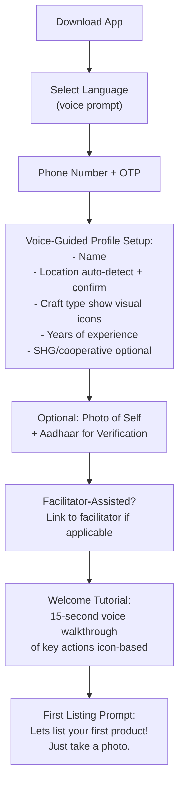

> [!IMPORTANT]
> **Decision Required — D3:** Should Aadhaar verification be mandatory at onboarding or deferred until first payout?  
> **Options:**  
> A. Mandatory at onboarding — higher trust from day one, but adds friction  
> B. Deferred until first payout — lower onboarding friction, but unverified sellers initially  
> C. Tiered — basic listing without Aadhaar, Aadhaar required for payouts and "Verified Artisan" badge  
> **Recommendation:** Option C (Tiered). Let artisans list immediately to hook them, require verification only when money moves. Verified artisans get a trust badge and higher visibility.

### 7.2 Product Listing Journey (Core Loop)

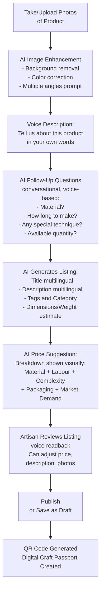

**Key interactions in the listing flow:**

| Step | Input Method | Literacy Required | Offline Capable? |
|---|---|---|---|
| Photo capture | Camera tap | None | ✅ Yes |
| Voice description | Speak | None | ✅ Yes (queued) |
| AI follow-up | Voice Q&A | None | ⚠️ Partial (cached questions) |
| Review listing | Voice readback + visuals | None | ⚠️ Partial |
| Set price | Slider/numpad + voice | Numeral recognition | ✅ Yes |
| Publish | Single button tap | None | ⚠️ Queued for sync |

### 7.3 Order Fulfilment Journey

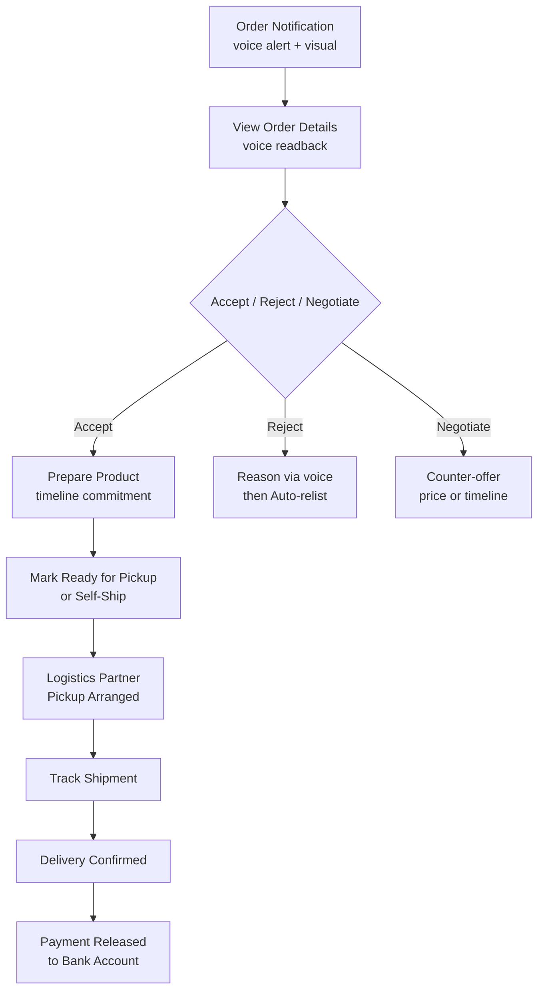

> [!IMPORTANT]
> **Decision Required — D4:** Should artisans have the ability to reject or negotiate orders, or should all listed products be "ready to ship"?  
> **Options:**  
> A. Ready-to-ship only (inventory model) — buyer gets instant confirmation  
> B. Accept/reject model — artisan confirms each order, may make-to-order  
> C. Hybrid — artisan marks products as "ready stock" or "made to order" during listing  
> **Recommendation:** Option C (Hybrid). Many artisans make products to order (especially weavers). A rigid inventory model would exclude them. "Ready stock" items get fast delivery badges; "made to order" items show estimated production time.

### 7.4 Post-Sale Journey

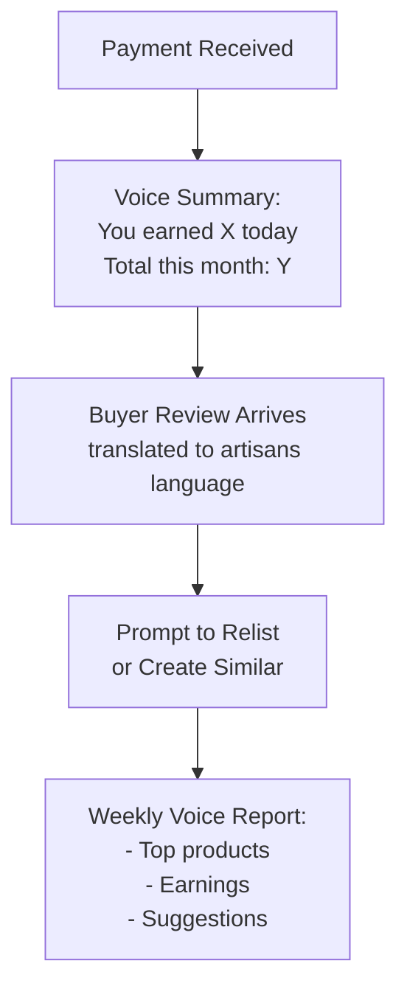

---

## 8. Complete Buyer Journey (B2C)

### 8.1 Discovery & Browsing

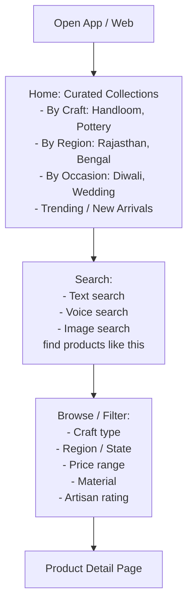

### 8.2 Product Detail & Trust

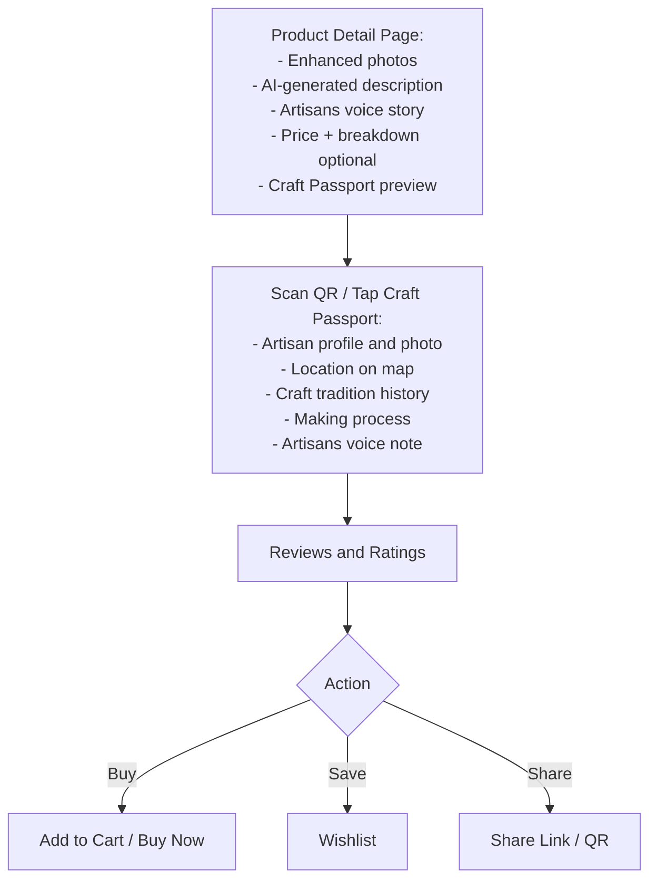

### 8.3 Purchase Flow

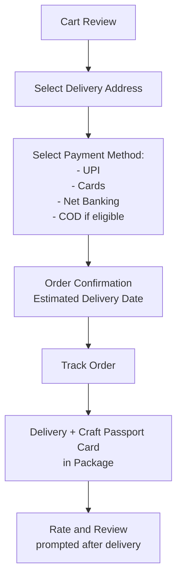

> [!IMPORTANT]
> **Decision Required — D5:** Should the buyer app be a native mobile app, a web app, or both?  
> **Options:**  
> A. Native mobile app only (Android + iOS)  
> B. Web app only (responsive)  
> C. Mobile app + web storefront  
> D. Mobile app for artisans, web + mobile app for buyers  
> **Recommendation:** Option D. Artisans need a native Android app (camera, voice, offline). Buyers benefit from both web (discovery, SEO, sharing) and mobile app (repeat purchases, notifications). Start with Android artisan app + responsive web for buyers, add iOS buyer app in Phase 2.

---

## 9. Complete Admin Journey

### 9.1 Admin Dashboard Capabilities

| Module | Key Functions |
|---|---|
| **Artisan Management** | Verification queue, profile review, fraud detection, artisan health score |
| **Listing Moderation** | AI-flagged listings for review (inappropriate content, IP violations, quality issues), bulk approve/reject |
| **Order Management** | Order status overview, stuck order alerts, dispute queue |
| **Cluster Management** | View active clusters, performance metrics, rebalance/reassign |
| **Financial** | Payout dashboard, commission tracking, refund management |
| **Content** | Manage curated collections, featured artisans, banner campaigns |
| **Analytics** | GMV, active artisans, conversion rates, regional heatmaps, craft-wise performance |
| **Support** | Ticket queue (artisan + buyer), escalation management |
| **Compliance** | GST reports, artisan KYC status, government scheme linkages |

### 9.2 Admin Workflows

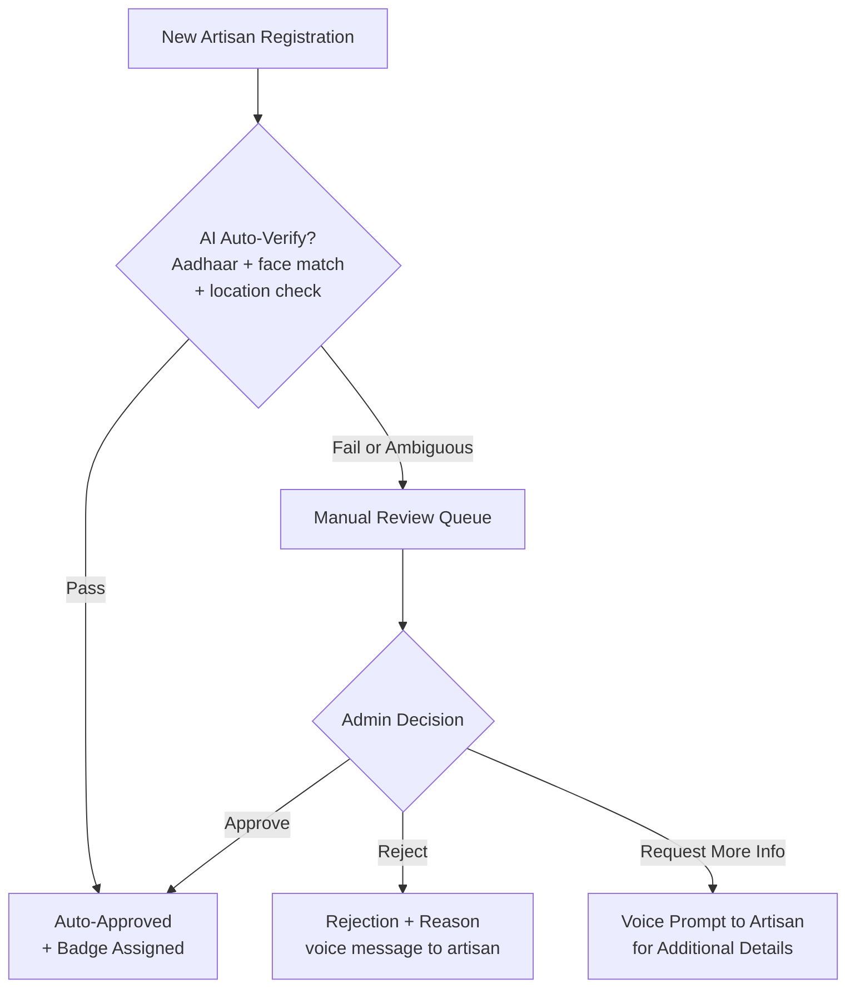

> [!IMPORTANT]
> **Decision Required — D6:** What is the admin platform?  
> **Options:**  
> A. Web-based admin dashboard only  
> B. Web dashboard + mobile admin app  
> **Recommendation:** Option A for MVP. Web dashboard is sufficient for admin tasks and faster to build. Mobile admin app can be added later if field operations require it.

---

## 10. B2B Buyer Journey

### 10.1 B2B Onboarding

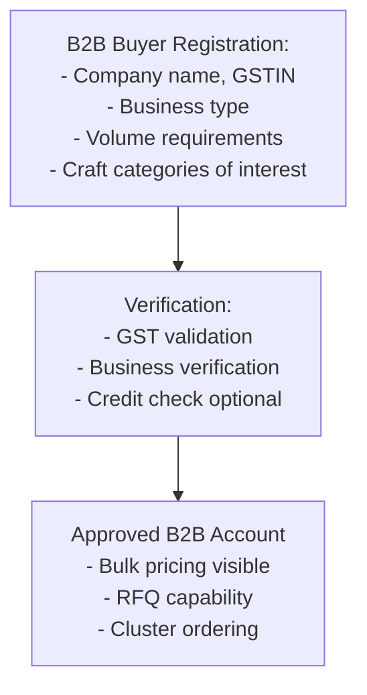

### 10.2 Bulk Order Flow

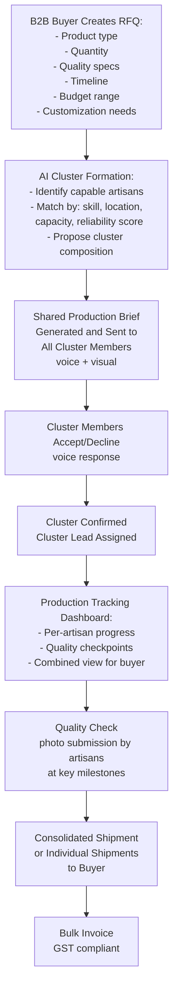

### 10.3 Cluster Formation Logic

The AI cluster formation is a critical differentiator. Here's the proposed logic:

| Factor | Weight | Data Source |
|---|---|---|
| **Skill match** | 30% | Craft type, past product quality ratings |
| **Geographic proximity** | 20% | GPS location (minimize logistics cost) |
| **Available capacity** | 20% | Current order load, stated weekly output |
| **Reliability score** | 20% | On-time delivery %, acceptance rate, quality ratings |
| **Past cluster performance** | 10% | Performance in previous cluster orders |

> [!IMPORTANT]
> **Decision Required — D7:** How should pricing work for B2B bulk orders?  
> **Options:**  
> A. Fixed bulk discount tiers (e.g., 10% off for 100+ units, 20% off for 500+)  
> B. Dynamic negotiation — B2B buyer proposes price, artisans accept/counter  
> C. AI-suggested bulk price based on fair pricing model + volume discount, artisans confirm  
> **Recommendation:** Option C. The AI should suggest a fair bulk price that accounts for volume efficiencies (less per-unit packaging, batch production) while ensuring artisans earn at least the AI-suggested fair price per unit. Artisans must explicitly confirm the bulk rate.

> [!WARNING]
> **Decision Required — D8:** Who handles quality control in cluster orders?  
> **Options:**  
> A. Platform relies on artisan self-reporting (photo proof at milestones)  
> B. Platform assigns a QC facilitator (field agent) for orders above a threshold  
> C. Buyer-side QC — samples sent before full production  
> D. Combination: Photo self-reporting for all + facilitator QC for orders above 50K + buyer sample approval for orders above 2L  
> **Recommendation:** Option D (Combination). Quality is the #1 risk in cluster orders. A layered approach balances cost and quality assurance.

---

## 11. Product Discovery (Buyer Side)

### 11.1 Discovery Mechanisms

| Mechanism | Description | Priority |
|---|---|---|
| **Curated Collections** | Editorially curated by craft, region, occasion, festival, story | P0 |
| **AI Recommendations** | "You might also like" based on browsing/purchase history | P1 |
| **Search (Text)** | Full-text search across titles, descriptions, tags in all supported languages | P0 |
| **Search (Voice)** | Speak to search in any supported language | P1 |
| **Search (Image)** | Upload/take photo to find similar products | P2 |
| **Category Browse** | Hierarchical: Craft Type → Sub-type → Region | P0 |
| **Map-Based Discovery** | Browse artisans and products on an interactive India map | P2 |
| **Artisan Profiles** | Browse by artisan — see their story, all products, reviews | P0 |
| **Trending / New Arrivals** | Algorithmically surfaced popular and new products | P1 |
| **Festival / Occasion Shops** | Seasonal: Diwali gifts, Wedding collection, Rakhi specials | P1 |

### 11.2 Search & Ranking Algorithm (Proposed Signals)

| Signal | Weight | Notes |
|---|---|---|
| Text/tag relevance | 30% | BM25 or semantic search |
| Product quality score | 20% | Photo quality, listing completeness, reviews |
| Artisan trust score | 15% | Verification, ratings, fulfilment history |
| Recency | 10% | Newer listings get a boost |
| Price competitiveness | 10% | Fair-priced items rank higher |
| Conversion rate | 10% | Products that sell well rank higher |
| Geographic relevance | 5% | Proximity to buyer (for delivery speed) |

> [!NOTE]
> Ranking must be fair and must NOT create winner-take-all dynamics. Artisans with fewer sales should still get visibility. Consider a "discovery quota" that ensures new artisans appear in browse feeds.

---

## 12. AI Catalog Creation

### 12.1 Catalog Generation Pipeline

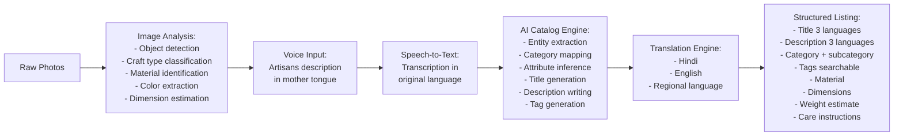

### 12.2 AI Follow-Up Questions

The AI should ask contextual follow-up questions based on what it can and cannot infer from the photo and initial voice input:

| Craft Type | Likely Follow-Up Questions |
|---|---|
| **Handloom textile** | "What thread did you use — cotton, silk, or something else?" / "How many days did this take to weave?" / "Does this saree have a specific motif name?" |
| **Pottery** | "Is this food-safe?" / "Did you use a kiln or sun-dry?" / "What clay is this — terracotta, stoneware?" |
| **Jewelry** | "What metal is this?" / "Are these stones natural or artificial?" / "Is this a traditional design from your region?" |
| **Painting** | "What paint/ink did you use?" / "Is this on cloth, paper, or wall?" / "What story does this painting tell?" |

The questions should feel like a **friendly conversation**, not a form. The AI should:
- Ask 3–5 questions maximum
- Skip questions it can confidently infer from the image
- Accept "I don't know" gracefully and fill in reasonable defaults
- Speak in the artisan's chosen language

> [!IMPORTANT]
> **Decision Required — D9:** Should the AI catalog be published directly, or should it go through a review step?  
> **Options:**  
> A. Auto-publish — AI generates, artisan confirms with single tap, live immediately  
> B. AI generates → artisan confirms → admin review queue → published  
> C. AI generates → artisan confirms → auto-published with AI moderation flag for suspicious listings  
> **Recommendation:** Option C. Auto-publish for speed (artisans need instant gratification), but AI moderation flags listings that may have issues (copyright images, offensive content, unrealistic pricing, possible counterfeit). Flagged items go to admin queue. This balances speed with safety.

---

## 13. AI Image Enhancement

### 13.1 Enhancement Pipeline

| Step | Technique | Purpose |
|---|---|---|
| 1. Background removal | U2-Net / SAM-based segmentation | Clean white/lifestyle background |
| 2. Color correction | Auto white-balance, exposure correction | True-to-life colors |
| 3. Sharpening | Adaptive unsharp masking | Crisp product details |
| 4. Shadow generation | AI-generated natural shadows | Professional look |
| 5. Perspective correction | Homography transformation | Straight, undistorted product |
| 6. Resolution upscaling | Real-ESRGAN or similar | High-res from low-res phone camera |
| 7. Multiple view generation | (Optional, Phase 2) AI-generated additional angles | More product views |

### 13.2 Image Guidelines for Artisans

The app should guide artisans to take better photos through voice + visual prompts:

- "Place your product on a plain surface"
- "Make sure there is good light — near a window is best"
- "Hold the phone steady — I'll count 3, 2, 1"
- "Can you take one more photo from the side?"

> [!IMPORTANT]
> **Decision Required — D10:** Should the app generate AI lifestyle images (e.g., a saree shown on a model, a vase shown in a room)?  
> **Options:**  
> A. Yes — AI-generated lifestyle context images alongside the clean product photo  
> B. No — only enhanced product photos on clean backgrounds  
> C. Phase 2 feature — start with clean backgrounds, add lifestyle later  
> **Recommendation:** Option C. Lifestyle images significantly boost conversion but are technically complex and risk misrepresentation. Start with clean, professional product photos. Add AI lifestyle images in Phase 2 with clear labeling ("AI-styled preview — actual product may vary").

### 13.3 Processing Constraints

| Constraint | Specification |
|---|---|
| **Processing location** | On-device for basic corrections; cloud for advanced enhancement |
| **Max processing time** | 15 seconds or less on-device, 30 seconds or less cloud |
| **Offline handling** | Basic corrections on-device; advanced enhancement queued for sync |
| **Min input quality** | 2MP minimum; app warns if image is too blurry/dark |
| **Output format** | JPEG, 1200x1200 px minimum, 500KB or less per image |

---

## 14. Voice-Based Product Description

### 14.1 Voice Interaction Architecture

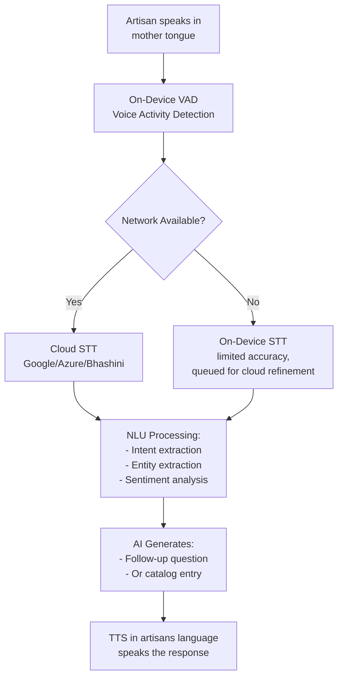

### 14.2 Supported Interaction Patterns

| Pattern | Example | When Used |
|---|---|---|
| **Free-form description** | "Yeh meri haath ki buni hui cotton saree hai, isme madhubani design hai" | Initial product description |
| **Guided Q&A** | AI: "Yeh banane mein kitna samay laga?" Artisan: "Teen din lage" | Follow-up questions |
| **Command** | "Price badha do thoda" / "Photo delete karo" | Editing listings |
| **Navigation** | "Meri orders dikhao" / "Naya product daalo" | App navigation |
| **Confirmation** | AI reads back listing, Artisan: "Haan, sahi hai" | Publishing |

> [!IMPORTANT]
> **Decision Required — D11:** Which speech-to-text engine should be used?  
> **Options:**  
> A. Google Cloud Speech-to-Text — best accuracy for major Indian languages, but cost per request  
> B. Azure Cognitive Speech — good Indian language support, competitive pricing  
> C. Bhashini (Government of India's AI language platform) — free, designed for Indian languages, but may have reliability/accuracy limitations  
> D. Hybrid — Bhashini as primary (free, government alignment), Google/Azure as fallback  
> **Recommendation:** Option D (Hybrid). Bhashini aligns with government mission (SIH context), is free, and supports 22 scheduled languages. Use Google Cloud STT as fallback for accuracy-critical flows (catalog creation). On-device models (Whisper-based) for basic offline capability.

---

## 15. Multilingual Support

### 15.1 Language Matrix

| Language | UI Support | Voice Input | Voice Output (TTS) | Catalog Translation | Priority |
|---|---|---|---|---|---|
| Hindi | ✅ | ✅ | ✅ | ✅ | P0 |
| English | ✅ | ✅ | ✅ | ✅ | P0 |
| Bengali | ✅ | ✅ | ✅ | ✅ | P0 |
| Tamil | ✅ | ✅ | ✅ | ✅ | P1 |
| Telugu | ✅ | ✅ | ✅ | ✅ | P1 |
| Marathi | ✅ | ✅ | ✅ | ✅ | P1 |
| Gujarati | ✅ | ✅ | ✅ | ✅ | P1 |
| Kannada | ✅ | ✅ | ✅ | ✅ | P1 |
| Odia | ✅ | ✅ | ✅ | ✅ | P1 |
| Assamese | ✅ | ✅ | ✅ | ✅ | P2 |
| Punjabi | ✅ | ✅ | ✅ | ✅ | P2 |
| Malayalam | ✅ | ✅ | ✅ | ✅ | P2 |

### 15.2 Translation Strategy

| Content Type | Translation Method | Quality Assurance |
|---|---|---|
| **UI strings** | Professional human translation + crowdsource review | Native speaker QA per language |
| **AI-generated listings** | LLM translation (GPT-4 / Gemini) | Spot-check by regional moderators |
| **Artisan voice stories** | Transcription → translation → optional dubbing | Artisan's original voice preserved, subtitle in buyer's language |
| **Buyer reviews** | Machine translation with "See original" option | Auto only |
| **Support chat** | Real-time translation layer | Human agent for escalations |

> [!IMPORTANT]
> **Decision Required — D12:** How many languages should be supported at launch?  
> **Recommendation:** Launch with Hindi + English + 2 regional languages corresponding to the pilot regions (see Q1). Add languages incrementally based on artisan onboarding demand.

---

## 16. Dynamic Pricing

### 16.1 Fair Price Calculation Model

The pricing engine is a core differentiator. The AI should estimate a fair price and **explain** it transparently.

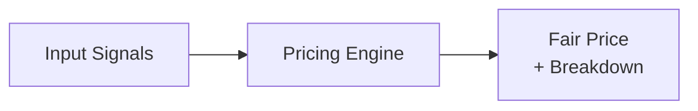

**Input Signals:**
- Material cost (inferred from craft type + artisan input)
- Labour time (artisan-stated + craft-type average)
- Complexity score (AI-assessed from image + description)
- Packaging cost (standard estimate)
- Market comparable (similar products on other platforms)
- Regional cost index (state-wise labour cost adjustment)

### 16.2 Price Breakdown Display (Artisan View)

The artisan should see a simple, visual breakdown:

```
 AI Suggested Price: ₹1,200
 ─────────────────────────────
 🧵 Material:       ₹300  (25%)
 ⏱️  Labour (3 days): ₹600  (50%)
 🎨 Complexity:     ₹150  (12.5%)
 📦 Packaging:      ₹50   (4.2%)
 📈 Market Demand:  ₹100  (8.3%)
 ─────────────────────────────
 You keep: ₹1,080 (after 10% fee)

 [Accept ₹1,200]  [Change Price ▼▲]
```

Voice readback: *"Aapke is saree ki material cost lagbhag ₹300 hai, teen din ki mehnat ka ₹600, design ki khoobsurti ke liye ₹150, packaging ₹50, aur market demand ke hisaab se ₹100 aur. Kul milake ₹1,200 sahi price hai. Aap ₹1,080 kamayenge. Aap price badha ya ghata sakte hain."*

### 16.3 Pricing Safeguards

| Safeguard | Description |
|---|---|
| **Minimum price floor** | AI should never suggest below minimum wage equivalent for stated labour time |
| **Maximum deviation alert** | If artisan sets price > 2x or < 0.5x of AI suggestion, show a gentle warning |
| **Market comparison** | "Similar products sell for ₹X–₹Y on other platforms" |
| **Historical data** | "Your last similar product sold for ₹Z" |
| **Artisan has final say** | AI only suggests; artisan always makes the final decision |

> [!IMPORTANT]
> **Decision Required — D13:** What is the platform's commission model?  
> **Options:**  
> A. Fixed percentage commission (e.g., 10% on every sale)  
> B. Tiered commission (lower % for new artisans, higher as they grow)  
> C. Zero commission — monetize through B2B services, premium features, and buyer-side fees  
> D. Freemium — free basic listing, paid premium features (promoted listings, analytics)  
> E. Hybrid — low commission (5%) + optional premium features  
> **Recommendation:** Option E (Hybrid). A 5% commission is significantly lower than middleman margins (30–60%) and lower than Amazon (15–20%). Premium features (promoted listings, advanced analytics, priority support) provide additional revenue without burdening base artisans. For government/SIH context, the low-commission model demonstrates social impact.

---

## 17. Market Linkage

### 17.1 Linkage Mechanisms

| Mechanism | Description | Impact |
|---|---|---|
| **Direct B2C** | Artisan → App → Consumer | Year-round income |
| **B2B Cluster Orders** | Buyer RFQ → AI Cluster → Artisan group fulfilment | Large order access |
| **Government E-Marketplace (GeM)** | Auto-list artisan products on GeM | Government procurement access |
| **Export Facilitation** | Connect with registered exporters on platform | International market |
| **Corporate Partnerships** | Curated collections for corporate gifting programs | Bulk seasonal orders |
| **Retail Partnerships** | Supply to boutique stores and retail chains | Offline retail presence |
| **Exhibition/Mela Integration** | Pre-register for government exhibitions through app | Fair participation |
| **Social Commerce** | Share product links on WhatsApp, Instagram, Facebook | Organic reach |

### 17.2 WhatsApp Integration

Given that artisans are already comfortable with WhatsApp, integration is critical:

| Feature | Description |
|---|---|
| **Order notifications** | New order alerts via WhatsApp |
| **Catalog sharing** | Artisan can share product link/image to WhatsApp contacts |
| **Mini-catalog** | WhatsApp Business catalog sync (Phase 2) |
| **Customer chat** | Buyer inquiries via WhatsApp (with translation layer) |

> [!IMPORTANT]
> **Decision Required — D14:** Should we integrate with WhatsApp Business API for notifications and commerce?  
> **Recommendation:** Yes, but as a P1 feature (not MVP launch). WhatsApp is the #1 communication channel for artisans. Order notifications via WhatsApp dramatically improve order acceptance rates. Full commerce (buy via WhatsApp) can be Phase 2.

---

## 18. Product Publishing

### 18.1 Publishing Pipeline

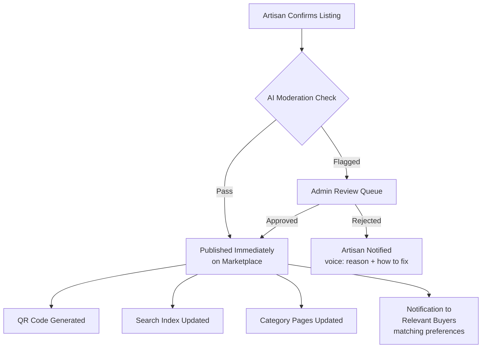

### 18.2 AI Moderation Checks

| Check | Action if Triggered |
|---|---|
| **NSFW content** | Auto-reject + notify artisan |
| **Copyright/trademark violation** | Flag for admin review |
| **Duplicate listing** | Warn artisan ("You already have a similar product") |
| **Unrealistic pricing** | Soft warning, allow publish |
| **Low quality image** | Prompt for better photo, allow publish with warning |
| **Prohibited items** | Auto-reject (weapons, controlled substances, etc.) |
| **Misleading claims** | Flag ("handmade" but image looks factory-produced) |

### 18.3 Digital Craft Passport

Each published product gets a unique QR-code-based Craft Passport:

| Passport Field | Source |
|---|---|
| **Artisan name & photo** | Profile |
| **Artisan location** | GPS + profile |
| **Craft tradition** | AI-classified + artisan input |
| **Making process** | Artisan's voice description |
| **Materials used** | AI-inferred + artisan confirmed |
| **Time to create** | Artisan stated |
| **Artisan's voice story** | Recorded during listing |
| **Certifications** | If any (GI tag, Handloom Mark, etc.) |
| **Carbon footprint estimate** | AI-calculated (Phase 2) |

The QR code is:
- Printed on a card included in the physical shipment
- Scannable in the app and on the web (no app required to view)
- Linked to the artisan's profile for repeat purchases

---

## 19. Orders

### 19.1 Order States

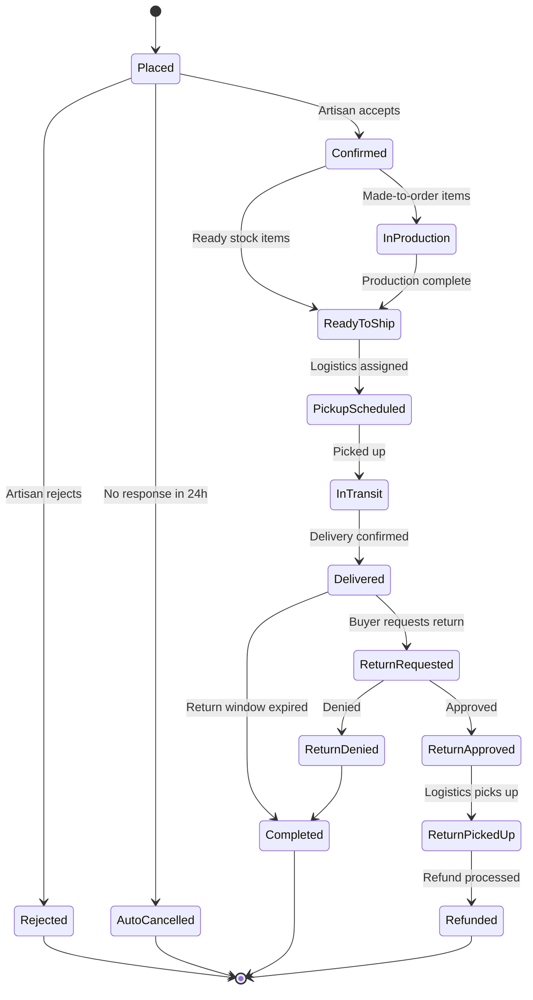

### 19.2 Order Types

| Order Type | Description | Fulfilment Model |
|---|---|---|
| **Single item (B2C)** | One product from one artisan | Direct ship |
| **Multi-item cart (B2C)** | Multiple products, possibly from multiple artisans | Split shipment per artisan |
| **Custom/Made-to-order** | Buyer requests customization | Artisan confirms timeline, produces, ships |
| **Bulk order (B2B)** | Large quantity, possibly requiring cluster | Cluster fulfilment with consolidated tracking |
| **Repeat order** | Buyer reorders a previous purchase | Streamlined flow, artisan pre-notified |

> [!IMPORTANT]
> **Decision Required — D15:** Should multi-artisan cart orders be shipped separately (per artisan) or consolidated at a hub?  
> **Options:**  
> A. Separate shipments — simpler logistics, higher shipping cost for buyer  
> B. Consolidated at a regional hub — lower shipping cost, added delay  
> C. Buyer chooses — "Ship as available" (separate) or "Ship together" (consolidated)  
> **Recommendation:** Option A for MVP, Option C for Phase 2. Consolidation requires regional warehouse infrastructure that won't exist at launch. Let each artisan ship directly to reduce complexity.

---

## 20. Payments

### 20.1 Buyer Payment Methods

| Method | Priority | Notes |
|---|---|---|
| **UPI (GPay, PhonePe, etc.)** | P0 | #1 digital payment in India |
| **Credit/Debit Cards** | P0 | Visa, Mastercard, RuPay |
| **Net Banking** | P1 | Major banks |
| **Cash on Delivery (COD)** | P1 | Important for trust, but higher RTO risk |
| **EMI / Pay Later** | P2 | For high-value items |
| **International Cards** | P2 | For diaspora/global buyers |

### 20.2 Artisan Payout

| Aspect | Specification |
|---|---|
| **Payout method** | Direct bank transfer (NEFT/IMPS) to artisan's bank account |
| **Payout frequency** | Within 3 business days of delivery confirmation (for ready stock); milestone-based for made-to-order |
| **Minimum payout** | ₹100 |
| **KYC required** | Bank account + Aadhaar (for payout, not onboarding) |
| **Payout dashboard** | Voice-enabled: "Aapke account mein ₹2,500 aaj transfer ho gaye" |

### 20.3 Payment Gateway

> [!IMPORTANT]
> **Decision Required — D16:** Which payment gateway to use?  
> **Options:**  
> A. Razorpay — best developer experience, good split payment support  
> B. Cashfree — strong focus on payouts (relevant for artisan payouts)  
> C. PayU — established, good COD support  
> D. Juspay — aggregator that supports multiple gateways  
> **Recommendation:** Option A (Razorpay) or B (Cashfree). Both offer excellent split payment APIs (buyer pays → platform takes commission → artisan gets payout). Cashfree has a slight edge on the payout side with better rural bank support. Final decision should factor in pricing negotiations.

### 20.4 Escrow & Trust

| Mechanism | Description |
|---|---|
| **Escrow hold** | Payment held by platform until delivery confirmed |
| **Auto-release** | If buyer doesn't raise issue within 48h of delivery, payment auto-released to artisan |
| **Dispute hold** | If return/dispute raised, payment held until resolution |

---

## 21. Delivery & Logistics

### 21.1 Logistics Strategy

> [!IMPORTANT]
> **Decision Required — D17:** What logistics model should we use?  
> **Options:**  
> A. Partner with existing logistics aggregator (Shiprocket, Delhivery) — plug-and-play  
> B. India Post as primary carrier — widest rural pickup network  
> C. Hybrid — India Post for rural artisans, private courier for urban artisans  
> D. Aggregator + India Post integration  
> **Recommendation:** Option D. Use a logistics aggregator (Shiprocket/iThink Logistics) that already integrates with India Post AND private couriers. The aggregator auto-selects the best carrier based on artisan location and buyer destination. India Post is critical because it reaches rural locations where private couriers don't.

### 21.2 Shipping Flow (Artisan Side)

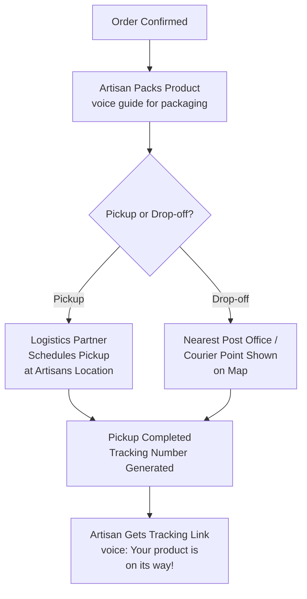

### 21.3 Packaging Support

Many artisans don't have proper packaging materials:

| Solution | Description |
|---|---|
| **Packaging guidelines** | Voice + visual guide for safe packing with available materials |
| **Packaging kits** | Platform-branded packaging available for purchase (at cost) |
| **Eco-packaging** | Encourage natural/recycled packaging materials — aligns with craft ethos |

### 21.4 Delivery Timelines

| Scenario | Expected Timeline |
|---|---|
| Ready stock, urban artisan | 3–5 days |
| Ready stock, rural artisan | 5–10 days |
| Made-to-order | Production time + 5–10 days |
| Bulk/cluster order | As per agreed timeline + 5–10 days |

---

## 22. Returns & Refunds

### 22.1 Return Policy Framework

> [!IMPORTANT]
> **Decision Required — D18:** What should the return policy be for handmade products?  
> **Options:**  
> A. No returns (as-is, handmade items are unique) — simplest but worst buyer trust  
> B. 7-day return for all products — best buyer trust but artisans bear return shipping + damage risk  
> C. Conditional returns: returnable for defects/damage/wrong item, non-returnable for "didn't like it" — balanced  
> D. Category-specific: clothing/textiles returnable, fragile items (pottery/glass) non-returnable unless damaged  
> **Recommendation:** Option C (Conditional). Handmade items are unique and not mass-produced. A "satisfaction guaranteed or money back" policy would be unsustainable. Allow returns only for defects, damage in transit, or wrong item. For "didn't like it," offer exchange or platform credit instead.

### 22.2 Return Flow

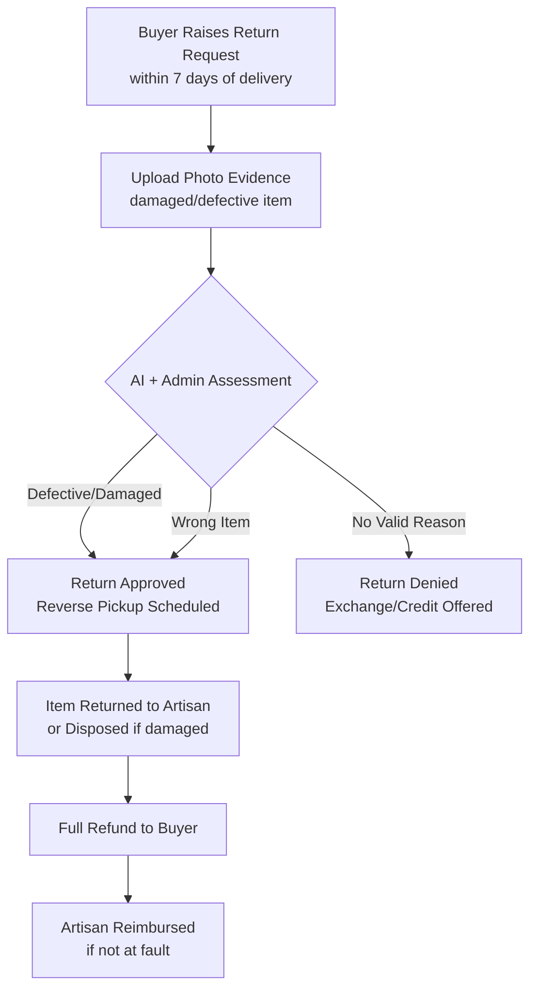

### 22.3 Damage Responsibility

| Damage Cause | Who Bears Cost |
|---|---|
| Manufacturing defect | Artisan (deducted from future payout or insured) |
| Damage in transit | Logistics partner (insurance claim) |
| Buyer mishandling | Buyer (return denied) |
| Wrong item sent | Artisan (correct item sent, or refund) |

> [!NOTE]
> Shipping insurance should be mandatory for items above ₹500. The cost can be included in shipping charges.

---

## 23. Reviews & Trust

### 23.1 Review System

| Feature | Description |
|---|---|
| **Star rating** | 1–5 stars for product quality |
| **Photo reviews** | Buyers can upload photos of received product |
| **Text review** | Written review with auto-translation |
| **Voice review** | (Phase 2) Buyers can leave voice reviews |
| **Verified purchase** | Only buyers who purchased can review |
| **Artisan response** | Artisan can respond to reviews (voice, translated) |

### 23.2 Trust Mechanisms

| Trust Signal | Description |
|---|---|
| **Verified Artisan** badge | Aadhaar-verified identity |
| **Craft Passport** | Full provenance and story |
| **GI Tag** indicator | Geographical Indication certified products |
| **Handloom Mark** | Government-certified handloom products |
| **Repeat Customer %** | Shows % of buyers who ordered again |
| **Artisan Since** | Duration on platform |
| **Fulfilment Score** | On-time delivery rate, acceptance rate |
| **Community Rating** | Average rating across all products |

### 23.3 Fake Review Prevention

| Mechanism | Description |
|---|---|
| Only verified purchasers can review | No incentivized reviews |
| AI detection of review farms | Pattern analysis on review timing, content |
| Photo verification | AI checks if review photo matches product listing |
| Rate limiting | Max 1 review per order per buyer |

---

## 24. Notifications

### 24.1 Notification Channels

| Channel | Artisan | B2C Buyer | B2B Buyer | Admin |
|---|---|---|---|---|
| **Push notification** | ✅ (with voice readback) | ✅ | ✅ | ✅ |
| **In-app** | ✅ (icon-based) | ✅ | ✅ | ✅ |
| **SMS** | ✅ (critical alerts) | ⚠️ (OTP only) | ⚠️ (OTP only) | ❌ |
| **WhatsApp** | ✅ (primary) | ✅ (opt-in) | ✅ (opt-in) | ❌ |
| **Email** | ❌ (most don't have email) | ✅ | ✅ | ✅ |
| **Voice call** | ⚠️ (critical only, e.g., large order) | ❌ | ❌ | ❌ |

### 24.2 Artisan Notification Types

| Event | Channel | Format |
|---|---|---|
| New order | Push + WhatsApp + Voice alert | "Nayi order aayi hai! ₹1,200 ka ek cotton saree order" |
| Order reminder (not accepted in 12h) | Push + SMS | "Aapki order ka jawab dena baaki hai" |
| Payment received | Push + WhatsApp | "₹1,080 aapke bank account mein bhej diye" |
| New review | Push | "Ek customer ne aapko 5 star diya! 'Beautiful saree'" |
| Weekly summary | Push (scheduled) | "Is hafte aapne ₹5,400 kamaye, 4 products bike" |
| Price suggestion update | Push | "Market mein demand badhi hai — price update karna chahenge?" |
| Cluster order invitation | Push + WhatsApp + Voice | "Ek bada order aaya hai — kya aap 50 mein se 10 saree bana sakti hain?" |

---

## 25. Analytics

### 25.1 Artisan Analytics (Voice-First)

The analytics for artisans should be delivered primarily through **voice summaries** and **simple visual charts**:

| Metric | Visualization | Voice Summary |
|---|---|---|
| **Total earnings** (week/month) | Large number + trend arrow | "Is mahine aapne ₹12,000 kamaye — pichle mahine se 20% zyada!" |
| **Products sold** | Count with icons | "Aapki 8 cheezein bikin" |
| **Top product** | Product photo + count | "Sabse zyada bika: Cotton Madhubani Saree — 3 bar" |
| **Profile views** | Simple bar chart | "132 logon ne aapke products dekhe" |
| **Rating** | Star display | "Aapki rating 4.7 star hai — bahut accha!" |
| **Pending actions** | Icon list | "2 orders ka jawab dena hai, 1 delivery pending" |

### 25.2 Admin Analytics Dashboard

| Category | Metrics |
|---|---|
| **Business** | GMV, revenue, commission earned, average order value, orders/day |
| **Supply** | Active artisans, new registrations, listings/artisan, listing quality scores |
| **Demand** | Active buyers, DAU/MAU, conversion rate, cart abandonment rate |
| **Fulfilment** | On-time delivery %, return rate, dispute rate, average delivery time |
| **AI Performance** | Catalog generation accuracy, image enhancement quality, pricing accuracy |
| **Regional** | State-wise heatmap of artisans, orders, revenue |
| **Craft-wise** | Performance by craft category |
| **Cluster** | Active clusters, cluster fulfilment rate, cluster satisfaction |

### 25.3 B2B Buyer Analytics

| Metric | Description |
|---|---|
| **Order history** | All past and current orders with status |
| **Spend analytics** | Total spend, category-wise breakdown |
| **Cluster performance** | On-time delivery, quality ratings for clusters used |
| **Reorder suggestions** | AI-suggested reorders based on past patterns |

---

## 26. Support

### 26.1 Support Architecture

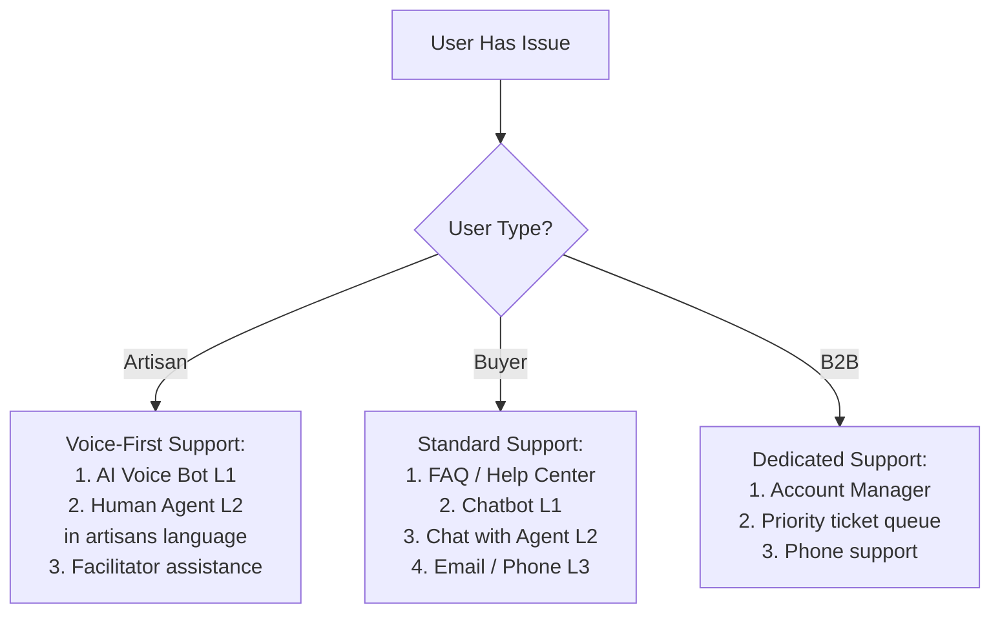

### 26.2 Artisan Support — Special Considerations

| Consideration | Approach |
|---|---|
| **Language** | Support in artisan's registered language |
| **Literacy** | Voice-based support, not text tickets |
| **Common issues** | How to take a better photo, how to change price, where is my payment, how to pack a product |
| **Facilitator as first responder** | If artisan is linked to a facilitator, route issue to facilitator first |
| **Proactive support** | App detects struggling artisans (no sales in 30 days) and proactively offers help |

---

## 27. Government Marketplace Integration

### 27.1 Integration Opportunities

| Platform | Type | Integration Approach | Priority |
|---|---|---|---|
| **GeM (Government e-Marketplace)** | Procurement | API integration to list artisan products on GeM; handle GeM orders through Kalakar Setu | P1 |
| **ONDC (Open Network for Digital Commerce)** | Commerce network | Register as ONDC seller app; artisan products discoverable across ONDC buyer apps | P1 |
| **Tribes India (TRIFED)** | Tribal artisan marketplace | Data sharing, cross-listing | P2 |
| **Craftmark / Handloom Mark** | Certification | Verify and display certification badges | P1 |
| **MSME Udyam Registration** | Business registration | Help artisans register as MSME through app | P2 |
| **PM Vishwakarma Scheme** | Government scheme | Link artisans to scheme benefits (toolkit, training, credit) | P2 |
| **National Handicrafts & Handlooms Museum** | Cultural documentation | Contribute to national craft documentation | P3 |

### 27.2 ONDC Integration

> [!IMPORTANT]
> **Decision Required — D19:** Should Kalakar Setu integrate with ONDC?  
> **Options:**  
> A. Yes, as a Seller Network Participant (SNP) — artisan products visible on all ONDC buyer apps (Paytm, PhonePe, etc.)  
> B. Yes, as both SNP and Buyer Network Participant (BNP) — also allow ONDC seller products on Kalakar Setu  
> C. No — build independent marketplace first  
> **Recommendation:** Option A. ONDC integration as SNP gives artisans massive reach across Paytm, PhonePe, Meesho, and other buyer apps. This aligns with government digital commerce strategy (strong for SIH). However, ONDC integration adds complexity — plan for Phase 2 launch.

---

## 28. Security

### 28.1 Security Requirements

| Domain | Requirement | Implementation |
|---|---|---|
| **Authentication** | Phone-based OTP (primary), biometric (optional) | Firebase Auth / custom OTP service |
| **Authorization** | Role-based access control (RBAC) | API-level enforcement |
| **Data encryption** | At rest (AES-256) and in transit (TLS 1.3) | Standard cloud provider encryption |
| **Payment security** | PCI-DSS compliance via payment gateway | Razorpay/Cashfree handles PCI |
| **Personal data** | DPDP Act 2023 compliance | Consent management, data minimization, deletion rights |
| **Aadhaar data** | Never stored on device or servers; use UIDAI API for verification only | Tokenized verification |
| **Voice data** | Stored only with artisan consent; deletable | Explicit consent during recording |
| **Image data** | Artisan retains ownership; platform gets usage license | Clear terms of service |
| **API security** | Rate limiting, API keys, JWT tokens | Standard API gateway |
| **Fraud prevention** | AI-based fraud detection (fake listings, price manipulation) | Rule engine + ML models |

### 28.2 Privacy Considerations

| Data Type | Retention | Artisan Control |
|---|---|---|
| **Voice recordings** | As long as listing is active | Can delete anytime |
| **Photos** | As long as listing is active | Can delete anytime |
| **Location** | Approximate (district-level) shown to buyers; exact stored for logistics | Can choose to hide |
| **Financial data** | As per RBI regulations | View-only, cannot modify historical |
| **Personal identity** | As per DPDP Act | Can request deletion (right to erasure) |

---

## 29. Accessibility

### 29.1 Accessibility Standards

| Requirement | Implementation |
|---|---|
| **Screen reader support** | Full TalkBack (Android) / VoiceOver (iOS) compatibility |
| **Text scaling** | Support system font scaling up to 200% |
| **Color contrast** | WCAG 2.1 AA minimum (4.5:1 for text) |
| **Touch targets** | Minimum 48x48dp tap targets |
| **Voice navigation** | App fully navigable by voice commands |
| **Haptic feedback** | Vibration for key actions (order confirmed, payment received) |
| **Audio cues** | Distinct sounds for different notification types |
| **Low vision** | High contrast mode, icon-heavy design |
| **Motor disabilities** | Single-hand operation, minimal complex gestures |

### 29.2 Specific Artisan Accessibility Needs

| Need | Solution |
|---|---|
| **Older artisans (50+) with poor eyesight** | Extra-large icons, high contrast, voice-everything |
| **Artisans who can't read any script** | Pure icon + voice UI for core flows |
| **Artisans with limited hand dexterity** (craft-related injuries) | Voice-only mode for everything except camera |
| **Shared phone** (family shares one device) | Multi-profile support on single device |

> [!IMPORTANT]
> **Decision Required — D20:** Should the app support multiple artisan profiles on a single device?  
> **Recommendation:** Yes. In many households, one smartphone is shared. Allow switching between artisan profiles with simple PIN or voice authentication. This is critical for facilitators who onboard multiple artisans using their own device.

---

## 30. Low-Literacy UX

### 30.1 Design Principles for Low-Literacy Users

| Principle | Implementation |
|---|---|
| **Icon-first** | Every action has a distinct, culturally relevant icon. No icon-only buttons without tooltip/voice label |
| **Voice-first** | All text content can be read aloud; all input can be spoken |
| **Minimal text** | UI uses icons + numbers + minimal text labels (in local script) |
| **Large touch targets** | Buttons 56dp or larger, well-spaced |
| **Linear flows** | One decision per screen, no complex multi-step forms |
| **Visual confirmations** | Animations + sounds for success/failure (checkmark animation, error buzz) |
| **Undo-friendly** | Every action is easily reversible; "delete" has confirmation |
| **No typing required** | Numeric keypad for price; everything else is voice or tap |
| **Color coding** | Consistent color meanings (green = success/money, red = alert, blue = info) |
| **Progressive disclosure** | Show only what's needed now; advanced features hidden until needed |
| **Cultural metaphors** | Use familiar concepts (marketplace, shop, khata) not tech jargon |

### 30.2 Navigation Design

```
 Bottom Tab Bar (4 icons, always visible)

 🏠 Home    📦 Orders    ➕ List    👤 Me

 + Central FAB for quick photo capture

 + 🎤 Floating mic button for voice
    commands (always accessible)
```

### 30.3 Onboarding for First-Time Users

| Step | Design |
|---|---|
| 1 | Full-screen welcome in detected language, auto-play voice greeting |
| 2 | Three swipeable tutorial screens with animations (no text reading required) |
| 3 | "Take your first photo" — camera opens with voice guidance |
| 4 | Voice-guided listing creation with progressive celebration |
| 5 | First listing published — confetti animation + voice congratulation |

---

## 31. Offline / Poor-Network Scenarios

### 31.1 Offline Capability Matrix

| Feature | Offline? | Sync Strategy |
|---|---|---|
| **Take product photos** | ✅ Full | Stored locally, uploaded when online |
| **Record voice description** | ✅ Full | Stored locally, processed when online |
| **View own listings** | ✅ Full | Cached locally |
| **Edit own listings (price, description)** | ✅ Full | Changes queued, synced when online |
| **AI image enhancement** | ⚠️ Basic only | Basic on-device; advanced queued for cloud |
| **AI catalog generation** | ⚠️ Partial | Cached model for common crafts; full generation queued |
| **View orders** | ✅ Cached | Last-synced data shown with "last updated" timestamp |
| **Accept/reject orders** | ✅ Queued | Action queued, synced when online |
| **Browse marketplace (buyer)** | ⚠️ Cached | Previously browsed products available; new search requires network |
| **Place order (buyer)** | ❌ | Requires network for payment |
| **Voice commands** | ⚠️ Basic | On-device for navigation; cloud for complex NLU |
| **Notifications** | ❌ | Requires network; SMS fallback for critical alerts |

### 31.2 Sync Architecture

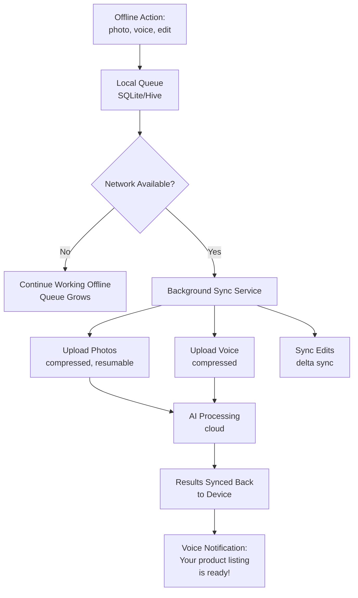

### 31.3 Network-Aware Design

| Network State | App Behavior |
|---|---|
| **No network** | Full offline mode, clear indicator, all actions queued |
| **2G (< 50 kbps)** | Text-only sync, images queued for better connection |
| **3G (50–500 kbps)** | Compressed images, reduced quality previews |
| **4G/WiFi** | Full experience |
| **Intermittent** | Resumable uploads, automatic retry with exponential backoff |

> [!IMPORTANT]
> **Decision Required — D21:** How aggressive should the offline-first approach be?  
> **Options:**  
> A. Minimal offline — only photo capture and voice recording work offline  
> B. Moderate offline — above + cached listings, order viewing, basic editing  
> C. Heavy offline — above + on-device AI models for catalog generation and image enhancement  
> **Recommendation:** Option B for MVP, Option C for Phase 2. On-device AI models (Option C) significantly increase app size (500MB+) and require powerful devices, which many artisans don't have. Option B covers 90% of offline needs with minimal app size impact.

---

## 32. Edge Cases

### 32.1 Artisan Edge Cases

| Edge Case | Scenario | Handling |
|---|---|---|
| **Shared phone** | Multiple family members are artisans using one phone | Multi-profile support with PIN switching |
| **Artisan changes phone** | Gets new phone, old data lost | Cloud-synced account, OTP-based login on new device, auto-restore |
| **Artisan is a minor** | 16-year-old skilled weaver | Require guardian's Aadhaar for verification; minor can create listings but payments go to guardian's account |
| **Artisan has no bank account** | Wants to sell but can't receive payments | Facilitate Jan Dhan account opening (link to nearest bank/CSC); allow facilitator's account temporarily |
| **Same product, multiple artisans** | 5 artisans in same village make identical products | Each artisan lists independently; AI distinguishes by artisan story/quality; no duplicate suppression |
| **Artisan stops responding** | Has active orders but goes silent (festival, illness) | Auto-cancel after 48h non-response; notify buyer; flag artisan profile (don't penalize — check on them) |
| **Artisan's product is a copy/fake** | Lists factory-made item as handmade | AI detection (image analysis for machine-made patterns); admin review queue; strike system |
| **Seasonal artisans** | Artisan is a farmer who crafts only during off-season | Support "vacation mode" — pause listings without losing profile/ratings |
| **Artisan collective / SHG** | Group wants one account | Support "Group Seller" account type with individual member profiles |
| **Very expensive product** | One-of-a-kind artwork above 50,000 | Enhanced listing with provenance certificate; escrow with milestone payments; insurance required |

### 32.2 Buyer Edge Cases

| Edge Case | Scenario | Handling |
|---|---|---|
| **Buyer expects Amazon-like delivery** | Wants next-day delivery for handmade item | Clear expectation setting in UX: "Handmade with love — allow 5–10 days" |
| **Buyer wants customization** | "Can you make this in blue instead of red?" | In-app chat (translated) between buyer and artisan; artisan can accept/decline custom request |
| **International buyer** | US-based NRI wants to buy | International shipping via logistics partner; customs documentation; pricing in USD with conversion |
| **Buyer disputes authenticity** | "This doesn't look handmade" | Craft Passport verification; admin review; artisan provides making process video |
| **Buyer wants to visit artisan** | Wants craft tourism experience | (Phase 2) "Visit the Artisan" feature — connect for studio visits |
| **Gift purchases** | Buyer wants product sent to different address with personal message | Gift wrapping option; custom message card; hide price in package |

### 32.3 System Edge Cases

| Edge Case | Scenario | Handling |
|---|---|---|
| **AI generates wrong category** | Pottery classified as home decor | Artisan can correct during review; feedback improves model |
| **AI suggests absurd price** | ₹50 for a 10-day handmade saree | Price floor based on minimum labour cost; "Are you sure?" for prices below threshold |
| **STT fails in noisy environment** | Background noise corrupts voice input | Noise detection + prompt: "It's a bit noisy — can you speak closer to the phone?" |
| **Unsupported language/dialect** | Artisan speaks Bhojpuri (not a scheduled language) | Fall back to closest supported language (Hindi); flag for language team expansion |
| **Bulk order — artisan drops out mid-production** | Cluster of 5, 1 artisan stops responding | AI reassigns quota to remaining artisans or finds replacement; notify cluster lead and buyer |
| **Payment gateway down** | Razorpay outage during peak sale | Failover to secondary gateway; COD as fallback |
| **Photo is not a product** | Artisan accidentally photographs face, food, etc. | AI object detection: "This doesn't look like a product — try again?" |
| **Duplicate Craft Passport scan** | Counterfeit QR code on fake product | Each QR is one-time-verifiable to original buyer; subsequent scans show "previously verified by buyer" |

### 32.4 Scale Edge Cases

| Edge Case | At What Scale | Mitigation |
|---|---|---|
| **Search performance** | 100K+ listings | Elasticsearch / Algolia with proper indexing |
| **Image storage costs** | 1M+ images | CDN + tiered storage (hot/warm/cold) |
| **AI processing bottleneck** | 1K+ concurrent listings | Auto-scaling cloud functions; queue-based processing |
| **Regional concentration** | 80% artisans from 3 states | Proactive outreach to underrepresented states |
| **Festival surge** | Diwali/Rakhi/Pongal demand spikes | Pre-season artisan preparation campaigns; inventory buffers |

---

## 33. Decisions Requiring Product Owner Approval

The following decisions have been identified as requiring explicit product owner input before proceeding to design and development. Each decision is marked with a recommended option, but the final call rests with the product owner.

| # | Decision | Options Summary | Recommendation | Impact |
|---|---|---|---|---|
| **D1** | Should "Facilitators" be a formal user role? | A. Formal role with separate app / B. No formal role / **C. Formal role, same app** | **C** | Architecture, UX |
| **D2** | Separate "Cluster Lead" role? | A. Yes, separate role / **B. Auto-assign + opt-in** | **B** | Cluster UX |
| **D3** | Aadhaar verification timing? | A. At onboarding / B. At first payout / **C. Tiered** | **C** | Onboarding, trust |
| **D4** | Order model: ready-to-ship vs. made-to-order? | A. Ready-to-ship only / B. Accept/reject / **C. Hybrid** | **C** | Order flow, UX |
| **D5** | Buyer app: native, web, or both? | A. Native only / B. Web only / C. Both / **D. Android artisan + web+mobile buyer** | **D** | Tech stack, timeline |
| **D6** | Admin platform type? | **A. Web dashboard only** / B. Web + mobile | **A** | Admin UX |
| **D7** | B2B bulk pricing model? | A. Fixed tiers / B. Negotiation / **C. AI-suggested + artisan confirm** | **C** | B2B revenue |
| **D8** | Cluster order quality control? | A. Self-report / B. Facilitator QC / C. Buyer QC / **D. Layered combination** | **D** | Quality, cost |
| **D9** | AI catalog review before publish? | A. Auto-publish / B. Admin review / **C. Auto-publish + AI moderation flags** | **C** | Speed vs. safety |
| **D10** | AI lifestyle images for products? | A. Yes / B. No / **C. Phase 2** | **C** | Tech complexity |
| **D11** | Speech-to-text engine? | A. Google / B. Azure / C. Bhashini / **D. Bhashini + Google fallback** | **D** | Cost, accuracy |
| **D12** | Languages at launch? | **Hindi + English + 2 regional** | Per pilot region | Scope |
| **D13** | Platform commission model? | A. Fixed % / B. Tiered / C. Zero / D. Freemium / **E. Hybrid 5% + premium** | **E** | Revenue |
| **D14** | WhatsApp Business API integration? | **Yes, but P1** (not MVP) | P1 | Engagement |
| **D15** | Multi-artisan cart shipping model? | **A. Separate (MVP)** → C. Buyer chooses (Phase 2) | **A → C** | Logistics |
| **D16** | Payment gateway? | **A. Razorpay** / B. Cashfree / C. PayU / D. Juspay | **A or B** | Payments |
| **D17** | Logistics model? | A. Aggregator / B. India Post / C. Hybrid / **D. Aggregator + India Post** | **D** | Delivery |
| **D18** | Return policy? | A. No returns / B. 7-day all / **C. Conditional** / D. Category-specific | **C** | Buyer trust |
| **D19** | ONDC integration? | **A. Yes, as seller (Phase 2)** / B. Yes, as both / C. No | **A** | Market reach |
| **D20** | Multi-profile on single device? | **Yes** | Yes | Accessibility |
| **D21** | Offline-first aggressiveness? | A. Minimal / **B. Moderate (MVP)** → C. Heavy (Phase 2) | **B → C** | App size, UX |

---

### Additional Open Questions (Not Yet Addressed)

| # | Question | Context |
|---|---|---|
| **Q1** | What are the pilot regions/states for launch? | Determines language priority, craft types, logistics partnerships, and facilitator recruitment |
| **Q2** | What is the target number of artisans for MVP launch? | 100? 1,000? 10,000? — impacts infrastructure planning |
| **Q3** | Is there a partnership with any existing artisan registry (DC Handicrafts, TRIFED, State Handloom Boards)? | Could accelerate artisan onboarding with pre-verified data |
| **Q4** | What is the expected timeline for MVP vs. full product? | Determines phasing of all P1/P2 features |
| **Q5** | Is there a budget for artisan onboarding camps (field agents, facilitators)? | Impacts go-to-market strategy |
| **Q6** | Should the app support artisan-to-artisan skill sharing or mentorship? | Community feature — scope creep risk but high impact |
| **Q7** | Should there be a "craft learning" section for buyers interested in craft traditions? | Content marketing + cultural preservation angle |
| **Q8** | Will the platform handle GST registration assistance for artisans? | Many artisans are below GST threshold (40L) but B2B buyers need GST invoices |
| **Q9** | What happens when an artisan passes away or retires? | Legacy handling — archive products? Transfer to apprentice/family? |
| **Q10** | Should the platform offer working capital / micro-loans to artisans? | Fintech angle — high impact but regulatory complexity |

---

> [!CAUTION]
> **This document is a living artifact.** No decisions should be silently assumed. All 21 decisions (D1–D21) and 10 open questions (Q1–Q10) require explicit product owner sign-off before moving to the UX design and technical architecture phases.

---

*Document prepared as part of Product Discovery for Kalakar Setu — Smart India Hackathon submission.*
