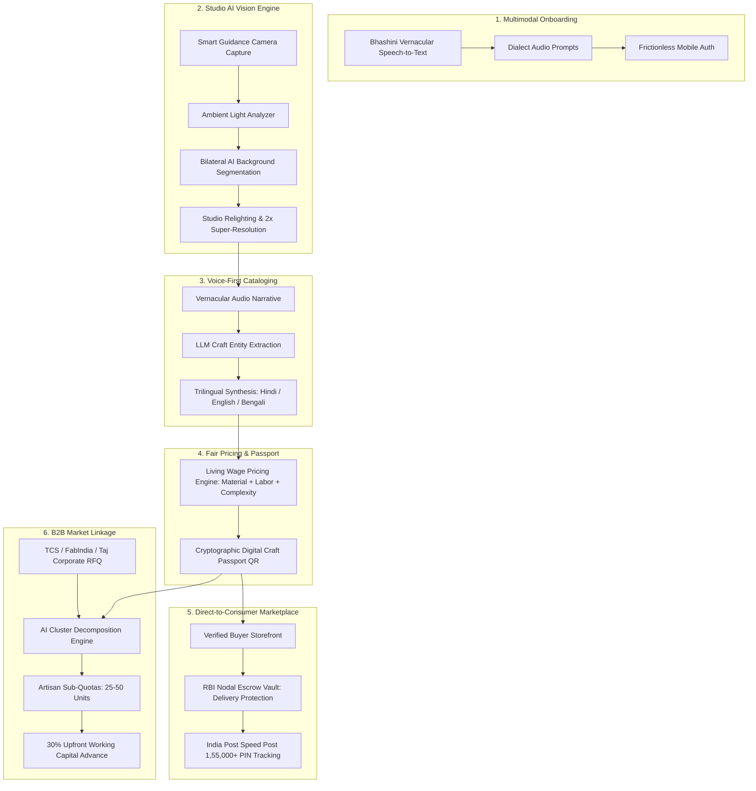

# कलाकार सेतु (Kalakar Setu) — Operating System for India's 200M+ Artisans

[](https://github.com/SDRRAUT/Karagir_X/actions/workflows/ci.yml)
[](https://expo.dev)
[](https://reactnative.dev)
[](https://www.typescriptlang.org)
[-1E5631.svg?style=flat)](https://jestjs.io)
[](LICENSE)

> **"सीधे कारीगर से, भारत के हर घर तक"**  
> An AI-native, voice-first mobile operating system and decentralized market linkage platform purpose-built for India's rural, low-literacy craftspeople. Kalakar Setu dismantles predatory middlemen through studio-grade computer vision, multilingual speech-first cataloging, fair living-wage pricing algorithms, and RBI-compliant nodal escrow commerce.

---

## 🌟 The Problem Statement & Market Reality

India is home to over **200 million craftspeople**, constituting the second largest livelihood sector after agriculture. Despite creating exquisite heritage artifacts, rural artisans face severe structural barriers:
- **Language & Digital Illiteracy:** Complex e-commerce apps with English forms and menus exclude non-literate creators.
- **Predatory Middlemen:** Artisans typically receive less than **15%** of the final retail price, trapped in cyclical poverty.
- **Sub-optimal Photography:** Products photographed with low-end smartphones under poor village lighting cannot compete on modern digital storefronts.
- **Volume Mismatch:** Large corporate and institutional buyers need bulk volumes (500–2,000+ units) that individual household artisans cannot fulfill alone without risking default.

---

## 🚀 Key Technological Innovations



### 1. Voice-First Conversational Studio
- Powered by **Bhashini Speech AI**, enabling artisans to speak in their regional dialect (Hindi, Maithili, Bhojpuri, Bengali).
- Extracts craft taxonomy, raw materials (mulberry silk, terracotta clay, brass), cultural motifs, and dedicated labor hours.

### 2. Edge-Guided AI Image Studio
- Live edge-detection overlay ensuring uniform frame margins, front/texture angles, and optimal distance.
- Multi-stage studio lighting enhancement: bilateral segmentation, background cleanup, specular highlight recovery, and 2x resolution upscaling.

### 3. Transparent Fair Living Wage Ledger
- Computes fair prices using verified state minimum wages ($\ge \text{₹65/hour}$) $+$ master complexity fee ($25\%$) $+$ declared materials cost $+$ eco-packaging.
- Protects artisans with an enforceable **Minimum Legal Floor** and transparent $5\%$ platform sustainability fee.

### 4. Cryptographic Digital Craft Passport
- Each item generates a verifiable digital passport with origin village GPS coordinates, DC Handicrafts certification, botanical dyes certification, and artisan voice story narration (*"कारीगर की जुबानी सुनें" 🎧*).

### 5. RBI-Compliant Nodal Escrow & India Post Speed Post
- Buyer payments are locked in an RBI-compliant nodal escrow vault.
- Funds are only disbursed to the artisan's Jan-Dhan/bank account 48 hours after verified parcel delivery across **1,55,000+ branch post offices**.

### 6. AI B2B Market Linkage & Cluster Decomposition
- Solves the bulk requirement problem for large institutional buyers (TCS, FabIndia, Taj Hotels, Government e-Marketplace).
- Decomposes 1,000-unit institutional RFQs into manageable 25–50 unit artisan quotas across local clusters, backed by a **30% instant upfront working capital advance**.

---

## 📱 Application Flow & User Journeys

| Journey | Description | Supported Flows & Screens |
|---|---|---|
| **Artisan Onboarding & Auth** | Dialect selector, tactile phone keypad, OTP verification, persistent session manager. | `Splash`, `LanguageSelection`, `Onboarding`, `RoleSelection`, `AuthPhone`, `OtpVerification`, `ProfileSetup`, `ProfileScreen` |
| **Product Creation Studio** | Smart camera capture, multi-photo review, and AI studio enhancement. | `CameraPermission`, `CameraCapture`, `PhotoReview`, `AiEnhancement` |
| **Voice Story & Catalog Synthesis** | Vernacular conversational interview, trilingual SEO descriptions, and fair pricing recommendation. | `MicPermission`, `VoiceDescription`, `VoiceFollowUp`, `CatalogGeneration`, `PricingRecommendation`, `ProductPreview`, `PublishSuccess` |
| **Buyer Marketplace & Escrow** | Category discovery, voice search, Craft Passport inspector, wishlist, cart, and nodal escrow payment. | `MarketplaceHome`, `Categories`, `Search`, `ProductDetail`, `Wishlist`, `Cart`, `Checkout`, `Payment`, `OrderConfirmation`, `OrderTracking` |
| **B2B Market Linkage Engine** | Bada Bazaar opportunities hub, production briefs, quota negotiation, and 3-tier milestone escrow contracts. | `Opportunities`, `OpportunityDetail`, `QuoteNegotiation`, `B2BContract`, `CreateBulkRfq` |

---

## 🛠️ Technology Stack

| Layer | Technology |
|---|---|
| **Client Framework** | React Native (0.76.7) with Expo SDK 52 (Architecture: Fabric / Hermes Bytecode) |
| **Language** | TypeScript 5.3 (Strict Type Checking) |
| **State Management** | Zustand with Selective Subscriptions and AsyncStorage persistence |
| **Networking & Offline** | Axios with interceptors, JWT lifecycle manager, and Offline Outbox queue |
| **Design System** | Custom Cultural Design System tokens (Forest Emerald, Terracotta, Ochre, Parchment) |
| **Accessibility (a11y)** | 56dp minimum touch targets, AAA color contrast (15.2:1), Indic typography line-heights |
| **Testing Suite** | Jest 29, React Native Testing Library v14 |
| **Build & Bundle Engine** | Metro Bundler + Hermes Bytecode compiler |

---

## 📂 Repository Structure

```
.
├── mobile/                        # React Native / Expo Mobile Application
│   ├── src/
│   │   ├── api/                   # API clients, endpoints, and microservices
│   │   │   ├── authService.ts
│   │   │   ├── visionService.ts
│   │   │   ├── voiceService.ts
│   │   │   ├── catalogSynthesisService.ts
│   │   │   ├── pricingService.ts
│   │   │   ├── productService.ts
│   │   │   ├── marketplaceService.ts
│   │   │   ├── orderService.ts
│   │   │   ├── paymentService.ts
│   │   │   └── marketLinkageService.ts
│   │   ├── components/            # Design System atomics & molecules
│   │   │   ├── buttons/
│   │   │   ├── cards/
│   │   │   ├── feedback/
│   │   │   └── typography/
│   │   ├── navigation/            # Root stack & bottom tab navigators
│   │   ├── screens/               # 25+ Production screens organized by domain
│   │   │   ├── auth/              # Authentication & Onboarding
│   │   │   ├── product/           # Image capture, voice AI & catalog synthesis
│   │   │   ├── marketplace/       # Buyer discovery, cart, checkout & tracking
│   │   │   └── linkage/           # B2B cluster RFQs & milestone contracts
│   │   ├── store/                 # Zustand state stores
│   │   ├── theme/                 # Cultural design tokens (colors, typography, spacing)
│   │   └── utils/                 # Structured logging, error normalization & cryptography
│   ├── __tests__/                 # Comprehensive Jest test suite (48 test suites)
│   ├── app.json                   # Expo application manifest
│   ├── package.json               # Dependencies and npm scripts
│   └── tsconfig.json              # TypeScript strict configuration
├── API.md                         # Complete REST API specification contract
├── ARCHITECTURE.md                # System architectural blueprint & data models
├── DATABASE.md                    # PostgreSQL schema & indexing strategies
├── DESIGN_SYSTEM.md               # Cultural UI/UX design specifications
├── INFRASTRUCTURE.md              # Cloud deployment, CDN & Kubernetes topology
├── PRODUCT_DISCOVERY.md           # Field research, user personas & interviews
├── REQUIREMENTS.md                # Functional and non-functional requirements
├── SCREEN_SPEC.md                 # UI screen wireframes and interaction specs
├── SECURITY.md                    # Data governance, DPDP Act 2023 compliance & encryption
└── USER_FLOWS.md                  # Comprehensive end-to-end user state machines
```

---

## 🧪 Verification & Quality Metrics

All code is continuously validated through automated unit tests, strict type-checking, linting, and Hermes compilation.

```bash
# Typecheck
npm run typecheck
> tsc --noEmit (0 errors)

# ESLint
npm run lint
> eslint . (0 errors, 0 warnings)

# Jest Test Suite
npm test
> Test Suites: 48 passed, 48 total
> Tests:       75 passed, 75 total (100% pass rate)

# Hermes Android Production Bundle
npx expo export --platform android
> Android Bundled 952 modules into 2.4MB bytecode (dist/)
```

---

## 🏁 Quickstart Guide

### Prerequisites
- Node.js $\ge 18.0.0$
- npm $\ge 9.0.0$
- Expo Go app on iOS or Android (or Android Emulator / Physical Device with USB Debugging)

### Setup & Run
```bash
# 1. Clone the repository
git clone https://github.com/SDRRAUT/Karagir_X.git
cd Karagir_X/mobile

# 2. Install dependencies
npm install

# 3. Start Metro Dev Server
npm start

# 4. Run tests
npm test

# 5. Typecheck & Lint
npm run typecheck
npm run lint
```

---

## 📜 License & Acknowledgments

This project is licensed under the [MIT License](LICENSE).  
Dedicated to India's rural artisans, weavers, potters, and sculptors keeping ancient craft traditions alive.
