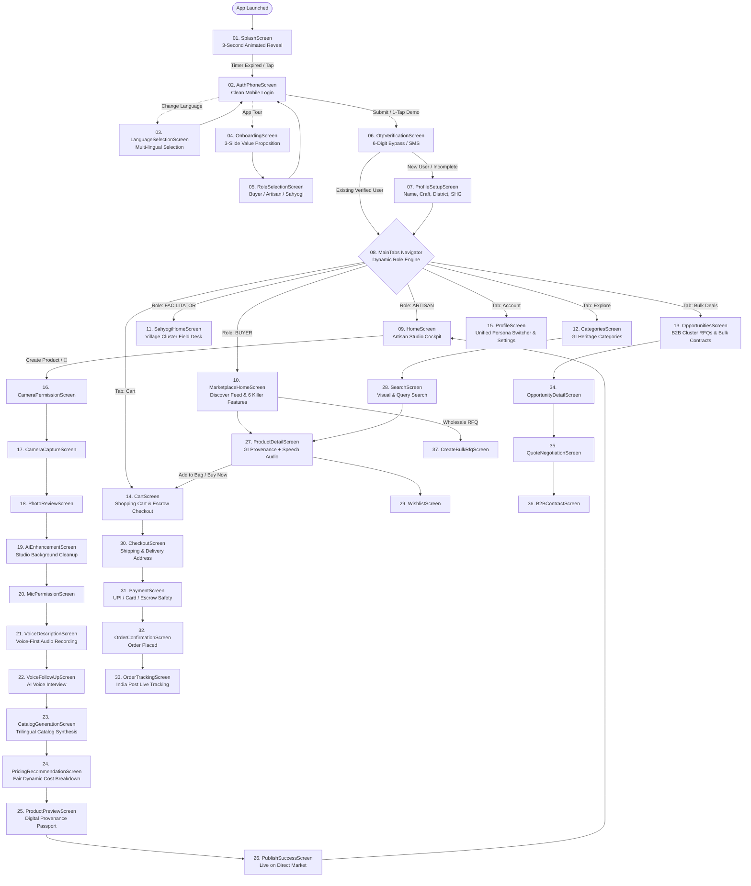
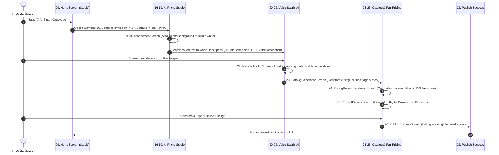
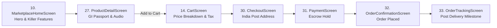

# KaragirX — UI/UX Master Screen Flow & Navigation Architecture

> **Purpose**: Definitive end-to-end architectural map of all screens, user journeys, navigation state machines, and voice guidance touchpoints across the **KaragirX** mobile application.

---

## 1. Master System Flowchart

---

## 2. Phase-by-Phase Screen Transitions

### Phase 1: Launch, Onboarding & Authentication Flow

| Step | Screen Name | Route ID | Triggers & Transitions | User Action | Audio Guidance (`VoiceCueButton`) |
|:---:|:---|:---|:---|:---|:---:|
| **01** | **[SplashScreen](file:///c:/Users/rauts/OneDrive/Desktop/karagir%20se/mobile/src/screens/auth/SplashScreen.tsx)** | `Splash` | Auto-navigates after **3.0 seconds** (or tap anywhere) $\rightarrow$ `AuthPhone` | Watch 3s logo reveal / Tap to skip | ❌ Ambient animation |
| **02** | **[AuthPhoneScreen](file:///c:/Users/rauts/OneDrive/Desktop/karagir%20se/mobile/src/screens/auth/AuthPhoneScreen.tsx)** | `AuthPhone` | • Select Role Pill (Buyer / Artisan / Sahyogi) • Tap `⚡ 1-Tap Demo` $\rightarrow$ `MainTabs` • Enter 10-digit mobile + tap `Continue` $\rightarrow$ `OtpVerification` • Tap `🌐 Change Language` $\rightarrow$ `LanguageSelection` • Tap `ℹ️ App Tour` $\rightarrow$ `Onboarding` | Input mobile or tap 1-tap demo | 🔊 *"कृपया अपना 10 अंकों का मोबाइल नंबर यहाँ दर्ज करें।"* |
| **03** | **[OnboardingScreen](file:///c:/Users/rauts/OneDrive/Desktop/karagir%20se/mobile/src/screens/auth/OnboardingScreen.tsx)** | `Onboarding` | 3 Value Proposition Carousel Slides: 1. Photo Studio AI 2. Voice Saathi Fair Pricing 3. Direct Escrow Payouts • Tap `Skip` or `Get Started` $\rightarrow$ `RoleSelection` | Swipe slides / Tap Next | 🔊 Dedicated Hindi audio explanation button on each slide |
| **04** | **[LanguageSelectionScreen](file:///c:/Users/rauts/OneDrive/Desktop/karagir%20se/mobile/src/screens/auth/LanguageSelectionScreen.tsx)** | `LanguageSelection` | Choose from 8 Indian languages (English, Hindi, Bengali, Marathi, Tamil, Telugu, Gujarati, Odia) $\rightarrow$ Returns to `AuthPhone` | Tap language tile | 🔊 Voice sample in target language |
| **05** | **[RoleSelectionScreen](file:///c:/Users/rauts/OneDrive/Desktop/karagir%20se/mobile/src/screens/auth/RoleSelectionScreen.tsx)** | `RoleSelection` | Choose account persona: • **Artisan / Seller** • **Buyer / Corporate** • **Cluster Sahyogi / Helper** $\rightarrow$ Navigates to `AuthPhone` with preselected persona | Tap persona card | 🔊 Role responsibility description |
| **06** | **[OtpVerificationScreen](file:///c:/Users/rauts/OneDrive/Desktop/karagir%20se/mobile/src/screens/auth/OtpVerificationScreen.tsx)** | `OtpVerification` | • Default testing code `123456` or SMS OTP • Tap `Verify & Continue` $\rightarrow$   - If profile incomplete: `ProfileSetup`   - If verified user: `MainTabs` | Enter 6 digits or tap Verify | 🔊 *"आपके मोबाइल नंबर पर भेजा गया 6 अंकों का ओटीपी दर्ज करें।"* |
| **07** | **[ProfileSetupScreen](file:///c:/Users/rauts/OneDrive/Desktop/karagir%20se/mobile/src/screens/auth/ProfileSetupScreen.tsx)** | `ProfileSetup` | • 1. Full Name (Dictate or Type) • 2. Craft Specialization (6 Grid Tiles) • 3. Workshop Location & District • 4. SHG / Facilitator Code (Optional) • Tap `Complete Setup` $\rightarrow$ `MainTabs` | Fill profile details | 🔊 Speaker icons next to each of the 4 inputs with field instructions |

---

### Phase 2: Master Artisan & Seller Studio Flow

| Step | Screen Name | Route ID | Screen Purpose & Primary Interaction | Next Screen |
|:---:|:---|:---|:---|:---|
| **09** | **[HomeScreen](file:///c:/Users/rauts/OneDrive/Desktop/karagir%20se/mobile/src/screens/HomeScreen.tsx)** | `MainTabs` $\rightarrow$ `HomeTab` | Artisan Production Cockpit: daily orders, earnings ledger (₹), batch tracking, and AI camera launch button | Tap 📸 AI Smart Catalogue $\rightarrow$ `CameraPermission` |
| **16** | **[CameraPermissionScreen](file:///c:/Users/rauts/OneDrive/Desktop/karagir%20se/mobile/src/screens/product/CameraPermissionScreen.tsx)** | `CameraPermission` | Explain camera usage for studio-quality craft capture | Tap Allow $\rightarrow$ `CameraCapture` |
| **17** | **[CameraCaptureScreen](file:///c:/Users/rauts/OneDrive/Desktop/karagir%20se/mobile/src/screens/product/CameraCaptureScreen.tsx)** | `CameraCapture` | Multi-angle photo capture with guidance overlay grid | Snap Photo $\rightarrow$ `PhotoReview` |
| **18** | **[PhotoReviewScreen](file:///c:/Users/rauts/OneDrive/Desktop/karagir%20se/mobile/src/screens/product/PhotoReviewScreen.tsx)** | `PhotoReview` | Preview captured angles, re-take or confirm | Tap Enhance $\rightarrow$ `AiEnhancement` |
| **19** | **[AiEnhancementScreen](file:///c:/Users/rauts/OneDrive/Desktop/karagir%20se/mobile/src/screens/product/AiEnhancementScreen.tsx)** | `AiEnhancement` | AI background removal, studio shadow, auto color correction | Tap Continue $\rightarrow$ `MicPermission` |
| **20** | **[MicPermissionScreen](file:///c:/Users/rauts/OneDrive/Desktop/karagir%20se/mobile/src/screens/product/MicPermissionScreen.tsx)** | `MicPermission` | Explain microphone usage for Voice Saathi conversational input | Tap Allow $\rightarrow$ `VoiceDescription` |
| **21** | **[VoiceDescriptionScreen](file:///c:/Users/rauts/OneDrive/Desktop/karagir%20se/mobile/src/screens/product/VoiceDescriptionScreen.tsx)** | `VoiceDescription` | One-tap audio recording: artisan explains heritage, clay/weave type, creation time | Tap Stop $\rightarrow$ `VoiceFollowUp` |
| **22** | **[VoiceFollowUpScreen](file:///c:/Users/rauts/OneDrive/Desktop/karagir%20se/mobile/src/screens/product/VoiceFollowUpScreen.tsx)** | `VoiceFollowUp` | AI Voice Saathi asks 2 conversational questions in Hindi: *"कच्चे माल में कितना खर्च आया?"* | Tap Finish $\rightarrow$ `CatalogGeneration` |
| **23** | **[CatalogGenerationScreen](file:///c:/Users/rauts/OneDrive/Desktop/karagir%20se/mobile/src/screens/product/CatalogGenerationScreen.tsx)** | `CatalogGeneration` | Real-time synthesis: Trilingual title, craft story, and technical tags | Tap View Pricing $\rightarrow$ `PricingRecommendation` |
| **24** | **[PricingRecommendationScreen](file:///c:/Users/rauts/OneDrive/Desktop/karagir%20se/mobile/src/screens/product/PricingRecommendationScreen.tsx)** | `PricingRecommendation` | Transparent breakdown: Material cost + Labor hours + Packaging = Fair Price (95% to artisan) | Tap Preview $\rightarrow$ `ProductPreview` |
| **25** | **[ProductPreviewScreen](file:///c:/Users/rauts/OneDrive/Desktop/karagir%20se/mobile/src/screens/product/ProductPreviewScreen.tsx)** | `ProductPreview` | Full buyer-facing mockup with Digital Provenance Passport & GI Seal | Tap Publish $\rightarrow$ `PublishSuccess` |
| **26** | **[PublishSuccessScreen](file:///c:/Users/rauts/OneDrive/Desktop/karagir%20se/mobile/src/screens/product/PublishSuccessScreen.tsx)** | `PublishSuccess` | Celebration modal: product code, shareable link, return to Studio | Tap Done $\rightarrow$ `MainTabs` |

---

### Phase 3: Buyer Marketplace & Commerce Flow

| Step | Screen Name | Route ID | Screen Purpose & Primary Interaction | Next Screen |
|:---:|:---|:---|:---|:---|
| **10** | **[MarketplaceHomeScreen](file:///c:/Users/rauts/OneDrive/Desktop/karagir%20se/mobile/src/screens/marketplace/MarketplaceHomeScreen.tsx)** | `MainTabs` $\rightarrow$ `HomeTab` | Discover Feed: 6 Killer Features showcase, Diwali festive deals, verified master artisans, GI craft grid | Tap any card $\rightarrow$ `ProductDetail` |
| **12** | **[CategoriesScreen](file:///c:/Users/rauts/OneDrive/Desktop/karagir%20se/mobile/src/screens/marketplace/CategoriesScreen.tsx)** | `MainTabs` $\rightarrow$ `ExploreTab` | Browse by craft taxonomy: Handloom, Terracotta, Dhokra, Woodcraft, Folk Painting | Tap category $\rightarrow$ `Search` |
| **27** | **[ProductDetailScreen](file:///c:/Users/rauts/OneDrive/Desktop/karagir%20se/mobile/src/screens/marketplace/ProductDetailScreen.tsx)** | `ProductDetail` | High-res carousel, artisan story, GI digital passport, **audio provenance speech playback**, Add to Bag | Tap `Add to Cart` $\rightarrow$ `Cart` |
| **14** | **[CartScreen](file:///c:/Users/rauts/OneDrive/Desktop/karagir%20se/mobile/src/screens/marketplace/CartScreen.tsx)** | `MainTabs` $\rightarrow$ `CartTab` | Cart items, quantity modifier, delivery estimate, 95% direct artisan payout badge | Tap `Checkout` $\rightarrow$ `Checkout` |
| **30** | **[CheckoutScreen](file:///c:/Users/rauts/OneDrive/Desktop/karagir%20se/mobile/src/screens/marketplace/CheckoutScreen.tsx)** | `Checkout` | Delivery address form, India Post pincode checker, GST invoice toggle | Tap `Proceed to Pay` $\rightarrow$ `Payment` |
| **31** | **[PaymentScreen](file:///c:/Users/rauts/OneDrive/Desktop/karagir%20se/mobile/src/screens/marketplace/PaymentScreen.tsx)** | `Payment` | UPI Intent, Card, NetBanking with 100% Escrow Protection guarantee badge | Tap `Pay ₹...` $\rightarrow$ `OrderConfirmation` |
| **32** | **[OrderConfirmationScreen](file:///c:/Users/rauts/OneDrive/Desktop/karagir%20se/mobile/src/screens/marketplace/OrderConfirmationScreen.tsx)** | `OrderConfirmation` | Order success animation, receipt, provenance certificate download | Tap `Track Order` $\rightarrow$ `OrderTracking` |
| **33** | **[OrderTrackingScreen](file:///c:/Users/rauts/OneDrive/Desktop/karagir%20se/mobile/src/screens/marketplace/OrderTrackingScreen.tsx)** | `OrderTracking` | 4-stage tracking: Order Packed $\rightarrow$ India Post Picked Up $\rightarrow$ In Transit $\rightarrow$ Delivered | Back to `MainTabs` |

---

### Phase 4: Cluster Sahyogi Field Operations Flow

| Step | Screen Name | Route ID | Screen Purpose & Primary Interaction |
|:---:|:---|:---|:---|
| **11** | **[SahyogiHomeScreen](file:///c:/Users/rauts/OneDrive/Desktop/karagir%20se/mobile/src/screens/facilitator/SahyogiHomeScreen.tsx)** | `MainTabs` $\rightarrow$ `HomeTab` | **Village Cluster Field Operations Desk**: • 5,000-Unit Cluster Quota gauge and progress bar • SOS Quota Reallocation between village clusters • QC Spec Audit check for artisan batches • 1-Tap Assisted Onboarding for non-smartphone artisans |

---

### Phase 5: B2B Wholesale & Cluster Opportunities Flow

| Step | Screen Name | Route ID | Screen Purpose & Primary Interaction | Next Screen |
|:---:|:---|:---|:---|:---|
| **13** | **[OpportunitiesScreen](file:///c:/Users/rauts/OneDrive/Desktop/karagir%20se/mobile/src/screens/linkage/OpportunitiesScreen.tsx)** | `MainTabs` $\rightarrow$ `BulkDealsTab` | Active B2B bulk orders: Corporate gifting, hotel chain procurements, export tenders | Tap RFQ $\rightarrow$ `OpportunityDetail` |
| **34** | **[OpportunityDetailScreen](file:///c:/Users/rauts/OneDrive/Desktop/karagir%20se/mobile/src/screens/linkage/OpportunityDetailScreen.tsx)** | `OpportunityDetail` | Unit specifications, required cluster volume, target delivery deadline, buyer profile | Tap `Submit Quote` $\rightarrow$ `QuoteNegotiation` |
| **35** | **[QuoteNegotiationScreen](file:///c:/Users/rauts/OneDrive/Desktop/karagir%20se/mobile/src/screens/linkage/QuoteNegotiationScreen.tsx)** | `QuoteNegotiation` | Counter-offer unit price, production timeline, batch milestone payouts | Tap `Accept & Sign` $\rightarrow$ `B2BContract` |
| **36** | **[B2BContractScreen](file:///c:/Users/rauts/OneDrive/Desktop/karagir%20se/mobile/src/screens/linkage/B2BContractScreen.tsx)** | `B2BContract` | Legally binding digital contract with escrow advance payment guarantee | Download / Confirm $\rightarrow$ `Opportunities` |
| **37** | **[CreateBulkRfqScreen](file:///c:/Users/rauts/OneDrive/Desktop/karagir%20se/mobile/src/screens/linkage/CreateBulkRfqScreen.tsx)** | `CreateBulkRfq` | Buyer form to request custom bulk craft orders (500+ units) | Submit $\rightarrow$ `Opportunities` |

---

### Phase 6: Global Account, Switcher & Settings

| Step | Screen Name | Route ID | Screen Purpose & Primary Interaction |
|:---:|:---|:---|:---|
| **15** | **[ProfileScreen](file:///c:/Users/rauts/OneDrive/Desktop/karagir%20se/mobile/src/screens/ProfileScreen.tsx)** | `MainTabs` $\rightarrow$ `ProfileTab` | • **Live Persona Switcher**: Seamlessly switch between Buyer, Artisan, and Sahyogi profiles • Direct Escrow Bank Account configuration • Language Preference (English default with 8 regional languages) • Privacy, Terms, and Support desk |

---

## 3. UI/UX Voice Guidance & Accessibility Matrix

Every input and detail-collection screen is equipped with a **`VoiceCueButton`** (`🔊`) that plays native Hindi audio guidance on click:

| Screen | Input Field | Audio Text (Hindi) | Visual Indicator |
|:---|:---|:---|:---:|
| [`AuthPhoneScreen.tsx`](file:///c:/Users/rauts/OneDrive/Desktop/karagir%20se/mobile/src/screens/auth/AuthPhoneScreen.tsx) | `MOBILE NUMBER` | *"कृपया अपना दस अंकों का मोबाइल नंबर यहाँ दर्ज करें।"* | `🔊` pulses orange during playback |
| [`ProfileSetupScreen.tsx`](file:///c:/Users/rauts/OneDrive/Desktop/karagir%20se/mobile/src/screens/auth/ProfileSetupScreen.tsx) | `1. Your Full Name` | *"यहाँ अपना पूरा नाम लिखें, जैसा आपके आधार कार्ड या बैंक खाते में दर्ज है।"* | `🔊` next to title |
| [`ProfileSetupScreen.tsx`](file:///c:/Users/rauts/OneDrive/Desktop/karagir%20se/mobile/src/screens/auth/ProfileSetupScreen.tsx) | `2. Craft Specialization` | *"आप जिस हस्तशिल्प या कला में काम करते हैं, जैसे हथकरघा, मिट्टी के बर्तन, या चित्रकला, उसे यहाँ चुनें।"* | `🔊` next to title |
| [`ProfileSetupScreen.tsx`](file:///c:/Users/rauts/OneDrive/Desktop/karagir%20se/mobile/src/screens/auth/ProfileSetupScreen.tsx) | `3. Workshop Location` | *"यह आपकी कार्यशाला या गाँव का स्थान है, जहाँ आपके शिल्प का निर्माण होता है।"* | `🔊` next to title |
| [`ProfileSetupScreen.tsx`](file:///c:/Users/rauts/OneDrive/Desktop/karagir%20se/mobile/src/screens/auth/ProfileSetupScreen.tsx) | `4. SHG / Facilitator Code` | *"यदि आप किसी स्वयं सहायता समूह या क्लस्टर सहयोगी से जुड़े हैं, तो उनका कोड यहाँ दर्ज करें।"* | `🔊` next to title |
| [`OtpVerificationScreen.tsx`](file:///c:/Users/rauts/OneDrive/Desktop/karagir%20se/mobile/src/screens/auth/OtpVerificationScreen.tsx) | `Enter 6-Digit OTP` | *"आपके मोबाइल नंबर पर भेजा गया 6 अंकों का ओटीपी कोड यहाँ दर्ज करें।"* | `🔊` beside OTP header |
| [`OnboardingScreen.tsx`](file:///c:/Users/rauts/OneDrive/Desktop/karagir%20se/mobile/src/screens/auth/OnboardingScreen.tsx) | Carousel Slides 1, 2, 3 | Reads natural Hindi voice narration of feature slides | `[ 🔊 Listen in Hindi ]` |
| [`ProductDetailScreen.tsx`](file:///c:/Users/rauts/OneDrive/Desktop/karagir%20se/mobile/src/screens/marketplace/ProductDetailScreen.tsx) | Digital Provenance Passport | Speaks artisan heritage story & GI authenticity certification | `[ 🔊 Listen to Artisan Story ]` |

---

## 4. Navigation Rules & Architectural Contracts

1. **Default Language**:
   - The application defaults to **English (`en_IN`)** across all labels, buttons, and navigation elements.
   - Regional Hindi audio is provided on-demand via the `VoiceCueButton` (`🔊`).
2. **Initial Route**:
   - The app starts on **`SplashScreen`** (`initialRouteName="Splash"` in `RootNavigator.tsx`).
   - The 3-second animated sequence reveals the brand artwork, then transitions to `AuthPhoneScreen`.
3. **Session Rehydration**:
   - If an authenticated session exists in `useAuthStore`, `SplashScreen` directly replaces navigation to `MainTabs`.
4. **Persona Switcher**:
   - Switching personas in `ProfileScreen` or `AuthPhoneScreen` updates `user.role` in `useAuthStore`, instantly re-rendering `DynamicHomeTabScreen` to the corresponding cockpit (`HomeScreen` for Artisan, `MarketplaceHomeScreen` for Buyer, `SahyogiHomeScreen` for Facilitator).
