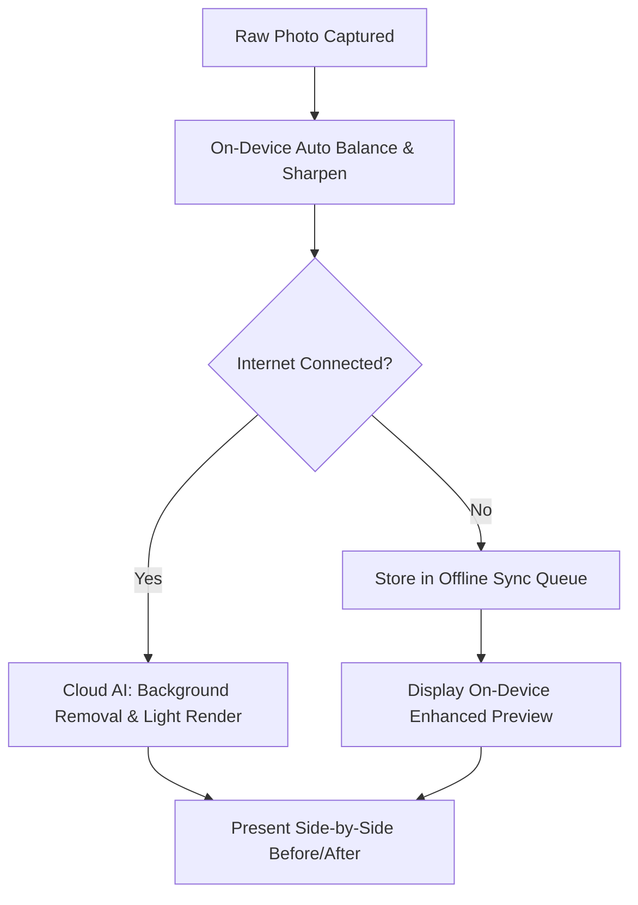
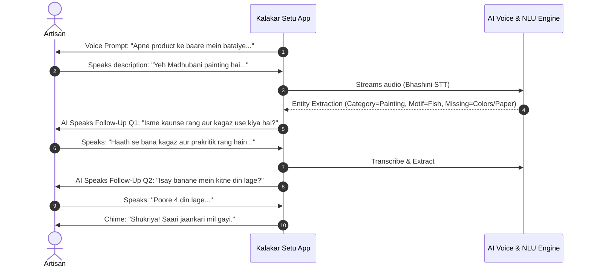
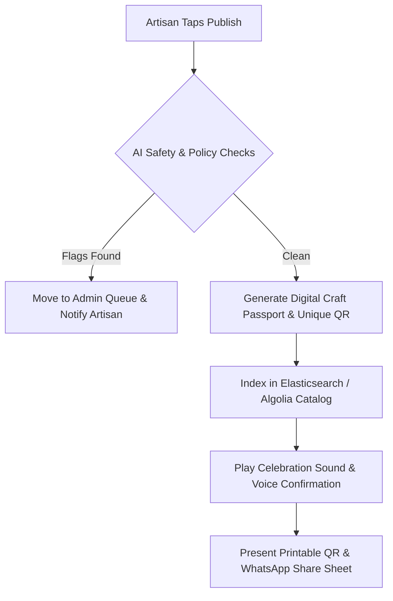
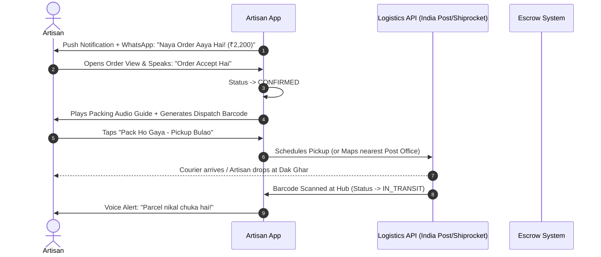
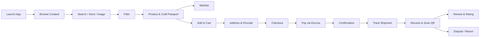
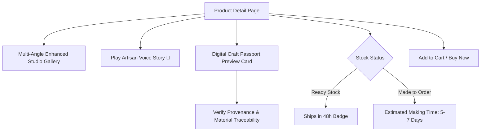
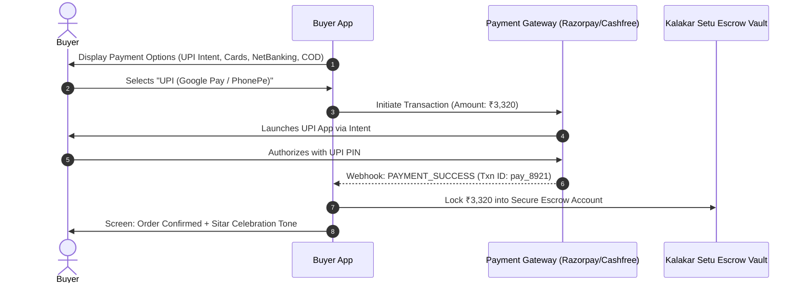
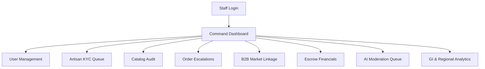
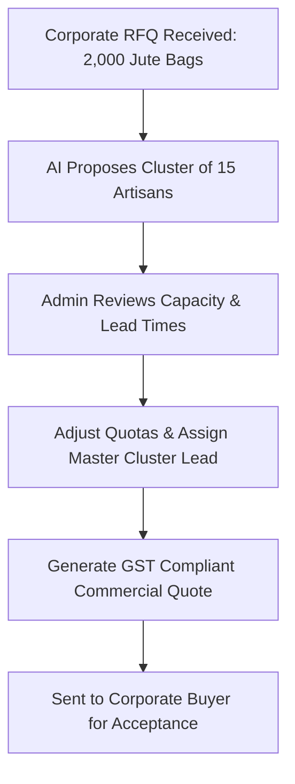

# Kalakar Setu — End-to-End User Flows Specification
## कला से बाज़ार तक | Detailed User Journey Maps & Failure Paths

> **Document Type:** End-to-End User Flows & Interaction Specification  
> **Version:** 1.0 — Production-Grade Specification  
> **Date:** 2026-09-03  
> **Status:** 🟡 Awaiting Product Owner Review  
> **Sources:** [PRODUCT_DISCOVERY.md](file:///C:/Users/rauts/OneDrive/Desktop/karagir%20se/PRODUCT_DISCOVERY.md) & [REQUIREMENTS.md](file:///C:/Users/rauts/OneDrive/Desktop/karagir%20se/REQUIREMENTS.md)

---

## Architectural Principles for User Flows

1. **Deterministic Action-Result Pairings:** Every single user action has an explicit, documented system result, state change, and sensory feedback (visual, haptic, auditory/voice).
2. **Failure-First Engineering:** Every critical interaction includes primary failure paths, network resilience branches, and graceful degradation paths.
3. **Voice-First & Icon-First Accessibility for Artisans:** Visual feedback is accompanied by regional TTS audio cues; complex textual choices are mapped to simple taps or voice intents.

---

# Table of Contents

1. [Artisan Journey](#1-artisan-journey)
   - [Flow A1: App Launch & Language Selection](#flow-a1-app-launch--language-selection)
   - [Flow A2: Onboarding & Phone OTP Registration](#flow-a2-onboarding--phone-otp-registration)
   - [Flow A3: Profile Setup & Role Linkage](#flow-a3-profile-setup--role-linkage)
   - [Flow A4: Tiered Identity Verification (Aadhaar / KYC)](#flow-a4-tiered-identity-verification-aadhaar--kyc)
   - [Flow A5: Artisan Dashboard & Voice Assistant Shell](#flow-a5-artisan-dashboard--voice-assistant-shell)
   - [Flow A6: Create Product — Capture Image & Framing Guide](#flow-a6-create-product--capture-image--framing-guide)
   - [Flow A7: AI Image Enhancement Pipeline](#flow-a7-ai-image-enhancement-pipeline)
   - [Flow A8: Voice Description & Conversational AI Follow-Up Q&A](#flow-a8-voice-description--conversational-ai-follow-up-qa)
   - [Flow A9: AI Catalog Generation (Multilingual Listings)](#flow-a9-ai-catalog-generation-multilingual-listings)
   - [Flow A10: Dynamic Pricing Recommendation & Explanation](#flow-a10-dynamic-pricing-recommendation--explanation)
   - [Flow A11: Voice Readback Review & Voice-Driven Edits](#flow-a11-voice-readback-review--voice-driven-edits)
   - [Flow A12: Publishing, AI Moderation & Digital Craft Passport](#flow-a12-publishing-ai-moderation--digital-craft-passport)
   - [Flow A13: Product Management & Inventory Control](#flow-a13-product-management--inventory-control)
   - [Flow A14: Order Lifecycle & Fulfilment](#flow-a14-order-lifecycle--fulfilment)
   - [Flow A15: Earnings, Escrow Release & Bank Payouts](#flow-a15-earnings-escrow-release--bank-payouts)
   - [Flow A16: Market Opportunities, RFQs & B2B Cluster Orders](#flow-a16-market-opportunities-rfqs--b2b-cluster-orders)
2. [Buyer Journey (B2C & B2B)](#2-buyer-journey-b2c--b2b)
   - [Flow B1: App Launch, Locale & Onboarding](#flow-b1-app-launch-locale--onboarding)
   - [Flow B2: Discovery & Homepage Navigation](#flow-b2-discovery--homepage-navigation)
   - [Flow B3: Multimodal Search (Text, Voice, Image)](#flow-b3-multimodal-search-text-voice-image)
   - [Flow B4: Faceted Filtering & Search Refinement](#flow-b4-faceted-filtering--search-refinement)
   - [Flow B5: Product Details, Craft Passport & Artisan Story](#flow-b5-product-details-craft-passport--artisan-story)
   - [Flow B6: Wishlist & Social Sharing](#flow-b6-wishlist--social-sharing)
   - [Flow B7: Cart Management (Multi-Artisan Split Cart)](#flow-b7-cart-management-multi-artisan-split-cart)
   - [Flow B8: Delivery Address Management & Pincode Validation](#flow-b8-delivery-address-management--pincode-validation)
   - [Flow B9: Checkout, Summary & Tax Breakdown](#flow-b9-checkout-summary--tax-breakdown)
   - [Flow B10: Multi-Option Payment & Escrow Lock](#flow-b10-multi-option-payment--escrow-lock)
   - [Flow B11: Order Confirmation & State Initialization](#flow-b11-order-confirmation--state-initialization)
   - [Flow B12: Real-Time Shipment Tracking](#flow-b12-real-time-shipment-tracking)
   - [Flow B13: Delivery Confirmation & QR Passport Physical Card Verification](#flow-b13-delivery-confirmation--qr-passport-physical-card-verification)
   - [Flow B14: Verified Buyer Review & Star Rating](#flow-b14-verified-buyer-review--star-rating)
   - [Flow B15: Post-Purchase Disputes, Returns & Refunds](#flow-b15-post-purchase-disputes-returns--refunds)
3. [Admin Journey](#3-admin-journey)
   - [Flow AD1: Secure Staff Authentication & Role-Based Access](#flow-ad1-secure-staff-authentication--role-based-access)
   - [Flow AD2: Operations Command Center Dashboard](#flow-ad2-operations-command-center-dashboard)
   - [Flow AD3: User Management (Buyers, Facilitators, Staff)](#flow-ad3-user-management-buyers-facilitators-staff)
   - [Flow AD4: Artisan Verification, KYC & Health Score Monitoring](#flow-ad4-artisan-verification-kyc--health-score-monitoring)
   - [Flow AD5: Product Catalog Governance & Quality Audit](#flow-ad5-product-catalog-governance--quality-audit)
   - [Flow AD6: Order Supervision, Split Shipping & Escalation Queue](#flow-ad6-order-supervision-split-shipping--escalation-queue)
   - [Flow AD7: Market Linkage Management (B2B Clusters & Institutional RFQs)](#flow-ad7-market-linkage-management-b2b-clusters--institutional-rfqs)
   - [Flow AD8: Financial Auditing, Commission Ledger & Escrow Reconciliation](#flow-ad8-financial-auditing-commission-ledger--escrow-reconciliation)
   - [Flow AD9: Automated & Human AI Moderation Queue](#flow-ad9-automated--human-ai-moderation-queue)
   - [Flow AD10: Platform Analytics, Heatmaps & GI Policy Reports](#flow-ad10-platform-analytics-heatmaps--gi-policy-reports)
4. [Universal Failure Matrix & System Recovery Patterns](#4-universal-failure-matrix--system-recovery-patterns)

---

# 1. Artisan Journey

---

### Flow A1: App Launch & Language Selection

| Parameter | Specification |
|---|---|
| **Entry Precondition** | Artisan has installed app on an Android device (v9+) or opened fresh app instance. |
| **Primary Goal** | Select native language via audio-visual cues without needing to read English or system default text. |

#### Detailed Step-by-Step Flow

1. **Launch Screen Render:**
   - App opens with a vibrant cultural splash screen displaying the Kalakar Setu emblem ("कला से बाज़ार तक").
   - A friendly chime plays, followed by an automatic audio prompt in Hindi and English: *"Namaste! Kripya apni bhasha chunein / Welcome! Please select your language."*
2. **Interactive Language Cards Display:**
   - The screen renders large tile cards (minimum 96dp height) with authentic native scripts and cultural visual icons:
     - 🇮🇳 **हिन्दी** (Hindi - with audio icon)
     - 🇮🇳 **English**
     - 🇮🇳 **বাংলা** (Bengali)
     - 🇮🇳 **தமிழ்** (Tamil)
     - 🇮🇳 **मराठी** (Marathi)
     - 🇮🇳 **ગુજરાતી** (Gujarati)
     - 🇮🇳 **ଓଡ଼ିଆ** (Odia)
3. **User Action:**
   - Artisan taps any card (e.g., "हिन्दी").
   - *Alternative Action:* Artisan taps the central microphone icon and speaks *"Hindi"* or *"Bangla"*.
4. **Defined Result:**
   - Haptic vibration confirms the tap.
   - The selected card highlights in forest emerald (`#1E5631`) with a checkmark.
   - An audio clip plays immediately in that exact dialect: *"Aapne Hindi chuni hai. Aage badhne ke liye hare button ko dabayein."*
   - A persistent green "Aage Badhein / Continue" button activates at the screen bottom.
5. **User Action:**
   - Artisan taps "Continue" button.
6. **Defined Result:**
   - Locale preferences are saved to local device encrypted storage (`AppPreferences.locale = 'hi'`).
   - Transition smoothly to Flow A2 (Onboarding & Registration).

#### Failure Paths & System Recovery
- **F-A1.1: Audio Engine Fails to Initialize:**
  - *Cause:* System sound muted, missing TTS engine library, or audio focus blocked.
  - *System Behavior:* Visual audio wave animations switch to vibrating glowing borders on the language cards. No crash.
  - *Recovery Action:* App falls back to standard pre-recorded AAC asset audio files instead of synthetic TTS.
- **F-A1.2: Unrecognized Voice Command for Language:**
  - *System Behavior:* App plays soft chime: *"Kripya screen par apni bhasha ko chuyein"* (Please touch your language on the screen). Visual pulse points to cards.

---

### Flow A2: Onboarding & Phone OTP Registration

| Parameter | Specification |
|---|---|
| **Entry Precondition** | Language selected in Flow A1; device has cellular network or Wi-Fi connectivity. |
| **Primary Goal** | Authenticate identity via 10-digit mobile number and SMS OTP without complex form entry. |

#### Detailed Step-by-Step Flow

1. **Registration View Render:**
   - Screen renders an oversized mobile phone icon, a 10-digit phone field with `+91` pre-fixed, and an in-app large tactile numeric keypad (numbers 0–9, backspace, and clear).
   - Audio prompt: *"Apna 10 ankon ka mobile number darj karein."*
2. **User Action:**
   - Artisan enters 10 digits using the large tactile keypad.
   - *Alternative:* Artisan taps mic button and dictates their number in digits: *"Nau aath do..."*
3. **Defined Result:**
   - Each entered digit sounds a subtle distinct tonal beep.
   - When 10 digits are complete, the "OTP Bhejo / Send OTP" button pulses bright green with a sound cue.
4. **User Action:**
   - Artisan taps "Send OTP".
5. **System Processing & Result:**
   - System calls SMS Gateway API (Firebase Auth / SMS Provider).
   - Screen transitions to 6-digit OTP verification screen.
   - A 60-second countdown timer starts.
   - Audio cue plays: *"Aapke mobile par 6 ankon ka code bheja gaya hai."*
6. **Auto-Retrieval / Manual Entry:**
   - *Android SMS Retriever API* intercepts the SMS automatically.
   - The 6 boxes fill automatically with a rolling animation.
7. **Defined Result:**
   - Checkmark animation triggers.
   - Success sound plays.
   - Auth token (JWT) generated and persisted in device KeyStore/SharedPrefs.
   - Route to Flow A3 (Profile Setup).

#### Failure Paths & System Recovery
- **F-A2.1: Invalid Phone Number (<10 digits or invalid Indian telecom prefix):**
  - *System Behavior:* Screen flashes yellow border; number vibrates.
  - *Voice Feedback:* *"Kripya sahi 10 ankon ka mobile number daalein."* (Please enter a valid 10-digit number).
- **F-A2.2: SMS OTP Delivery Timeout (>60 seconds):**
  - *System Behavior:* At 0 seconds, countdown replaces with two prominent voice-guided buttons:
    1. 🔄 *"Dobara SMS bhejein"* (Resend SMS)
    2. 📞 *"Call par code paayein"* (Voice Call OTP)
  - *Recovery Action:* Tapping "Call par code paayein" triggers Twilio/Exotel outbound call to the artisan reading the OTP twice in their chosen language.
- **F-A2.3: Incorrect OTP Entered:**
  - *System Behavior:* OTP boxes highlight red and clear with a double buzz.
  - *Voice Feedback:* *"Code galat hai. Kripya message dekh kar dobara daalein."* Remaining attempts (out of 3) announced.

---

### Flow A3: Profile Setup & Role Linkage

| Parameter | Specification |
|---|---|
| **Entry Precondition** | Artisan authenticated via phone number. |
| **Primary Goal** | Establish artisan's name, craft discipline, location, and optional linkage to a Self-Help Group (SHG) or Facilitator. |

#### Detailed Step-by-Step Flow

1. **Visual & Voice Guided Prompt:**
   - Screen shows a friendly artisan avatar with a pulsating microphone.
   - Voice prompt: *"Namaste! Apna poora naam boliye ya likhiye."* (Please speak or write your full name).
2. **User Action:**
   - Artisan taps mic and speaks: *"Sunita Devi"*.
3. **Defined Result:**
   - Speech-to-Text converts audio to text.
   - Displays "सुनीता देवी / Sunita Devi" in a clear preview box.
   - Voice confirms: *"Sunita Devi — kya yeh sahi hai?"* (Thumbs up / Thumbs down icons appear).
4. **User Action:**
   - Artisan taps Green Thumbs Up.
5. **Location Detection:**
   - System prompts: *"Aapka gaon ya shahar auto-detect karein?"*
   - Artisan grants GPS permission via OS dialog.
   - System retrieves Lat/Long, reverse geocodes to District and State (e.g., *"Madhubani, Bihar"*).
   - Voice reads back: *"Aapka sthan: Madhubani, Bihar"* with a state map pin visual.
6. **Craft Discipline Selection:**
   - Screen renders visual grid of craft tiles:
     - 🧵 Handloom & Weaving (बुनाई)
     - 🏺 Clay & Terracotta (मिट्टी के बर्तन)
     - 🎨 Traditional Painting (मधुबनी / वारली पेंटिंग)
     - 🪵 Woodcraft & Carving (लकड़ी का काम)
     - 💍 Metalcraft & Jewelry (धातु शिल्प)
     - 🧺 Bamboo & Jute (बांस और जूट)
7. **User Action:**
   - Artisan taps "Traditional Painting" tile.
8. **Facilitator / SHG Linkage (Optional):**
   - Screen asks: *"Kya aap kisi Sahayak (Facilitator) ya SHG se jude hain?"*
   - Options: Large QR Scanner button (*"Sahayak ka QR Scan karein"*) OR *"Nahi, main akele bechta hoon"* (Skip).
   - Artisan taps "Skip".
9. **Defined Result:**
   - Artisan profile record initialized in DB with fields: `id`, `name`, `phone`, `craft_category`, `location_district`, `location_state`, `verification_tier: 0 (Unverified)`.
   - Transitions to Flow A5 (Artisan Dashboard).

#### Failure Paths & System Recovery
- **F-A3.1: GPS Location Fails or Denied:**
  - *System Behavior:* Voice prompt asks: *"Apne rajya ka naam boliye"* (Speak your state name).
  - *Voice Selection:* Artisan speaks *"Bihar"* → System presents 5 major artisan districts with voice tags → Artisan taps *"Madhubani"*.
- **F-A3.2: Facilitator QR Code Damaged or Invalid:**
  - *System Behavior:* Scanner emits alert tone: *"Yeh QR code sahi nahi hai. Aap ise chhodkar aage badh sakte hain."* "Skip" button highlights automatically.

---

### Flow A4: Tiered Identity Verification (Aadhaar / KYC)

| Parameter | Specification |
|---|---|
| **Entry Precondition** | Artisan triggered KYC from Profile or before first withdrawal; internet connection active. |
| **Primary Goal** | Elevate profile trust tier to "Verified Artisan" via Aadhaar OTP / DigiLocker without storing raw Aadhaar. |

#### Detailed Step-by-Step Flow

1. **Trigger Screen:**
   - Screen displays a gold shield icon: *"Pehchaan Satyaapan (Verified Artisan Badge)"*.
   - Voice prompt: *"Aapke account mein paise bhejne aur vishwas badhane ke liye Aadhaar verify karein."*
2. **User Action:**
   - Artisan enters 12-digit Aadhaar number on large keypad.
3. **Defined Result:**
   - Aadhaar number masked as `XXXX-XXXX-1234`.
   - "OTP Bhejo" button activates.
4. **User Action:**
   - Artisan taps "OTP Bhejo".
5. **System Processing & Result:**
   - Backend calls UIDAI / DigiLocker e-KYC Gateway.
   - OTP sent to the mobile number registered with UIDAI.
   - Screen transitions to Aadhaar OTP entry view.
6. **User Action:**
   - Artisan inputs 6-digit Aadhaar OTP received from UIDAI.
7. **System Verification & Result:**
   - Tokenized KYC verification confirms: Match with Artisan Name & Demographic DOB.
   - Status updated in DB: `verification_tier = 1 (Verified)`, `aadhaar_verified = true`, `kyc_reference_token = "dg_enc_8921"`. Raw Aadhaar is purged immediately.
   - Green Verified Badge appears on profile: **"सत्यापित कलाकार / Verified Artisan ✅"**.
   - Congratulatory voice message plays: *"Badhai ho! Aapka account satyaapit ho gaya hai."*
   - Return to Dashboard or Payout workflow.

#### Failure Paths & System Recovery
- **F-A4.1: Aadhaar Mobile Mismatch (Artisan does not have Aadhaar-linked SIM):**
  - *Cause:* Aadhaar registered with older relative's phone number.
  - *System Behavior:* Screen explains in voice: *"Aadhaar OTP us number par gaya hai jo Aadhaar card se juda hai."*
  - *Alternative Path:* System offers *"Aadhaar card ki photo upload karein"* for manual Admin back-office verification (takes 24–48 hours) while allowing the artisan to continue listing products.
- **F-A4.2: UIDAI Server Gateway Outage:**
  - *System Behavior:* Screen displays: *"Aadhaar server abhi busy hai. Aap bina verification ke bhi product list kar sakte hain. Paise nikaalte waqt verify kar lene."*
  - *Action:* System allows seamless deferral without blocking the user.

---

### Flow A5: Artisan Dashboard & Voice Assistant Shell

| Parameter | Specification |
|---|---|
| **Entry Precondition** | Artisan has completed onboarding or re-opens app. |
| **Primary Goal** | Provide zero-clutter situational awareness of orders, earnings, products, and one-touch creation. |

#### Detailed Step-by-Step Flow

1. **Dashboard Home View Render:**
   - **Header:** Artisan Profile Photo, Name, Verified Badge, and active Language pill.
   - **Top Card (Earnings & Orders Snapshot):**
     - Large green card: Total Earned this month (e.g., `₹8,400`).
     - Yellow notification pill (if pending action exists): *"1 Naya Order Aaya Hai!"*
   - **Center Floating Visual CTAs:**
     - 📸 **Bada Camera Button (➕ Naya Product Daalein)** — prominent pulsing center button.
     - 📦 **Orders Button** with badge counter (`1`).
     - 💰 **Kamai (Earnings) Button**.
     - 🤝 **Bada Bazaar (B2B Bulk Orders) Button**.
   - **Persistent Floating Mic (Assistant):**
     - Ambient glowing mic at bottom-right corner.
2. **Ambient Voice Greeting:**
   - On open, app softly announces: *"Namaste Sunita ji! Aaj aapka 1 naya order pending hai. Dekhne ke liye peela button dabayein."*
3. **User Action:**
   - Artisan taps the large Camera Button (📸).
4. **Defined Result:**
   - Haptic click.
   - Opens Camera View (Flow A6).

#### Failure Paths & System Recovery
- **F-A5.1: Device Completely Offline:**
  - *System Behavior:* Dashboard displays a discrete offline badge: *"Offline Mode — Aap naye product photo le sakte hain, internet aane par save ho jayenge."*
  - *Action:* Camera button remains 100% active and functional.

---

### Flow A6: Create Product — Capture Image & Framing Guide

| Parameter | Specification |
|---|---|
| **Entry Precondition** | Artisan tapped "Naya Product Daalein" or issued voice command *"Naya product banana hai"*. |
| **Primary Goal** | Guide artisan through capturing high-clarity product photos with smart visual overlays. |

#### Detailed Step-by-Step Flow

1. **Camera View Launch:**
   - Custom full-screen camera view opens.
   - Centered golden frame overlay appears with dashed borders indicating optimal product bounds.
   - Ambient voice guidance: *"Apne product ko saaf jagah par rakhein aur roshni mein photo kheechein."*
2. **On-Device Real-Time Image Quality Analyzer:**
   - On-device lightweight ML (TFLite) evaluates camera stream every 500ms:
     - *Light meter check:* If ambient illumination is dark → Torch turns on automatically or audio says: *"Thoda roshni mein le jaaiye."*
     - *Stability check:* Gyroscope checks device shake → If steady, frame border turns from Yellow to Bright Green.
     - *Distance check:* Object detection checks if product fills 50%–80% of frame.
3. **User Action:**
   - Artisan presses the large green shutter button.
4. **Defined Result:**
   - Shutter click sound plays.
   - Photo is captured at full sensor resolution (e.g., 12MP/4K) and cached to local directory `file:///storage/.../raw_img_01.jpg`.
   - Thumbnail preview slides into bottom drawer (showing "1/4 photos").
   - Voice prompt: *"Bahut sundar! Ab ek photo doosre angle ya nazdeek se kheechein, ya aage badhein."*
   - Two buttons appear:
     - 📷 *"Aur Photo Lein"* (Take another)
     - ➡️ *"Ho Gaya / Aage Badhein"* (Done / Proceed)
5. **User Action:**
   - Artisan taps "Aage Badhein".
6. **Defined Result:**
   - Camera shuts down; transitions to Flow A7 (AI Image Enhancement).

#### Failure Paths & System Recovery
- **F-A6.1: Blurry Photo Detected (Laplacian Variance < Threshold):**
  - *System Behavior:* Before saving, screen shows comparison vibration and voice alerts: *"Photo thodi dhundhli ho gayi hai. Haath sthir rakh kar ek baar phir kheechein."*
  - *Action:* Automatic option given: 🔄 *"Dobara Lein"* (Retake) vs. ⚠️ *"Yahi Chalegi"* (Keep anyway).
- **F-A6.2: Camera Hardware Permission Denied:**
  - *System Behavior:* Screen explains with voice: *"Photo lene ke liye camera ka permission dena zaroori hai."*
  - *Action:* Single tap button directly opens Android App Settings permission toggle.

---

### Flow A7: AI Image Enhancement Pipeline

| Parameter | Specification |
|---|---|
| **Entry Precondition** | 1 to 4 raw photos captured in Flow A6. |
| **Primary Goal** | Clean background, balance studio light, sharpen craft textures, and produce marketplace-ready photos. |

#### Detailed Step-by-Step Flow

1. **Processing Screen Display:**
   - Animated visual of an artisan brush smoothing over the image with a cultural rotating mandala spinner.
   - Voice cue: *"Aapki photo ko sundar aur saaf banaya ja raha hai..."*
2. **Dual-Stage Image Enhancement Processing:**
   - **Stage 1 (Immediate On-Device):**
     - Homography perspective normalization.
     - Auto white-balance correction & unsharp mask filtering.
   - **Stage 2 (Cloud AI Processing - Fast API):**
     - AI segmenter (U²-Net / SAM) isolates craft from cluttered rural room backgrounds.
     - Places craft onto clean studio neutral gradient with realistic ground drop-shadow.
     - Texture sharpening specifically calibrated for handloom thread count and clay specular highlights.
3. **Defined Result:**
   - Screen presents interactive slider: Left side = Original Photo; Right side = Studio Enhanced Photo.
   - Voice readback: *"Dekhiye! Background saaf kar diya gaya hai. Kya yeh pasand aaya?"*
   - Action buttons:
     - ✨ *"Enhanced Photo Rakhein"* (Keep Enhanced - Primary)
     - 🔄 *"Asli Photo Rakhein"* (Keep Original)
4. **User Action:**
   - Artisan taps "Enhanced Photo Rakhein".
5. **Defined Result:**
   - Enhanced image assets marked as `is_primary = true`.
   - Transitions directly to Flow A8 (Voice Description).

#### Failure Paths & System Recovery
- **F-A7.1: Network Disconnection during Cloud Upload:**
  - *System Behavior:* System does not stall or hang. After 5-second timeout, it automatically uses the Stage 1 on-device enhanced photo.
  - *Voice Notification:* *"Internet kamzor hai. Humne photo ko basic saaf kar diya hai, baad mein cloud enhance ho jayega."*
  - *Action:* Background worker tags task for cloud re-enhancement upon Wi-Fi reconnect.
- **F-A7.2: Segmentation Fails (Edge blending on intricate craft e.g., thin cane work):**
  - *System Behavior:* AI confidence detector returns score < 0.70.
  - *Recovery Action:* System switches from harsh background removal to a soft optical depth-of-field blur (Bokeh) behind the original background, preserving fine artisan details.

---

### Flow A8: Voice Description & Conversational AI Follow-Up Q&A

| Parameter | Specification |
|---|---|
| **Entry Precondition** | Enhanced photos confirmed; microphone permissions granted. |
| **Primary Goal** | Extract rich catalog details (materials, technique, dimensions, time spent) through a natural voice conversation. |

#### Detailed Step-by-Step Flow

1. **Voice Prompt Initiation:**
   - Screen displays an animated circular voice visualizer with vibrant pulsing ripples.
   - Friendly audio prompt: *"Apne is product ke baare mein batayein — yeh kya hai, kaise banaya, aur kya khaas hai?"*
2. **User Action (Initial Free-Form Voice Input):**
   - Artisan taps mic (or speaks freely): *"Yeh Madhubani painting hai, jisme machhli aur ped ka design hai. Humne haath se banaya hai."*
3. **System Speech-to-Text & Entity Parsing:**
   - Bhashini STT engine converts audio to native Hindi text transcript.
   - LLM Catalog Parser extracts:
     - `craft_type`: Madhubani Painting
     - `motifs`: Fish, Tree of Life
     - `technique`: Freehand brush/nib
     - `missing_critical_entities`: [material_base, natural_vs_chemical_dyes, dimensions, time_to_make]
4. **Contextual Conversational Follow-Up (Question 1):**
   - System synthesizes natural voice prompt: *"Bahut khoob! Yeh kis kagaz ya kapde par bani hai, aur rang kaunse hain?"*
5. **User Action:**
   - Artisan speaks: *"Yeh handmade handmade kagaz par hai, aur rang phool aur patti ke natural rang hain."*
6. **Contextual Conversational Follow-Up (Question 2 - Labor Input for Pricing):**
   - System synthesizes voice prompt: *"Isay poora karne mein aapko kitne ghante ya din lage?"*
7. **User Action:**
   - Artisan speaks: *"Lagbhag 3 se 4 din lag gaye roz kaam karke."*
8. **Completion Trigger:**
   - System calculates that minimum completeness threshold (92%) is satisfied.
   - Pleasant bell chime sounds.
   - Voice says: *"Shukriya! Saari zaroori jaankari mil gayi hai. Ab hum aapka listing bana rahe hain."*
   - Transitions to Flow A9 (AI Catalog Generation).

#### Failure Paths & System Recovery
- **F-A8.1: Severe Ambient Noise (Wind, Market Sounds, Machines):**
  - *System Behavior:* Spectral noise filter detects SNR < 10dB.
  - *Feedback:* Voice prompts gently: *"Aaspas awaaz thodi zyada hai. Kripya phone ko muh ke paas lakar bolein."* Visual VU-meter indicates microphone reception.
- **F-A8.2: Dialect / Slang Misinterpretation:**
  - *System Behavior:* STT returns low confidence for specific vernacular words (e.g., regional tool names like *"kalam"*, *"charkha"* dialect variant).
  - *Recovery Action:* System retains the phonetic audio chunk, uses craft-domain regional dictionary mapping to map synonyms, and keeps original audio snippet for the Craft Passport.
- **F-A8.3: Artisan Stops Speaking / Unresponsive:**
  - *System Behavior:* Silence detector triggers after 6 seconds of no speech.
  - *Action:* Prompts with a specific example: *"Aap bata sakte hain yeh kis cheez se bana hai — jaise sooti dhaaga ya kacha koot?"*

---

### Flow A9: AI Catalog Generation (Multilingual Listings)

| Parameter | Specification |
|---|---|
| **Entry Precondition** | Entities parsed from voice Q&A and image classification. |
| **Primary Goal** | Synthesize professional, SEO-optimized, culturally respectful product listings in English, Hindi, and Regional Language. |

#### Detailed Step-by-Step Flow

1. **Generation Workflow Execution:**
   - Backend LLM orchestrator takes structured entity JSON and invokes prompt engineering pipeline:
     - **Title Generation:** Catchy, descriptive e-commerce title with search keywords (e.g., *"Handmade Madhubani Folk Art Painting on Handmade Paper — Traditional Fish & Nature Motif (12x8 inch)"*).
     - **Description Generation:** Story-driven emotional copy highlighting the artisan's tradition, exact materials, care instructions, and authenticity.
     - **Attribute Tagging:** Category (`Home Decor > Wall Art`), Material (`Handmade Cotton Paper, Botanical Inks`), Occasion (`Housewarming, Festive Gift`).
     - **Multilingual Translation:** Simultaneous generation of high-quality localized copy in English, Hindi, and regional language.
2. **Defined Result:**
   - Structured listing payload ready in memory and draft saved to local DB.
   - Immediate automatic invocation of Flow A10 (Dynamic Pricing Recommendation).

#### Failure Paths & System Recovery
- **F-A9.1: LLM Generation Latency / Rate Limit:**
  - *System Behavior:* If LLM takes > 6 seconds, system falls back to a deterministic rule-based template engine: `"{Material} {Craft_Type} with {Motif} - Handcrafted in {District}"`.
  - *Action:* Artisan is never kept waiting; template creates an accurate baseline listing instantly.

---

### Flow A10: Dynamic Pricing Recommendation & Explanation

| Parameter | Specification |
|---|---|
| **Entry Precondition** | Catalog listing generated; labor hours and craft type established. |
| **Primary Goal** | Calculate a transparent, fair selling price with cost breakdown so artisan is protected from underpricing. |

#### Detailed Step-by-Step Flow

1. **Pricing Calculation Engine Execution:**
   - Algorithm calculates:
     $$\text{Base Material} = ₹250$$
     $$\text{Labor} = 28\text{ hrs} \times ₹50/\text{hr (Regional Artisan Index)} = ₹1,400$$
     $$\text{Artistic Complexity Multiplier} = 1.25 \times ₹1,400 = ₹1,750$$
     $$\text{Eco-Packaging Estimate} = ₹60$$
     $$\text{Platform Fair Suggested Price} = ₹2,160 \quad (\text{Rounded to } ₹2,150)$$
     $$\text{Platform Commission (5\%)} = -₹107.50$$
     $$\text{Artisan Net Take-Home} = ₹2,042.50$$
2. **Visual Breakdown Display:**
   - The screen renders an interactive visual ledger card:
     - 🧵 **Kacha Maal (Material):** ₹250
     - ⏱️ **Mehnat (Labor 4 Days):** ₹1,400
     - 🎨 **Kala ki Banawat (Complexity):** ₹350
     - 📦 **Packaging:** ₹60
     - 💰 **AI Suggested Selling Price:** **₹2,150**
     - 💵 **Aapke Khate Mein Aayenge (Your Take-Home):** **₹2,042**
3. **Voice Explanation:**
   - Voice reads aloud: *"AI ke mutabik is painting ka sahi daam ₹2,150 hona chahiye. Isme aapka material aur 4 din ki mehnat shamil hai. Commission ke baad aapko poore ₹2,042 milenge."*
4. **Interactive Adjustment Controls:**
   - Two large buttons:
     - 🟢 **"₹2,150 Manzoor Hai"** (Accept suggested price)
     - 🟡 **"Apna Daam Daalein"** (Enter custom price)
5. **User Action:**
   - Artisan taps "Apna Daam Daalein", presses `+` button three times to set price to `₹2,300`.
6. **Defined Result:**
   - Net earnings auto-recalculates on screen to `₹2,185`.
   - Voice says: *"Aapne daam ₹2,300 chuna. Aapko ₹2,185 milenge."*
   - Proceeds to Flow A11 (Voice Review).

#### Failure Paths & System Recovery
- **F-A10.1: Artisan Sets Exploitative Low Price (< Cost of Labor):**
  - *Scenario:* Artisan enters `₹400` for a 4-day piece.
  - *System Behavior:* Alert banner turns amber. Voice gently warns: *"Yeh daam aapki 4 din ki mehnat se bahut kam hai. Bazaar mein log iske kam se kam ₹1,800 dene ko tayyar hain. Kya aap sach mein ₹400 rakhna chahte hain?"*
  - *Artisan Choice:* Can still override (artisan has final decision-making power), but system actively protects against exploitation.

---

### Flow A11: Voice Readback Review & Voice-Driven Edits

| Parameter | Specification |
|---|---|
| **Entry Precondition** | Enhanced photo, listing metadata, and price finalized. |
| **Primary Goal** | Complete audio review of the entire product listing for low-literacy validation before publishing. |

#### Detailed Step-by-Step Flow

1. **Card Summary Presentation:**
   - Screen shows clean product mock-up card: Main photo, Title in native script, Price, Key attributes.
   - Large speaker icon animates.
2. **Automated Voice Readback:**
   - Audio narrates:
     *"Aapki listing tayyar hai:*
     *Naam: Madhubani Fish Painting on Handmade Paper.*
     *Daam: ₹2,300.*
     *Banane mein lage: 4 din.*
     *Agar sab sahi hai toh hare button ko dabayein, ya mic dabakar bole ki kya badalna hai."*
3. **User Action (Voice Edit Demonstration):**
   - Artisan presses mic and says: *"Daam ₹2,200 kar do aur quantity 2 kar do."*
4. **System Response & Result:**
   - NLU interprets: `UPDATE price = 2200`, `UPDATE inventory = 2`.
   - Screen numbers update with smooth counter animation.
   - Voice confirms: *"Theek hai! Daam ₹2,200 aur quantity 2 kar di gayi hai."*
5. **Final Approval User Action:**
   - Artisan taps the large pulsing green button: **"Publish Karein / Market Mein Daalein"** (🚀).
6. **Defined Result:**
   - Trigger Flow A12 (Publishing, AI Moderation & Passport).

#### Failure Paths & System Recovery
- **F-A11.1: Artisan Wants to Retake Photo at Final Stage:**
  - *User Action:* Speaks: *"Photo achhi nahi lag rahi, doosri leni hai."*
  - *System Behavior:* Opens camera directly (Flow A6) while preserving all captured text/pricing data so artisan does not have to repeat the voice Q&A.

---

### Flow A12: Publishing, AI Moderation & Digital Craft Passport

| Parameter | Specification |
|---|---|
| **Entry Precondition** | Artisan confirmed listing review in Flow A11. |
| **Primary Goal** | Execute automated safety checks, mint Digital Craft Passport QR, and publish listing live on buyer marketplace. |

#### Detailed Step-by-Step Flow

1. **Automated AI Moderation Filter:**
   - Image scanned for inappropriate imagery, non-product faces, or trademarked factory logos.
   - Text scanned for banned keywords or deceptive mass-manufactured claims.
   - *Result:* Passed with Safety Score 0.99.
2. **Digital Craft Passport Generation:**
   - Unique cryptographic Craft ID generated: `IN-BR-MDB-2026-89421`.
   - QR code generated pointing to public verifiable provenance URL: `https://kalakarsetu.in/craft/IN-BR-MDB-2026-89421`.
   - Dynamic Craft Passport data package compiled:
     - Artisan Name, District, Coordinates (fuzzed to village level for privacy).
     - Verified Artisan Badge indicator.
     - Embedded 15-second original artisan voice story clip.
     - Production timestamp, materials, and photo archive.
3. **Marketplace Indexing:**
   - Listing document written to Firestore / PostgreSQL.
   - Search indexing pushed to Search Engine.
4. **Celebration & Visual Feedback:**
   - Vibrant on-screen confetti burst.
   - Loud joyous chime.
   - Voice announces: *"Badhai ho Sunita ji! Aapka product Kalakar Setu bazaar mein live ho gaya hai. Puri duniya ab ise dekh sakti hai!"*
5. **Packaging QR Card Tooling:**
   - Screen displays printable/shareable **Craft Passport Tag**:
     - Shows how the physical QR card looks with prompt: *"Yeh QR code apne parcel ke dabbe mein zaroor daalein."*
     - Options: 🟢 *"WhatsApp par bhejein"* (Share to local printer/CSC) | 📦 *"Dashboard par jayein"*.
6. **Defined Result:**
   - Product status becomes `ACTIVE`.
   - Artisan transitions to Flow A13 (Product Management) or returns to Dashboard.

#### Failure Paths & System Recovery
- **F-A12.1: Content Flagged by Automated Moderation (e.g., Copyright artwork image match):**
  - *System Behavior:* Listing is not rejected outright. It is saved in `PENDING_ADMIN_REVIEW` status.
  - *Voice Notification:* *"Aapka product suraksha jaanch ke liye review mein gaya hai. Hum 12 se 24 ghante mein update denge."*
  - *Admin Routing:* Dispatched to Admin Queue (Flow AD9).
- **F-A12.2: Device Loses Connection During Publish Click:**
  - *System Behavior:* Action stored in local SQLite Outbox queue.
  - *Feedback:* *"Listing save ho gayi hai. Phone internet se judte hi yeh live ho jayegi."*
  - *Auto-Sync:* Background WorkManager dispatches API call as soon as connectivity resumes.

---

### Flow A13: Product Management & Inventory Control

| Parameter | Specification |
|---|---|
| **Entry Precondition** | Artisan has at least 1 draft or published product. |
| **Primary Goal** | Monitor active listings, modify prices, update quantities, or pause sales via voice or icon taps. |

#### Detailed Step-by-Step Flow

1. **Inventory Grid Display:**
   - Accessed via "Mere Products" (📦) tab.
   - Products displayed as large visual photo cards with simple indicators:
     - Green dot = 🟢 **Live (Bikne ke liye tayyar)**
     - Red dot = 🔴 **Bik gaya / Out of stock**
     - Amber dot = 🟡 **Review chal raha hai**
   - Each card displays price in large bold numerals and stock count.
2. **User Action:**
   - Artisan taps a product card or uses voice command: *"Pehli painting ka daam badlo"* (Change price of first painting).
3. **Action Drawer Options:**
   - ✏️ **Daam Badlein (Update Price)**
   - 🔢 **Stock Badlein (Change Stock Count)**
   - ⏸️ **Chhutti Mode / Pause Karein (Temporarily Hide)**
   - 🗑️ **Delete Karein**
4. **User Action:**
   - Artisan taps "Pause Karein" because they are traveling for a family festival.
5. **Defined Result:**
   - Product badge changes to ⏸️ Paused.
   - Marketplace immediately delists product from search.
   - Voice confirms: *"Product ko pause kar diya hai. Jab aap tayyar hon, tab dobara shuru kar sakte hain."*

#### Failure Paths & System Recovery
- **F-A13.1: Artisan Attempts to Delete a Product with an Active Pending Order:**
  - *System Behavior:* Delete blocked.
  - *Feedback Tone & Voice:* *"Is product ka ek order abhi bhejna baaki hai, isliye ise delete nahi kar sakte. Order poora hone ke baad delete karein."*

---

### Flow A14: Order Lifecycle & Fulfilment

| Parameter | Specification |
|---|---|
| **Entry Precondition** | A buyer has completed checkout and payment for the artisan's product. |
| **Primary Goal** | Accept order, package product with Craft Passport, and coordinate India Post / courier dispatch. |

#### Detailed Step-by-Step Flow

1. **High-Priority Incoming Order Alert:**
   - Device sounds an attention-grabbing custom sitar chime.
   - Loud Push Notification + WhatsApp audio note arrives: *"Sunita ji! Aapki painting ka naya order aaya hai Delhi se. ₹2,200 ka."*
2. **Order Detail Screen:**
   - Card shows: Product thumbnail, Buyer City (*"Delhi"* - full street address hidden for safety), Expected Dispatch Date (*"Within 3 days"*), and Net Earning (*"Aapko milenge: ₹2,090"*).
   - Three large tactile action buttons:
     - 🟢 **Accept Karein (Haan, bhejungi)**
     - 🔴 **Reject Karein (Nahi bhej sakti)**
     - ⏱️ **Thoda Samay Chahiye (Request +2 days)**
3. **User Action:**
   - Artisan taps "Accept Karein".
4. **Packaging Voice Guide:**
   - Status moves to `CONFIRMED`.
   - Voice assistant instructs:
     *"Bohot badhiya! Kripya painting ko plastic sheet aur bubble wrap mein lapetein. Craft Passport QR card dabbe ke andar daalna na bhoolein."*
   - Screen renders step-by-step visual packing illustrations.
5. **Dispatch Coordination:**
   - Artisan selects fulfillment mode:
     - 🚚 **Ghar se Pickup (Courier will pick up from home)**
     - 📮 **Dak Ghar Drop (Drop at nearest village post office)**
   - Artisan chooses "Dak Ghar Drop".
   - App renders an India Post digital parcel manifest bar-code on screen.
6. **Handover to Postal / Courier Agent:**
   - Artisan takes parcel to the local Branch Post Office (Dak Ghar).
   - Postmaster scans phone screen bar-code or notes the 13-character Speed Post Tracking Number (`SP123456789IN`).
7. **Defined Result:**
   - Status updates to `IN_TRANSIT`.
   - Artisan receives voice confirmation: *"Parcel dispatch ho gaya hai! Delhi pahunchte hi aapka payment release hoga."*

#### Failure Paths & System Recovery
- **F-A14.1: Artisan Does Not Respond Within 24 Hours:**
  - *System Behavior:* Auto-escalation sequence:
    - At 12 hours: Urgent SMS sent + Facilitator (if linked) alerted.
    - At 20 hours: Automated IVR voice phone call placed to artisan: *"Aapka ek order cancel hone wala hai. Kripya app kholein."*
    - At 24 hours: Order auto-cancels; full refund initiated to buyer; artisan's listing temporarily set to inactive to protect buyer experience.
- **F-A14.2: Pickup Courier Fails to Arrive on Scheduled Date:**
  - *System Behavior:* System detects missed pickup window via Logistics Webhook.
  - *Action:* Automatically reassigns priority pickup for next morning and sends comfort SMS to artisan and buyer.

---

### Flow A15: Earnings, Escrow Release & Bank Payouts

| Parameter | Specification |
|---|---|
| **Entry Precondition** | Order marked as `DELIVERED` by postal tracking and 48-hour return window elapses without dispute. |
| **Primary Goal** | Release escrow funds directly into artisan's verified bank account via IMPS/NEFT with voice explanation. |

#### Detailed Step-by-Step Flow

1. **Escrow Release Trigger:**
   - Buyer delivery confirmed + 48 hours pass.
   - Escrow status shifts: `HELD_IN_ESCROW` ➔ `RELEASED_TO_PAYOUT_BATCH`.
2. **Payout Execution:**
   - Payment Gateway (Razorpay/Cashfree) initiates instant IMPS transfer to Artisan's linked bank account (or Jan Dhan Account).
   - Transfer transaction ID logged: `IMPS_TXN_7749201`.
3. **Sensory Celebration on Artisan Device:**
   - Coin drop sound effect plays on artisan's phone.
   - Push notification with voice auto-play: *"Aapke account mein ₹2,090 jama ho gaye hain! Pura balance dekhne ke liye yahan chuyein."*
4. **Earnings (Khata) View:**
   - Screen displays a traditional passbook (" डिजिटल खाता / Digital Khata"):
     - Total Lifetime Earnings: `₹14,290`
     - Available Balance: `₹0` (auto-withdrawn)
     - Recent Transfers list with green checkmarks and bank name (*"State Bank of India - A/C ..4921"*).
   - Large speaker button reads out the entire ledger line-by-line upon tap.

#### Failure Paths & System Recovery
- **F-A15.1: Bank Account Transfer Reversal (Invalid IFSC / Dormant Account):**
  - *System Behavior:* Bank IMPS returns code `R03` (Account Dormant/Invalid).
  - *Action:* Funds safely bounce back to platform secure reserve.
  - *Urgent Voice Prompt:* *"Aapke bank khate mein paise transfer nahi ho sake. Kripya apna bank account check karein ya apne Sahayak ki madad lein."*
  - *Assisted Resolution:* A notification ticket is routed to the linked Facilitator and Admin Support Desk.

---

### Flow A16: Market Opportunities, RFQs & B2B Cluster Orders

| Parameter | Specification |
|---|---|
| **Entry Precondition** | Institutional buyer or corporate submits an RFQ for bulk items (e.g., 500 hand-painted files) that requires cluster manufacturing. |
| **Primary Goal** | Invite individual artisans to take on sub-quotas of large orders with guaranteed rates and unified quality briefs. |

#### Detailed Step-by-Step Flow

1. **Cluster Matching Engine Match:**
   - AI matches Sunita Devi based on craft: Madhubani Painting, high reliability score (94%), and geography (Madhubani Cluster).
2. **Opportunity Invitation Banner:**
   - Glowing gold card on Dashboard: *"🤝 Bada Bazaar Opportunity — Corporate Diwali Gift Order"*.
   - Voice cue: *"Sunita ji! Ek bada order aaya hai 500 Madhubani folders ka. Kya aap 50 folder banana chahte hain?"*
3. **User Action:**
   - Artisan taps the invitation card.
4. **Production Brief Presentation:**
   - Audio + Visual Brief:
     - **Product:** Madhubani Khadi Document Folder.
     - **Aapka Quota:** 50 pieces.
     - **Samay:** 20 din.
     - **Aapki Kamai:** **₹25,000** (₹500 per piece guaranteed).
     - **Raw Material:** Sourced collectively or provided by cluster lead.
   - Two buttons: 🟢 *"Haan, Main Banaugi (Accept 50)"* | ⚪ *"Thoda Kam (Accept 25)"* | 🔴 *"Abhi Samay Nahi Hai (Decline)"*.
5. **User Action:**
   - Artisan speaks or taps: *"Haan, Main Banaugi"*.
6. **Defined Result:**
   - Artisan allocated 50 pieces in Cluster `#CLUST-2026-DIWALI-04`.
   - Cluster Lead assigned to local Master Artisan / SHG Leader for physical coordination.
   - Milestone tracking screen unlocks in app:
     - Milestone 1: Raw Material Ready (Photo verification)
     - Milestone 2: 50% Painted (Photo verification)
     - Milestone 3: Ready for Group Dispatch
   - Advance material deposit (30% = ₹7,500) released to artisan account upfront.

#### Failure Paths & System Recovery
- **F-A16.1: Artisan Falls Sick / Cannot Complete Quota Mid-Way:**
  - *User Action:* Taps SOS button in Cluster view: *"Main bacha hua kaam nahi kar sakti."*
  - *System Behavior:* Re-allocates remaining 20 units to neighboring standby cluster members automatically. No punitive account ban; system preserves social safety.

---

# 2. Buyer Journey (B2C & B2B)

---

### Flow B1: App Launch, Locale & Onboarding

| Parameter | Specification |
|---|---|
| **Entry Precondition** | Buyer opens Kalakar Setu web portal or mobile app. |
| **Primary Goal** | Instant frictionless entry into catalog discovery without mandatory upfront login barriers. |

#### Detailed Step-by-Step Flow

1. **Launch & Geo-Context Detection:**
   - Fast splash (<1.2s) displays Kalakar Setu branding.
   - IP / GPS location detected to infer currency (INR default, USD for international) and shipping region.
2. **Homepage Render (Guest Mode Enabled):**
   - High-performance, visual storefront loads immediately with zero registration pop-ups.
   - Buyer can browse, search, and view Craft Passports freely as a guest.
3. **Authentication Deferred:**
   - Account creation is deferred until:
     - Adding item to Wishlist
     - Proceeding to Checkout
     - Explicitly tapping "Sign In" in top navigation.

---

### Flow B2: Discovery & Homepage Navigation

| Parameter | Specification |
|---|---|
| **Entry Precondition** | Buyer on storefront homepage. |
| **Primary Goal** | Browse curated artisan collections, seasonal gift guides, regional GI craft traditions, and live maker stories. |

#### Detailed Step-by-Step Flow

1. **Visual Curation Feed:**
   - **Hero Carousel:** Impact stories (e.g., *"Meet Sunita Devi: Preserving 500-year-old Mithila Art"* with embedded 10s video/audio reel).
   - **Craft Map of India:** Interactive map widget allowing users to tap states (e.g., Rajasthan, Odisha, Assam) to view indigenous crafts.
   - **Curated Collections:** *"Handwoven Cottons"*, *"Terracotta Tableware"*, *"Diwali Corporate Curations"*, *"GI Tagged Treasures"*.
   - **Direct-From-Artisan Pill:** Displays artisan avatars with their local village and craft badge.
2. **User Action:**
   - Buyer taps on *"Terracotta Tableware"* collection tile.
3. **Defined Result:**
   - Seamless transition to filtered catalog view displaying pottery and terracotta products.

---

### Flow B3: Multimodal Search (Text, Voice, Image)

| Parameter | Specification |
|---|---|
| **Entry Precondition** | Buyer is searching for a specific craft item. |
| **Primary Goal** | Find authentic handcrafted products using natural language text, voice, or photo similarity matching. |

#### Detailed Step-by-Step Flow

1. **Search Bar Presentation:**
   - Prominent search bar at top with:
     - Keyboard search icon
     - 🎤 Voice search button
     - 📷 Visual image search button
2. **User Search Actions & Results:**
   - **Path A: Semantic Text Search:**
     - User types: *"blue handloom cotton saree for summer"*.
     - Elasticsearch/Algolia semantic parser extracts material (`Cotton`), color (`Blue`), product (`Saree`), intent (`Lightweight`).
     - Returns relevant products with search highlights.
   - **Path B: Multilingual Voice Search:**
     - User taps mic and speaks: *"Ghar sajane ke liye mitti ke deepak"* (Clay lamps for home decoration).
     - Bhashini STT translates intent → displays curated terracotta diyas.
   - **Path C: Visual Reverse Image Search:**
     - User uploads photo of a handcrafted brass bell seen at a temple or boutique.
     - Vector embedding model (CLIP) finds closest visual match in brass metalcraft inventory.

#### Failure Paths & System Recovery
- **F-B3.1: Zero Search Results Found:**
  - *System Behavior:* Screen does not show a blank page.
  - *Recovery Display:* Shows: *"We couldn't find an exact match for '[query]', but here are similar handcrafted traditions you might love"* + displays trending regional crafts + *"Request a custom craft from an artisan cluster"* button.

---

### Flow B4: Faceted Filtering & Search Refinement

| Parameter | Specification |
|---|---|
| **Entry Precondition** | Buyer is viewing search results or category list. |
| **Primary Goal** | Narrow down products by craft type, state/GI tag, price, ready stock vs. made-to-order. |

#### Detailed Step-by-Step Flow

1. **Faceted Filter Drawer:**
   - Accessible via "Filters & Sort" button.
   - Filters available:
     - **Craft Form:** Handloom, Terracotta, Wood Carving, Dhokra Metal, etc.
     - **Region of Origin:** Bihar, Bengal, Rajasthan, etc.
     - **Certifications:** GI Tagged (Geographical Indication) ✅, Handloom Mark ✅, Silk Mark ✅.
     - **Fulfillment Type:** Ready Stock (Ships in 48h) vs. Made to Order (1–2 weeks).
     - **Price Slider:** ₹200 to ₹50,000+.
2. **User Action:**
   - Buyer checks: `[x] GI Tagged`, `[x] Ready Stock`.
3. **Defined Result:**
   - Catalog refreshes asynchronously in <200ms showing active filter tags with product count (`Showing 38 authentic crafts`).

---

### Flow B5: Product Details, Craft Passport & Artisan Story

| Parameter | Specification |
|---|---|
| **Entry Precondition** | Buyer taps on a specific product card. |
| **Primary Goal** | Experience the emotional provenance of the craft, inspect high-res photos, verify authenticity, and choose purchase options. |

#### Detailed Step-by-Step Flow

1. **Gallery & Visual Showcase:**
   - Studio enhanced photos with pinch-to-zoom (up to 4x) to examine weave thread count or paint brushstrokes.
   - Authentic badge overlay: *"100% Genuine Handcrafted — Made in Madhubani, Bihar"*.
2. **Artisan Story & Voice Player:**
   - Dedicated card showing Artisan Sunita Devi's photo, verified checkmark, and village location.
   - **"Hear the Maker's Story" 🎵:** An interactive audio widget with playback scrubber:
     - Buyer taps play: Original artisan voice speaks in Hindi, accompanied by smooth English/Hindi subtitles scrolling below.
3. **Digital Craft Passport Drawer:**
   - Tap "Inspect Craft Passport" unfolds:
     - Material provenance: 100% Natural dyes extracted from marigold flowers and neem leaves.
     - Labor invested: 28 hours over 4 days.
     - Unique Craft Identity ID: `IN-BR-MDB-2026-89421`.
     - Fair Price Guarantee pill: *"The artisan receives 95% of the proceeds from this sale."*
4. **Action Options:**
   - Select Quantity (1, 2, 3...)
   - 🛒 **Add to Cart**
   - ⚡ **Buy Now**

---

### Flow B6: Wishlist & Social Sharing

| Parameter | Specification |
|---|---|
| **Entry Precondition** | Buyer viewing product page or browse card. |
| **Primary Goal** | Save product for later or share with story link on social channels. |

#### Detailed Step-by-Step Flow

1. **User Action (Wishlist):**
   - Buyer taps Heart icon (`♡`).
2. **Defined Result:**
   - Heart animates with red bounce (`❤️`).
   - If guest: Bottom sheet asks for quick phone OTP login to save wishlist across devices.
   - Item stored in `buyer_wishlist`.
3. **User Action (Social Sharing):**
   - Buyer taps Share icon.
4. **Defined Result:**
   - Native OS share sheet opens with pre-formatted rich preview:
     *"Discover this authentic hand-painted Madhubani artwork by artisan Sunita Devi on Kalakar Setu. Every purchase supports rural makers directly! [Link]"*

---

### Flow B7: Cart Management (Multi-Artisan Split Cart)

| Parameter | Specification |
|---|---|
| **Entry Precondition** | Buyer has added 1 or more items to cart. |
| **Primary Goal** | Transparently manage orders that may originate from multiple rural artisan locations. |

#### Detailed Step-by-Step Flow

1. **Cart View Render:**
   - Items grouped intelligently by Artisan / Dispatch Hub:
     - **Package 1 of 2:** Madhubani Painting (Artisan: Sunita Devi, Bihar) — Delivery in 5–7 days.
     - **Package 2 of 2:** Blue Pottery Mug (Artisan: Ram Das, Jaipur) — Delivery in 4–6 days.
2. **Price Breakdown Display:**
   - Subtotal: `₹3,200`
   - Estimated Delivery: `₹120` (Optimized aggregated courier calculation)
   - Artisan Support Contribution: `₹0` (Platform takes zero hidden markup)
   - **Total Payable:** **₹3,320**
3. **Action:**
   - Buyer taps "Proceed to Checkout".

---

### Flow B8: Delivery Address Management & Pincode Validation

| Parameter | Specification |
|---|---|
| **Entry Precondition** | Buyer enters checkout pipeline. |
| **Primary Goal** | Validate deliverability to 19,000+ Indian pincodes including rural and metro areas. |

#### Detailed Step-by-Step Flow

1. **Address Form Entry:**
   - Buyer inputs Street, Pincode, City, State, and Recipient Mobile Number.
2. **Automated Pincode Serviceability Check:**
   - System calls Logistics API (India Post + Shiprocket serviceability endpoint).
   - Confirms standard and COD delivery availability for the destination pincode.
3. **Defined Result:**
   - Address validated and saved with green checkmark: *"Serviceable by India Post Speed Post & Bluedart"*.
   - Proceeds to Flow B9 (Checkout Summary).

#### Failure Paths & System Recovery
- **F-B8.1: Unserviceable Remote Pincode by Private Couriers:**
  - *System Behavior:* Logistics selector automatically routes package to **India Post National Postal Network**, which covers 100% of Indian postal codes.
  - *Notification:* *"Your area is delivered via India Post Speed Post. Delivery may take 6-8 business days."* No checkout blockage.

---

### Flow B9: Checkout, Summary & Tax Breakdown

| Parameter | Specification |
|---|---|
| **Entry Precondition** | Cart verified and shipping address selected. |
| **Primary Goal** | Final order review with transparent shipping, delivery dates, and tax invoice generation parameters. |

#### Detailed Step-by-Step Flow

1. **Order Summary Review:**
   - Shows recipient name, masked delivery address, estimated arrival date range.
   - For B2B accounts: Toggle switch for *"Include GSTIN for Input Tax Credit"* (auto-validates company GSTIN).
2. **Action:**
   - Buyer taps "Proceed to Payment".

---

### Flow B10: Multi-Option Payment & Escrow Lock

| Parameter | Specification |
|---|---|
| **Entry Precondition** | Order confirmed for payment. |
| **Primary Goal** | Process secure payment via UPI, Cards, NetBanking, or COD, locking funds into platform Escrow. |

#### Detailed Step-by-Step Flow

1. **Payment Options Display:**
   - **UPI (Fastest):** Deep-link icons for Google Pay, PhonePe, Paytm, CRED UPI.
   - **Debit / Credit Cards:** Visa, Mastercard, RuPay.
   - **NetBanking:** All major Indian banks.
   - **Cash on Delivery (COD):** Available for verified domestic buyers.
2. **User Action:**
   - Buyer taps "Google Pay".
3. **System Execution:**
   - UPI Intent opens Google Pay on device.
   - Buyer enters UPI PIN.
4. **Defined Result:**
   - Gateway returns instant payment success webhook (`PAYMENT_SUCCESS`).
   - Funds are deposited directly into the Kalakar Setu Nodal Escrow Account.
   - Order status shifts from `INITIATED` to `PAID_ESCROW_LOCKED`.
   - Transitions to Flow B11 (Order Confirmation).

#### Failure Paths & System Recovery
- **F-B10.1: Payment Gateway Timeout / Network Drop During UPI Pin:**
  - *System Behavior:* App displays polling status screen: *"Checking payment confirmation with your bank... Please do not press back."* (poll for 30s).
  - *Recovery:* If payment deducted from bank but webhook delayed, system's async reconciler claims the payment within 2 minutes, generates the order, and sends confirmation SMS.

---

### Flow B11: Order Confirmation & State Initialization

| Parameter | Specification |
|---|---|
| **Entry Precondition** | Payment verified in Flow B10. |
| **Primary Goal** | Deliver instant purchase confirmation, order reference number, and dispatch alert to artisan. |

#### Detailed Step-by-Step Flow

1. **Confirmation Screen Render:**
   - Green animated checkmark + celebratory chime.
   - Order Reference: `#KS-2026-98124`.
   - Message: *"Thank you! Your order has been placed directly with Sunita Devi (Bihar). She has been notified to prepare your authentic craft."*
2. **Action CTAs:**
   - 📦 *"Track Order"* (Direct link to Flow B12)
   - 📄 *"Download Invoice"*
   - 🏠 *"Continue Exploring"*

---

### Flow B12: Real-Time Shipment Tracking

| Parameter | Specification |
|---|---|
| **Entry Precondition** | Buyer navigates to "My Orders" and selects active order. |
| **Primary Goal** | Provide transparent multi-leg milestone tracking from rural artisan workshop to buyer doorstep. |

#### Detailed Step-by-Step Flow

1. **Visual Timeline Render:**
   - Visual progress stepper:
     - 🟢 **Order Confirmed** (Date/Time)
     - 🟢 **Handcrafted & Packed** (Artisan attached Craft Passport QR)
     - 🟢 **Dispatched via India Post / Courier** (Tracking `#SP123456789IN`)
     - 🟡 **In Transit** (Current Hub: Patna Sorting Facility)
     - ⚪ **Out for Delivery**
     - ⚪ **Delivered**
2. **Live Map & Courier Link:**
   - Tapping tracking number opens live postal telemetry sync view.

---

### Flow B13: Delivery Confirmation & QR Passport Physical Card Verification

| Parameter | Specification |
|---|---|
| **Entry Precondition** | Courier delivers physical parcel to buyer address. |
| **Primary Goal** | Deliver craft safely; buyer scans physical QR card to experience maker provenance and initiate completion. |

#### Detailed Step-by-Step Flow

1. **Physical Unboxing:**
   - Buyer opens box, finds authentic craft wrapped with eco-materials.
   - Inside package rests a gold embossed card: **"Digital Craft Passport — Meet Your Maker"** with printed QR code.
2. **User Action:**
   - Buyer points smartphone camera at the QR code.
3. **Defined Result:**
   - Browser opens verified URL: `https://kalakarsetu.in/craft/IN-BR-MDB-2026-89421`.
   - Confetti animation on screen: *"Authenticity Verified: Handcrafted by Sunita Devi in Madhubani."*
   - Plays artisan's voice message thanking the buyer directly.
   - Delivery timestamp is officially confirmed in platform ledger.
   - 48-hour dispute countdown begins before escrow funds are disbursed to artisan.

---

### Flow B14: Verified Buyer Review & Star Rating

| Parameter | Specification |
|---|---|
| **Entry Precondition** | Order status is `DELIVERED`. |
| **Primary Goal** | Collect verified review, photos, and direct message of appreciation for the artisan. |

#### Detailed Step-by-Step Flow

1. **Review Invitation:**
   - Prompt on Passport page or push notification 24 hours after delivery: *"How does the craft look in your home? Leave a note for Sunita Devi!"*
2. **User Action:**
   - Buyer selects 5 Stars (⭐⭐⭐⭐⭐).
   - Uploads photo of painting hung on living room wall.
   - Writes: *"Stunning colors! The fish motif is so detailed. Honored to have authentic Madhubani art in our home."*
3. **Defined Result:**
   - Review publishes with **"Verified Purchaser ✅"** badge.
   - Backend auto-translates buyer's English review into Hindi.
   - Pushes notification to Artisan Sunita Devi: *"Customer ne aapko 5-Star diya aur photo bheji!"*

---

### Flow B15: Post-Purchase Disputes, Returns & Refunds

| Parameter | Specification |
|---|---|
| **Entry Precondition** | Product arrived damaged or defective; request raised within 48-hour return window. |
| **Primary Goal** | Fair dispute resolution protecting buyers from transit damage while shielding artisans from frivolous returns. |

#### Detailed Step-by-Step Flow

1. **Dispute Initiation:**
   - Buyer goes to Order `#KS-2026-98124` → taps "Report an Issue / Return".
2. **Required Evidence Submission:**
   - Buyer selects reason:
     - 💥 *Damaged during transit*
     - ❌ *Wrong item received*
     - 🔍 *Defective craftwork*
   - Buyer is mandated to upload 2 photos of packaging and damaged item.
3. **AI + Ops Assessment:**
   - System checks if transit damage insurance covers shipment.
   - If transit damage: Full refund approved for buyer; artisan's payout is protected by platform logistics transit insurance.
4. **Defined Result:**
   - Return approved: Reverse courier pickup scheduled.
   - Refund credited to original buyer payment method within 3–5 banking days.

---

# 3. Admin Journey

---

### Flow AD1: Secure Staff Authentication & Role-Based Access

| Parameter | Specification |
|---|---|
| **Entry Precondition** | Admin / Staff member accesses web management portal at `admin.kalakarsetu.in`. |
| **Primary Goal** | Enforce multi-factor authentication (MFA) and assign granular role permissions. |

#### Detailed Step-by-Step Flow

1. **Login Credentials Entry:**
   - Admin enters email and password.
   - System prompts for 6-digit TOTP code (Google Authenticator / YubiKey).
2. **Role Authorization Check:**
   - System verifies role privileges:
     - `SUPER_ADMIN`: Full access.
     - `OPS_MODERATOR`: Catalog, KYC, Dispute queue.
     - `FINANCE_CONTROLLER`: Escrow, payouts, commission ledger.
     - `B2B_FACILITATOR`: Clusters, corporate RFQs.
3. **Defined Result:**
   - Auth JWT issued with 8-hour expiry and IP binding; routes to Operations Dashboard (Flow AD2).

---

### Flow AD2: Operations Command Center Dashboard

| Parameter | Specification |
|---|---|
| **Entry Precondition** | Authenticated admin staff. |
| **Primary Goal** | Real-time cockpit view of Gross Merchandise Value (GMV), active listings, pending orders, and urgent alerts. |

#### Detailed Step-by-Step Flow

1. **Dashboard Overview Metrics:**
   - **Real-Time GMV Today:** `₹4,82,900` across 318 orders.
   - **Active Artisans Online:** 4,120 artisans across 18 states.
   - **Moderation Backlog:** `7 listings flagged`.
   - **Disputes Needing Attention:** `2 escalations`.
   - **Cluster Production Health:** `14 active clusters (98% on-time pace)`.
2. **Action Hotlinks:**
   - One-click navigation to KYC Review, Moderation Queue, and Bulk RFQ Matching.

---

### Flow AD3: User Management (Buyers, Facilitators, Staff)

| Parameter | Specification |
|---|---|
| **Entry Precondition** | Admin viewing "User Management" tab. |
| **Primary Goal** | Audit buyer behavior, manage field facilitators, verify NGO partner credentials, and enforce suspensions. |

#### Detailed Step-by-Step Flow

1. **User Grid & Search:**
   - Filter by: `Buyer`, `Facilitator`, `Admin Staff`.
2. **Facilitator Accreditation Workflow:**
   - View pending NGO / SHG Leader applications.
   - Inspect uploaded NGO registration certificates and field operational districts.
   - Admin clicks: **"Approve Facilitator"** ➔ System auto-generates QR Link Code and sends onboarding SMS to facilitator.

---

### Flow AD4: Artisan Verification, KYC & Health Score Monitoring

| Parameter | Specification |
|---|---|
| **Entry Precondition** | Artisan has submitted manual KYC documents or flagged by unusual activity. |
| **Primary Goal** | Verify artisan authenticity, grant "Verified Artisan" badges, and audit health scores. |

#### Detailed Step-by-Step Flow

1. **KYC Verification Queue:**
   - Admin inspects artisan profile, uploaded photo proof of workshop/loom, and Aadhaar verification token.
   - Admin clicks: **"Verify & Grant Badge"**.
2. **Health Score Audit:**
   - System calculates composite Artisan Health Index (0–100) based on:
     - Order acceptance rate (weight 30%)
     - On-time dispatch rate (weight 40%)
     - Customer review rating (weight 30%)
   - Artisans scoring < 50 trigger automatic assignment of a local Facilitator to provide in-person assistance.

---

### Flow AD5: Product Catalog Governance & Quality Audit

| Parameter | Specification |
|---|---|
| **Entry Precondition** | Products published on marketplace. |
| **Primary Goal** | Spot-check listings for authentic craft claims, GI tag accuracy, and photography quality standards. |

#### Detailed Step-by-Step Flow

1. **Catalog Audit View:**
   - Admin filters listings by craft category: *"Blue Pottery of Jaipur"*.
   - Audits whether claims align with genuine Geographical Indication (GI) guidelines.
   - Can edit tags, suggest category reclassification, or request artisan to add higher resolution photos.

---

### Flow AD6: Order Supervision, Split Shipping & Escalation Queue

| Parameter | Specification |
|---|---|
| **Entry Precondition** | Orders in progress across India. |
| **Primary Goal** | Detect stuck shipments, intervene in dispatch delays, and manage multi-artisan split packages. |

#### Detailed Step-by-Step Flow

1. **Delayed Shipment Radar:**
   - Automated rule flags any order where artisan accepted >48 hours ago but package not scanned by postal partner.
   - Admin triggers automated WhatsApp reminder to artisan or contacts village branch post office coordinator.

---

### Flow AD7: Market Linkage Management (B2B Clusters & Institutional RFQs)

| Parameter | Specification |
|---|---|
| **Entry Precondition** | Corporate or government buyer submits bulk RFQ via B2B portal. |
| **Primary Goal** | Review AI-formed artisan clusters, adjust quota allocations, and issue formal B2B proposals. |

#### Detailed Step-by-Step Flow

1. **RFQ Inspection:**
   - Order: `2,000 Handwoven Jute Laptop Sleeves for Tech Conference`.
   - AI proposal: Form cluster across 12 weavers in Murshidabad, West Bengal.
2. **Admin Review & Calibration:**
   - Admin reviews collective capacity: 150 bags/day.
   - Approves unit rate of `₹380/unit` (₹350 to artisans, ₹30 platform facilitation fee).
3. **Dispatch of Production Briefs:**
   - Admin clicks: **"Approve & Broadcast to Cluster"**.
   - Triggers Flow A16 on 12 artisan phones simultaneously.

---

### Flow AD8: Financial Auditing, Commission Ledger & Escrow Reconciliation

| Parameter | Specification |
|---|---|
| **Entry Precondition** | Daily banking cut-off time (23:59 IST). |
| **Primary Goal** | Reconcile nodal escrow bank balance with pending orders, commission earnings (5%), and payouts. |

#### Detailed Step-by-Step Flow

1. **Reconciliation Run:**
   - Automated job calculates:
     - Total Inflow Escrow: `₹24,80,000`
     - Released to Artisans Today: `₹19,20,000`
     - Platform Commission Accrued: `₹1,01,000`
     - Escrow Discrepancies: `₹0.00`
2. **Payout Approvals:**
   - Finance Controller signs off on batch IMPS disbursement for delivery-confirmed orders.

---

### Flow AD9: Automated & Human AI Moderation Queue

| Parameter | Specification |
|---|---|
| **Entry Precondition** | An artisan listing was flagged by automated vision/text filters in Flow A12. |
| **Primary Goal** | Rapid human review (<4 hours) to approve genuine crafts flagged falsely or reject prohibited goods. |

#### Detailed Step-by-Step Flow

1. **Moderation Queue Item Review:**
   - Item flagged: *"Handmade Clay Idol"*. Reason: Image flagged as potential face violation.
   - Admin inspects image: Verifies it is an authentic terracotta Durga sculpture, not a person's photo.
2. **Action:**
   - Admin clicks: **"Approve & Release to Live Market"**.
3. **Defined Result:**
   - Item immediately indexed in search; artisan receives cheerful voice notification that product is live.

---

### Flow AD10: Platform Analytics, Heatmaps & GI Policy Reports

| Parameter | Specification |
|---|---|
| **Entry Precondition** | Admin accesses "Reports & Analytics" tab. |
| **Primary Goal** | Generate policy-level impact data for Ministry/Government stakeholders (SIH metrics), including artisan income uplift. |

#### Detailed Step-by-Step Flow

1. **Analytics Dashboard:**
   - **Economic Impact Metric:** Average monthly income increase per onboarded artisan: `+84%` vs. pre-platform baseline.
   - **Geographic Coverage Heatmap:** Shaded district-level density map of India showing craft clusters.
   - **Export Report:** One-click generation of PDF/Excel report formatted for Ministry of Textiles & ONDC compliance.

---

# 4. Universal Failure Matrix & System Recovery Patterns

| Category | Failure Scenario | Detection Trigger | Automated System Behavior | User Recovery Experience |
|---|---|---|---|---|
| **Network** | Device goes completely offline while artisan is speaking description. | Socket connection drop / HTTP timeout. | Audio cached locally in encrypted SQLite chunk store. Sync flag set. | Voice says: *"Aapki baat record ho gayi hai. Internet aate hi listing ban jayegi."* |
| **Voice AI** | Background noise causes speech recognition confidence score < 0.50. | Bhashini STT confidence response. | Discard corrupted chunk; does not insert hallucinated text. | Mic ripples pulse yellow: *"Aaspas shor zyada hai. Kripya phone ke paas aakar bolein."* |
| **Camera** | Camera produces blurry, unusable photo. | On-device Laplacian variance < 100. | Real-time check blocks saving blurry image. | Voice guidance: *"Haath sthir rakhein... 3, 2, 1"* with green alignment frame. |
| **Pricing** | Artisan mistakenly sets price at ₹10 for a high-effort craft. | Price is < 40% of AI calculated fair labor floor. | Soft validation alert blocks accidental instant publish. | Audio prompt: *"Is craft par aapki mehnat zyada hai. Kya aap sach mein ₹10 rakhna chahte hain?"* |
| **Fulfillment** | Artisan does not respond to new order within 24 hours. | Scheduled cron job detects order state = `PLACED` at t+24h. | Auto-cancels order; triggers 100% refund to buyer; delists item. | Linked Facilitator receives alert to visit artisan and provide assistance. |
| **Logistics** | Private courier cannot deliver to remote rural destination. | Logistics aggregator API returns `UNSERVICEABLE_PINCODE`. | Fallback engine dynamically re-routes shipment to **India Post Speed Post**. | Buyer informed: *"Delivered via India Post National Postal Network."* |
| **Financial** | Bank account payout fails due to dormant artisan Jan Dhan account. | IMPS error callback from bank (`R03`). | Funds held safely in platform escrow reserve; retry queue paused. | Voice message + SMS sent to artisan: *"Bank khate mein dikkat hai. App mein jakar sahi number daalein."* |
| **Returns** | Buyer reports damaged parcel after delivery. | Return ticket logged with photo proof within 48h. | Transit insurance claims initiated; buyer refunded; artisan payout protected. | Clear visual timeline of claim settlement visible to both parties. |

---

*End of User Flows Specification — Kalakar Setu Platform*
